[](https://www.microchip.com)

## Motor Control With AVR® Family

This repository features a motor control application designed for high-speed trapezoidal sensorless control, which includes three implementations based on the AVR family: AVR16EB32, AVR128DA48, and ATmega4809 devices. Check the [*Release Notes*](#release-notes) section to see the available functionality of the current release. The aim of this application is to maintain stability during a high count of electrical rotations per minute (>200,000 electrical RPM) through a simplified Proportional-Integral (PI) algorithm. Sensored control is also supported for lower speeds. All these three code examples have the same functionality; the only difference being the device used.

- <b>AVR EB</b> has two new peripherals: the Timer Counter type E (TCE) and the Waveform Extension (WEX), with new hardware capabilities designed to handle functions typically managed by software in motor control, as described in the [Getting Started with the TCE and WEX](https://onlinedocs.microchip.com/oxy/GUID-8FB8D192-E8C9-4748-B991-D4D842E01591-en-US-1/index.html) and in the [AVR® EB Data Sheet](https://www.microchip.com/en-us/product/avr16eb32#document-table)

- <b>AVR DA</b> provides increased memory, higher CPU frequency and additional pins, as described in the [AVR® DA Data Sheet](https://www.microchip.com/en-us/product/avr128da48#document-table)

- <b>ATmega</b> incorporates features from both AVR EB and AVR DA families, offering a well-balanced combination of hardware capabilities, memory, and pin count, as described in the [AVR® ATmega Data Sheet](https://www.microchip.com/en-us/product/atmega4809#document-table)
  
The application is designed to obtain a trapezoidal drive with motor synchronization and support for sensorless feedback type. The focus is on Brushless Direct Current (BLDC) and Permanent Magnet Synchronous (PMSMs) motors. Also, the single-phase (one-phase) shaded-pole motors are supported.

The sensorless feedback and synchronization are achieved using the Zero-Cross Detections (ZCDs) corresponding to the Back-Electromotive Forces (BEMFs) of each of the three phases of the motor. The BEMFs are captured using hardware peripherals, thus improving the accuracy of zero-cross detections at high speeds. The motor synchronization is achieved using a Proportional-Integral (PI) algorithm, that calculates the error between  the measured and the ideal ZCD.

The sensored feedback and synchronization are achieved using the transitions from the Hall sensors, corresponding to each of the three phases of the motor. The transitions are captured using hardware peripherals. The motor synchronization is achieved using the same Proportional-Integral (PI) algorithm used for Sensorless control, that calculates the error between the captured transition and the ideal transition.

<h2> Table of Contents </h2>

- [Motor Control With AVR® Family](#motor-control-with-avr-family)
- [Release Notes](#release-notes)
- [Related Documentation](#related-documentation)
- [Software Used](#software-used)
- [Hardware Used](#hardware-used)
- [Solution Diagram](#solution-diagram)
- [Quick Start Guide](#quick-start-guide)
  - [Physical Setup](#physical-setup)
  - [Curiosity Nano - MPPB Pin Mapping](#curiosity-nano---mppb-pin-mapping)
  - [Necessary Hardware Tweaks](#necessary-hardware-tweaks)
  - [Configuration Settings](#configuration-settings)
- [Application Usage](#application-usage)
  - [Let's Spin the Motor](#lets-spin-the-motor)
  - [Tunning Guide](#tunning-guide)
  - [Programming the AVR® MCU](#programming-the-avr-mcu)
  - [Console Interface](#console-interface)
  - [PWM Input Interface](#pwm-input-interface)
- [Software Description](#software-description)
  - [Software Organization in Folders and Files](#software-organization-in-folders-and-files)
  - [MCC Maping](#mcc-maping)
  - [Application Block Overview](#application-block-overview)
  - [Application Flowchart](#application-flowchart)
  - [Application Programming Interface Functions](#application-programming-interface-functions)
  - [Configurable Parameters](#configurable-parameters)
  - [Application Interrupt Window Time](#application-interrupt-window-time)
  - [Motor Drive Sequence](#motor-drive-sequence)
    - [PWM Mode](#pwm-mode)
    - [Single Pulse Mode](#single-pulse-mode)
    - [Switching Between PWM and Single Pulse](#switching-between-pwm-and-single-pulse)
  - [Motor Feedback Sensing](#motor-feedback-sensing)
    - [BEMF Sensing](#bemf-sensing)
    - [Hall Sensing](#hall-sensing)
  - [Motor Synchronization Algorithm](#motor-synchronization-algorithm)
  - [Motor Speed Regulator Algorithm](#motor-speed-regulator-algorithm)
- [Results](#results)
- [Summary](#summary)

## Release Notes

Current version 1.5.0 features:

- Support for changing motor spinning direction at run time, clockwise (CW) and counter clockwise (CCW), for three-phase motors

Version 1.4.0 features:

- Support for the sensored control using Hall sensors for three-phase motors
- Updated switching frequency to 47 kHz for the AVR128DA48 platform

Version 1.3.0 features:

- Support for one-phase (single-phase) BLDC and PMSM shaded-pole motors, using the sensorless control with BEMF sensing

Version 1.2.0 features:

- Crossing from the Pulse-Width Modulation (PWM) drive mode to Single Pulse drive mode with adjustable speed thresholds

Version 1.1.0 features:

- Adjustable phase advance
- Speed regulator with adjustable Kp and Ki parameters for Closed-Loop control
- PWM input for compatibility with radio-controlled receivers
- Removed virtual potentiometer feature

Version 1.0.0 features:

- Support for three-phase BLDC and PMSM motors
- Motor specification in the configuration file
- Trapezoidal drive
- BEMF sensing
- Start ramp
- Proportional-Integral (PI) algorithm with fixed parameters for Open-Loop synchronization
- Fault support for hardware Peak Overcurrent Protection (Peak OCP), software Average Overcurrent Protection (Avg OCP), Overvoltage Protection (OVP) and Stall Detection
- Current, Voltage Bus and Potentiometer analog measurements at run time
- Potentiometer emulation in percentage, configurable from the configuration file
- Switching frequency at 40 kHz

## Related Documentation

More details and code examples on the AVR16EB32, AVR128DA48 and ATmega4809 can be found at the following links:

- [AVR<sup>®</sup> EB Product Page](https://www.microchip.com/en-us/products/microcontrollers/8-bit-mcus/avr-mcus/avr-eb)
- [AVR<sup>®</sup> EB Code Examples](https://mplab-discover.microchip.com/v2?dsl=avr16eb32)
- [AVR<sup>®</sup> DA Product Page](https://www.microchip.com/en-us/products/microcontrollers/8-bit-mcus/avr-mcus/avr-da)
- [AVR<sup>®</sup> DA Code Examples](https://mplab-discover.microchip.com/v2?dsl=avr128da48)
- [AVR<sup>®</sup> ATmega Product Page](https://www.microchip.com/en-us/products/microcontrollers/8-bit-mcus/avr-mcus/atmega4809)
- [AVR<sup>®</sup> ATmega Code Examples](https://mplab-discover.microchip.com/v2?dsl=atmega4809)

## Software Used

- [MPLAB® X IDE v6.30 or newer](https://www.microchip.com/en-us/tools-resources/develop/mplab-x-ide?utm_source=GitHub&utm_medium=TextLink&utm_campaign=MCU8_AVR-EB&utm_content=avr16eb32-bldc-pmsm-motor-control-library-github&utm_bu=MCU08)
- [AVR-Ex DFP v2.11.221 or newer](https://packs.download.microchip.com/)
- [AVR-Dx DFP v2.7.321 or newer](https://packs.download.microchip.com/)
- [AVR-ATmega DFP v3.6.299 or newer](https://packs.download.microchip.com/)
- [MPLAB® XC8 compiler v3.10 or newer](https://www.microchip.com/en-us/tools-resources/develop/mplab-xc-compilers?utm_source=GitHub&utm_medium=TextLink&utm_campaign=MCU8_AVR-EB&utm_content=avr16eb32-bldc-pmsm-motor-control-library-github&utm_bu=MCU08)
- [MPLAB Code Configurator (MCC) v5.8.4 or newer](https://www.microchip.com/en-us/tools-resources/configure/mplab-code-configurator)

## Hardware Used

- [AVR<sup>®</sup> EB Curiosity Nano](https://www.microchip.com/en-us/development-tool/EV73J36A)
- [AVR<sup>®</sup> DA Curiosity Nano](https://www.microchip.com/en-us/development-tool/DM164151)
- [AVR<sup>®</sup> ATmega Curiosity Nano](https://www.microchip.com/en-us/development-tool/DM320115)
- [Multi-Phase Power Board (MPPB)](https://www.microchip.com/en-us/development-tool/EV35Z86A)
- [AVR EB Curiosity Nano Adaptor to MPPB](https://www.microchip.com/en-us/development-tool/EV88N31A)
- [AVR DA Curiosity Nano Adaptor to MPPB](#curiosity-nano---mppb-pin-mapping), made with wires
- [AVR ATmega Curiosity Nano Adaptor to MPPB](#curiosity-nano---mppb-pin-mapping), made with wires
- A voltage power supply (6-55V and 10A limit, depending on the motor used)
- At least one BLDC motor
- For the development and testing of this demo, the following motors were used:
  - ACT42BLF01
  - ACT57BLF02
  - SZSPEED 2207 KV 2500
  - Hacker A10 KV 2900
  - A2212 KV 2200
  - 130K RPM 12V low-cost hair-dryer motor
  - 110K RPM 220V low-cost hair-dryer motor
  - 110K RPM 220V hair-dryer one-phase motor
  - Hurst DMA0002024C1010

## Solution Diagram

<br>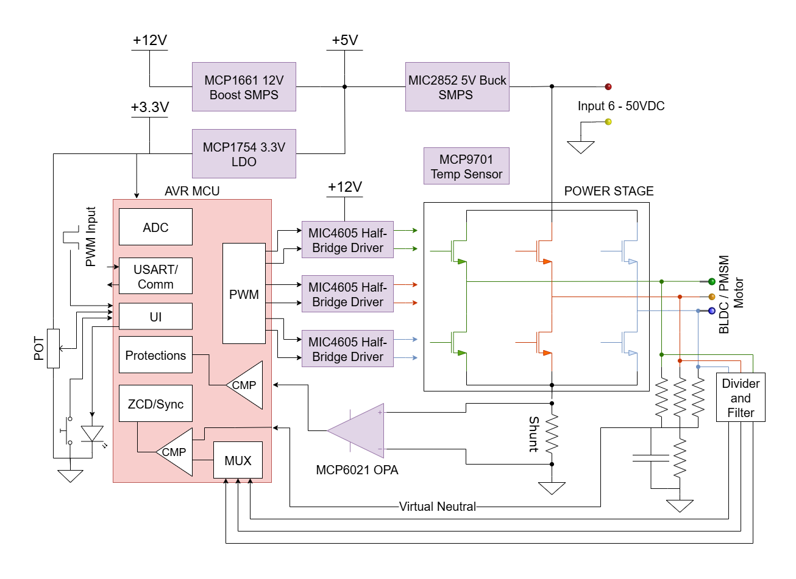

## Quick Start Guide

### Physical Setup

The AVR16EB32, AVR128DA48 or ATmega4809 Curiosity Nano Development boards are used along with the MPPB, AVR EB, AVR DA or ATmega CNANO to MPPB adapter board, the BLDC motor and a voltage power supply.

<br>Connection steps:

1. Plug in the AVR16EB32, AVR128DA48 or ATmega4809 Curiosity Nano board in the connector present on the MPPB adapter board.
2. Plug in the MPPB adapter board to the MPPB board.
3. Plug in the AVR® EB, AVR DA or ATmega Curiosity Nano boards to the PC.
4. Connect the voltage power supply wires to the V_SUPPLY conector from the MPPB.
5. Connect the motor phase wires to the PHASE connector from MPPB in any order.
6. Connect the Hall sensors wires to the HALL SENSOR connector from MPPB (phase A with Hall A, phase B with Hall B and phase C with Hall C).

<br> <b>Note:</b> Step 6 is optional if sensored control is preferred. The order of Hall sensors wires must match the order of motor phases wires for the control algorithm to work. The A, B, and C wire connection succession is mandatory for both motor phases and Hall sensors.

<h4> Example Setup: </h4>

|          Three Phase Motors                                            |            One Phase Motors                                                |
|:----------------------------------------------------------------------:|:--------------------------------------------------------------------------:|
|                                       | 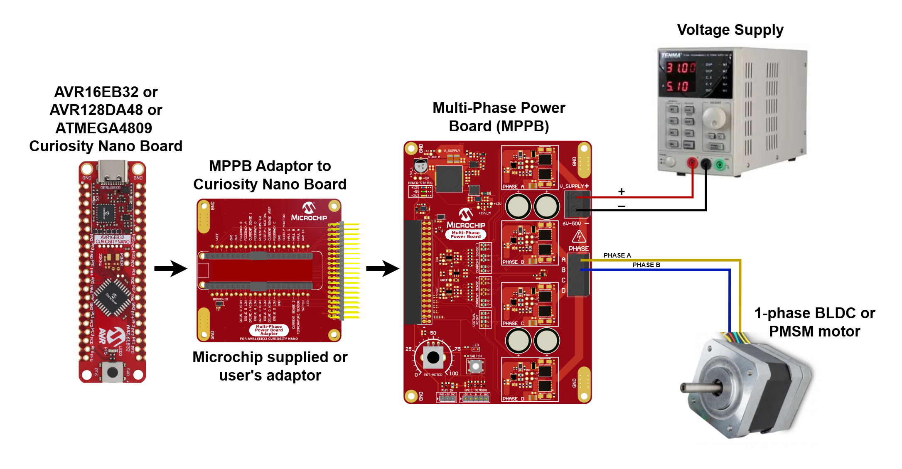                                      |

### Curiosity Nano - MPPB Pin Mapping

If the MPPB and the adapter boards are not used, the user can integrate the AVR EB, AVR DA or ATmega boards into another hardware setup by using the following pinouts:

| Curiosity Nano Boards Pinout                                              | Curiosity Nano - MPPB Pin Mapping                                        |
|:-------------------------------------------------------------------------:|:------------------------------------------------------------------------:|
| 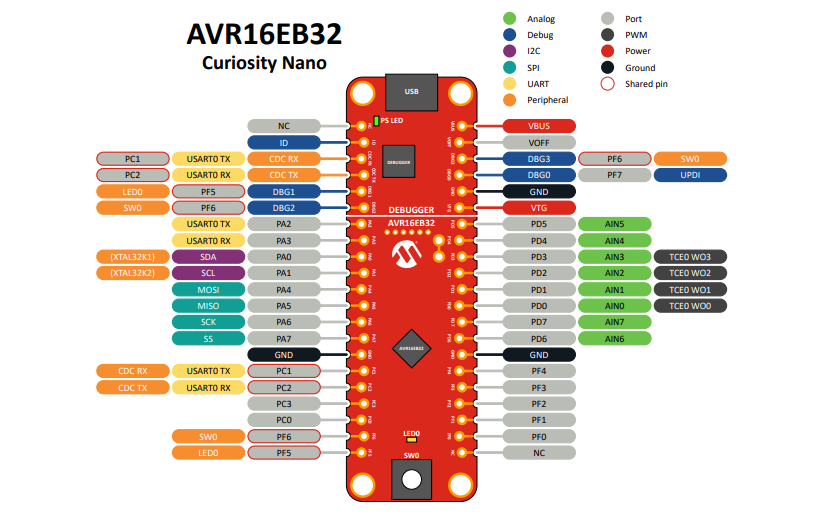                                   | 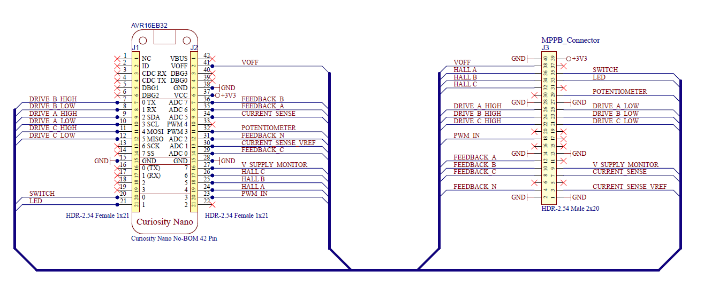                                   |
| 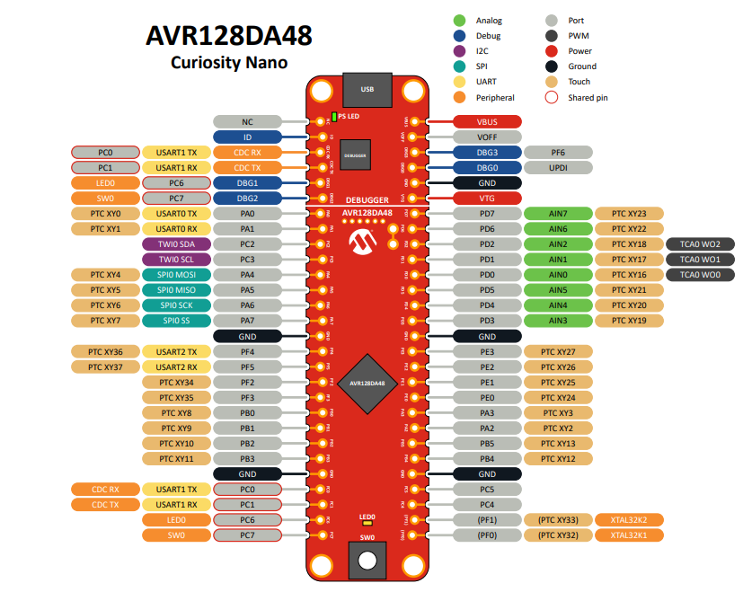                                   | 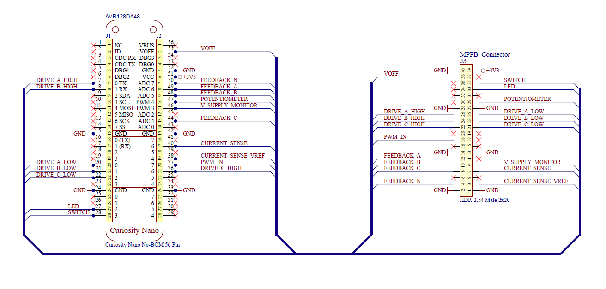                                   |
| 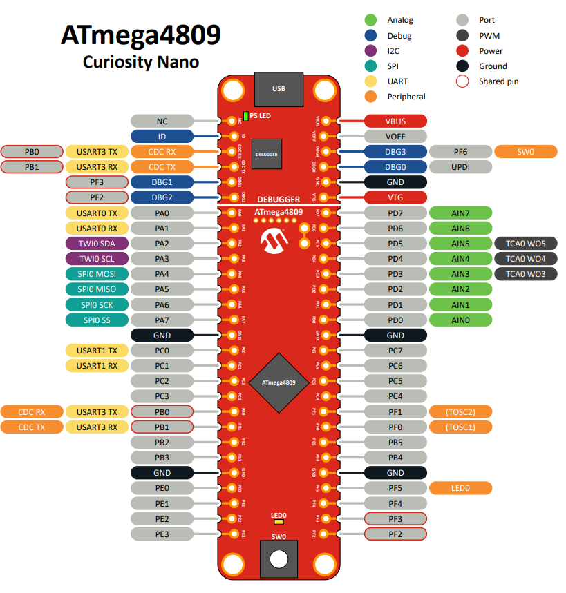                               | 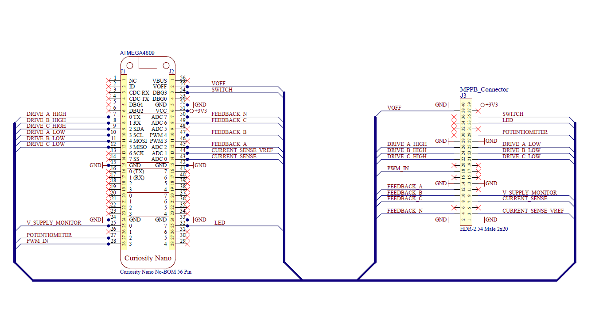                               |

<h4> Pin mapping legend AVR16EB32, AVR128DA48, ATmega4809 Curiosity Nano Boards to MPPB </h4>

| Pin Name                      | AVR16EB32 Curiosity Nano Board | AVR128DA48 Curiosity Nano Board | ATmega4809 Curiosity Nano Board | MPPB Board                    |
|-------------------------------|--------------------------------|---------------------------------|---------------------------------|-------------------------------|
|Drive A High                   |Pin 9  - PA0                    |Pin 7  - PA0                     |Pin 7  - PA0                     |Pin 26                         |
|Drive A Low                    |Pin 10 - PA1                    |Pin 20 - PB0                     |Pin 10 - PA3                     |Pin 25                         |
|Drive B High                   |Pin 7  - PA2                    |Pin 8 -  PA1                     |Pin 8  - PA1                     |Pin 24                         |
|Drive B Low                    |Pin 8  - PA3                    |Pin 21 - PB1                     |Pin 11 - PA4                     |Pin 23                         |
|Drive C High                   |Pin 11 - PA4                    |Pin 36 - PA2                     |Pin 9  - PA2                     |Pin 22                         |
|Drive C Low                    |Pin 12 - PA5                    |Pin 22 - PB2                     |Pin 12 - PA5                     |Pin 21                         |
|Feedback A                     |Pin 35 - PD4                    |Pin 49 - PD6                     |Pin 45 - PD2                     |Pin 12                         |
|Feedback B                     |Pin 36 - PD5                    |Pin 48 - PD2                     |Pin 47 - PD4                     |Pin 10                         |
|Feedback C                     |Pin 29 - PD6                    |Pin 44 - PD4                     |Pin 49 - PD6                     |Pin 8                          |
|Feedback N                     |Pin 31 - PD0                    |Pin 50 - PD7                     |Pin 50 - PD7                     |Pin 4                          |
|Current Sense                  |Pin 34 - PD3                    |Pin 40 - PE2                     |Pin 43 - PD0                     |Pin 7                          |
|Current Sense V<sub>REF</sub>  |Pin 30 - PD7                    |Pin 38 - PE0                     |Pin 44 - PD1                     |Pin 3                          |
|Current Trip                   |Pin 34 - PD3                    |Pin 40 - PE2                     |Pin 41 - PC7                     | -                             |
|V Supply Monitor               |Pin 27 - PF4                    |Pin 46 - PD0                     |Pin 25 - PE0                     |Pin 9                          |
|Potentiometer                  |Pin 32 - PD1                    |Pin 47 - PD1                     |Pin 27 - PE2                     |Pin 29                         |
|LED                            |Pin 21 - PF5                    |Pin 27 - PC6                     |Pin 32 - PF5                     |Pin 33                         |
|Switch                         |Pin 20 - PF6                    |Pin 28 - PC7                     |Pin 54 - PF6                     |Pin 35                         |
|PWM IN                         |Pin 23 - PF0                    |Pin 37 - PA3                     |Pin 28 - PE3                     |Pin 18                         |
|TXC                            |Pin 16 - PC1                    |Pin 25 - PC0                     |Pin 20 - PB0                     | -                             |
|RXC                            |Pin 17 - PC2                    |Pin 26 - PC1                     |Pin 21 - PB1                     | -                             |
|HALL A                         |Pin 24 - PF1                    |Pin 18 - PF2                     |Pin 29 - PF2                     |Pin 36                         |
|HALL B                         |Pin 25 - PF2                    |Pin 19 - PF3                     |Pin 30 - PF3                     |Pin 34                         |
|HALL C                         |Pin 26 - PF3                    |Pin 16 - PF4                     |Pin 31 - PF4                     |Pin 32                         |
|3V3                            |Pin 37                          |Pin 51                           |Pin 51                           |Pin 39                         |
|V<sub>OFF</sub>                |Pin 41                          |Pin 55                           |Pin 55                           |Pin 38                         |
|GND                            |Pins: 38, 28, 15                |Pins: 52, 42, 33, 24, 15         |Pins: 52, 42, 33, 24, 15         |Pins: 40, 28, 27, 14, 13, 2, 1 |

<br><b>Note:</b> In this repository, schematics for all the three platforms are provided in the `pdf` folder:
 - AVR16EB32_MPPB_Mapping
 - AVR128DA48_MPPB_Mapping
 - ATMEGA4809_MPPB_Mapping
</br>

### Necessary Hardware Tweaks

<br> This demo requires adding three SMD capacitors of 1 nF each with the size of 0402 on the MPPB board, one for each motor phases. Also, the capacitor for the motor neutral filter must be replaced with a 3.3 nF one of the same size, as explained below.

<br> Because this demo counts on capturing the BEMF using the hardware capture mechanism of a timer, the captured signals need filtering to remove the false Zero-Cross Detection (ZCD). The easiest method to do this is by using a RC low-pass filter. The MPPB board has placeholder pads for the capacitors that need to be added. The capacitor for virtual neutral point is already in place, but needs to be replaced with a 3.3 nF one, and the capacitor values for phases A, B and C must have the value of 1 nF (three times smaller than the one from virtual neutral). With these capacitor values, the resulted RC filters will add a 10-µs delay to the zero-cross detection. The resulted RC filters are sufficient for noise filtering and do not add a high delay, thus allowing the motor to spin at very high electrical RPMs.

<h4> Capacitors location marked with green rectangles </h4>

<br><br>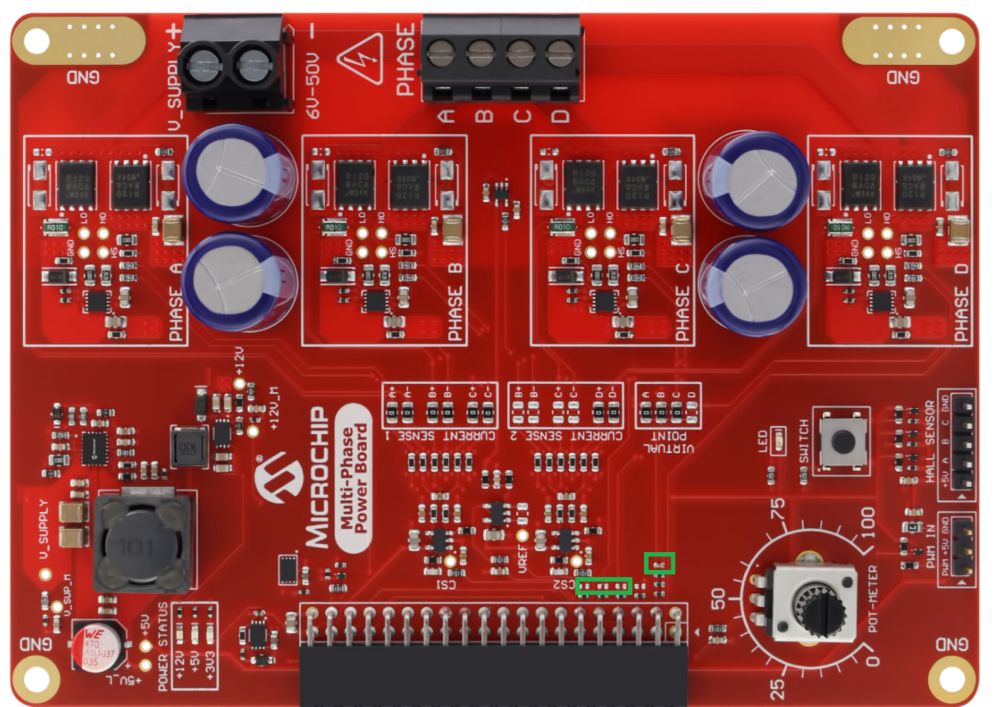

<h4> Capacitors location zoomed in </h4>

<br><br>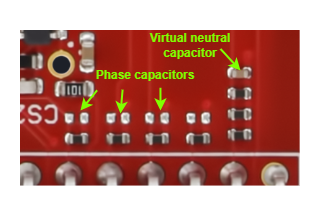

<br> <b>Note:</b> The capacitors are not needed if only sensored control is preferred.

### Configuration Settings

<br>The following configuration settings (apart from the default values) are needed to run the demo in the Trapezoidal Sensorless mode with the ACT42BLF01 motor,the SZSPEED 2207 2500KV drone motor and the one-phase hair dryer motor.
<br>Edit the settings in the [`config.h`](#configurable-parameters) configuration file according to the usage scenario.

<br><h3> ACT42BLF01 Motor Configuration Settings </h3>

```c

/* Analog module settings */
#define ADC_IIR_FILTER                  true         /* Smoothing filter on ADC functions: POT, VBUS, current */

/* PWM-In settings */
#define PWM_IN_PERIOD                   (20.0)       /* ms */
#define PWM_IN_MAX_DCY                  ( 2.0)       /* ms */
#define PWM_IN_MIN_DCY                  ( 1.0)       /* ms */

/* Board specific settings - MPPB */
#define CURRENT_SHUNT_RESISTANCE        (0.01)       /* Resistance in ohm of the current shunt */
#define CURRENT_AMPLIFIER_GAIN          (7.5)
#define VBUS_DIVIDER                    (16.0)
#define ANALOG_REFERENCE                (3300.0)     /* mV */
#define ADC_VBUS_TRIP                   (51000.0)    /* mV - VBUS trip level */
#define ADC_CURRENT_TRIP                (7000.0)     /* mA - ADC current trip level */
#define COMPARATOR_CURRENT_TRIP         (20000.0)    /* mA - Comparator trip level - not used on external-comparator configurations */
#define FAULT_COMPARATOR_EN             true
#define BOARD_PHASE_RC_DELAY            (10.0)       /* microseconds - RC filter delay */
#define BOARD_MOSFET_RDSON              (0.004)      /* ohm - MOSFETs Rds-on resistance */

/* Motor-specific settings */
/* ACT42BLF01:  supply 24V, 3A limit */
#define MOTOR_PHASE_ADVANCE             (10.0)       /* Phase advance 0.0 ... 30.0 electrical degrees */
#define MOTOR_STARTUP_CURRENT           (2500.0)     /* mA - Initial alignment current pulse may be higher than overcurrent protection */
#define MOTOR_RPP                       (2.6)        /* ohms - Motor resistance measured phase-to-phase */
#define MOTOR_OPEN_LOOP_RAMP            (0.0004)     /* Amplitude ramp steepness: step size per millisecond 0.00004 ... 1.0 */
#define MOTOR_ALIGNMENT_DURATION        (10)         /* ms */
#define MOTOR_STARTUP_TIME              (1000)       /* ms -  Delay until commands (POT or PWM-in) are accepted; '-1' makes commands to be ignored */
#define MOTOR_STATRUP_SPEED             (4000.0)     /* e-RPM - Specify the initial speed - minimum value is 120 e-RPM*/
#define HALL_ENABLED                    false        /* Setting to 'true' enables the Hall synchronization, while setting to 'false' enables the BEMF synchronization */
#define HALL_MISALIGNMENT               (10.0)       /* Hall misalignment 0.0 ... 30.0 electrical degrees */
#define HALL_INVERTED                   false        /* Sets the Hall pins polarity - 'true' for sensors active in '0' and 'false' for sensors active in '1' */ 

/* Speed regulation specific settings */
#define REGULATOR_SPEED_EN              true         /* Setting to 'true' enables speed control in Closed Loop, setting to 'false' enables amplitude control in Open Loop */
#define REGULATOR_MAX_SPEED             (15000.0)    /* e-RPM target speed for 100% command */
#define REGULATOR_MIN_SPEED             (4000.0)     /* e-RPM target speed for   0% command */
#define REGULATOR_PI_KP                 (1.0)        /* PI speed control loop proportional coefficient */
#define REGULATOR_PI_KI                 (1.0)        /* PI speed control loop integral coefficient */
#define REGULATOR_PI_DT                 (50.0)       /* PI time step size [ms]; this parameter is also used for measurement of speed in open loop—minimum 10 ms */

/* Drive Algorithm settings */
#define DRIVE_FORCED                    false        /* Setting to 'true' runs the motor without BEMF sensing, only blind drive and no rotor synchronization, which could overheat the motor */
#define SINGLE_PULSE_MODE               false        /* Setting to 'true' enables the single pulse drive method, while setting to 'false' enables the PWM modulation drive method */
#define PWM_TO_SP_THRESHOLD             (120000.0)   /* e-RPM  PWM -> Single Pulse transition */
#define SP_TO_PWM_THRESHOLD             (100000.0)   /* e-RPM  Single Pulse -> PWM transition */
#define STALL_DETECTION_THRESHOLD       (50)         /* Stall detection tolerance: higher number - more tolerant to perturbances, but slower detection */
#define STALL_DETECTION_ENABLED         true         /* Setting to 'false' disables the stall detection mechanism */
#define STALL_MAXIMUM_ERPM              (5000000.0)  /* e-RPM - Threshold when the algorithm might lose synchronization */
#define ONE_PHASE_MODE                  false        /* Setting to 'true' enables the One Phase mode, where only phases A and B are used. Setting to 'false' enables the Three Phase mode, where phases A, B and C are used. */
```

<br><h3> SZSPEED 2207 2500KV Drone Motor Configuration Settings </h3>

```c

/* Analog module settings */
#define ADC_IIR_FILTER                  true         /* Smoothing filter on ADC functions: POT, VBUS, current */

/* PWM-In settings */
#define PWM_IN_PERIOD                   (20.0)       /* ms */
#define PWM_IN_MAX_DCY                  ( 2.0)       /* ms */
#define PWM_IN_MIN_DCY                  ( 1.0)       /* ms */

/* Board specific settings - MPPB */
#define CURRENT_SHUNT_RESISTANCE        (0.01)       /* Resistance in ohm of the current shunt */
#define CURRENT_AMPLIFIER_GAIN          (7.5)
#define VBUS_DIVIDER                    (16.0)
#define ANALOG_REFERENCE                (3300.0)     /* mV */
#define ADC_VBUS_TRIP                   (51000.0)    /* mV - VBUS trip level */
#define ADC_CURRENT_TRIP                (15000.0)    /* mA - ADC current trip level */
#define COMPARATOR_CURRENT_TRIP         (20000.0)    /* mA - Comparator trip level - not used on external-comparator configurations */
#define FAULT_COMPARATOR_EN             false
#define BOARD_PHASE_RC_DELAY            (10.0)       /* microseconds - RC filter delay */
#define BOARD_MOSFET_RDSON              (0.004)      /* ohm - MOSFETs Rds-on resistance */

/* Motor-specific settings */
/* A2207-2500KV:  supply 16V, 3A limit */
#define MOTOR_PHASE_ADVANCE             (10.0)       /* Phase advance 0.0 ... 30.0 electrical degrees */
#define MOTOR_STARTUP_CURRENT           (10000.0)    /* mA - Initial alignment current pulse may be higher than overcurrent protection */
#define MOTOR_RPP                       (0.1)        /* ohms - Motor resistance measured phase-to-phase */
#define MOTOR_OPEN_LOOP_RAMP            (0.0004)     /* Amplitude ramp steepness: step size per millisecond 0.00004 ... 1.0 */
#define MOTOR_ALIGNMENT_DURATION        (5)          /* ms */
#define MOTOR_STARTUP_TIME              (1000)       /* ms -  Delay until commands (POT or PWM-in) are accepted; '-1' makes commands to be ignored */
#define MOTOR_STATRUP_SPEED             (25000.0)    /* e-RPM - Specify the initial speed - minimum value is 120 e-RPM*/
#define HALL_ENABLED                    false        /* Setting to 'true' enables the Hall synchronization, while setting to 'false' enables the BEMF synchronization */
#define HALL_MISALIGNMENT               (0.0)        /* Hall misalignment 0.0 ... 30.0 electrical degrees */
#define HALL_INVERTED                   false        /* Sets the Hall pins polarity - 'true' for sensors active in '0' and 'false' for sensors active in '1' */ 

/* Speed regulation specific settings */
#define REGULATOR_SPEED_EN              true         /* Setting to 'true' enables speed control in Closed Loop, setting to 'false' enables amplitude control in Open Loop */
#define REGULATOR_MAX_SPEED             (250000.0)   /* e-RPM target speed for 100% command */
#define REGULATOR_MIN_SPEED             (50000.0)    /* e-RPM target speed for   0% command */
#define REGULATOR_PI_KP                 (1.0)        /* PI speed control loop proportional coefficient */
#define REGULATOR_PI_KI                 (0.1)        /* PI speed control loop integral coefficient */
#define REGULATOR_PI_DT                 (20.0)       /* PI time step size [ms]; this parameter is also used for measurement of speed in open loop—minimum 10 ms */

/* Drive Algorithm settings */
#define DRIVE_FORCED                    false        /* Setting to 'true' runs the motor without BEMF sensing, only blind drive and no rotor synchronization, which could overheat the motor */
#define SINGLE_PULSE_MODE               true         /* Setting to 'true' enables the single pulse drive method, while setting to 'false' enables the PWM modulation drive method */
#define PWM_TO_SP_THRESHOLD             (120000.0)   /* e-RPM  PWM -> Single Pulse transition */
#define SP_TO_PWM_THRESHOLD             (100000.0)   /* e-RPM  Single Pulse -> PWM transition */
#define STALL_DETECTION_THRESHOLD       (50)         /* Stall detection tolerance: higher number - more tolerant to perturbances, but slower detection */
#define STALL_DETECTION_ENABLED         true         /* Setting to 'false' disables the stall detection mechanism */
#define STALL_MAXIMUM_ERPM              (50000000.0) /* e-RPM - Threshold when the algorithm might lose synchronization */
#define ONE_PHASE_MODE                  false        /* Setting to 'true' enables the One Phase mode, where only phases A and B are used. Setting to 'false' enables the Three Phase mode, where phases A, B and C are used. */
```

<br><h3> Hair Dryer One-Phase Motor Configuration Settings </h3>

```c

/* Analog module settings */
#define ADC_IIR_FILTER                  true         /* Smoothing filter on ADC functions: POT, VBUS, current */

/* PWM-In settings */
#define PWM_IN_PERIOD                   (20.0)       /* ms */
#define PWM_IN_MAX_DCY                  ( 2.0)       /* ms */
#define PWM_IN_MIN_DCY                  ( 1.0)       /* ms */

/* Board specific settings - MPPB */
#define CURRENT_SHUNT_RESISTANCE        (0.01)       /* Resistance in ohm of the current shunt */
#define CURRENT_AMPLIFIER_GAIN          (7.5)
#define VBUS_DIVIDER                    (16.0)
#define ANALOG_REFERENCE                (3300.0)     /* mV */
#define ADC_VBUS_TRIP                   (51000.0)    /* mV - VBUS trip level */
#define ADC_CURRENT_TRIP                (15000.0)    /* mA - ADC current trip level */
#define COMPARATOR_CURRENT_TRIP         (20000.0)    /* mA - Comparator trip level - not used on external-comparator configurations */
#define FAULT_COMPARATOR_EN             false
#define BOARD_PHASE_RC_DELAY            (10.0)       /* microseconds - RC filter delay */
#define BOARD_MOSFET_RDSON              (0.004)      /* ohm - MOSFETs Rds-on resistance */

/* Motor-specific settings */
/* 220V AC 120W 110000RPM One Phase:  supply 50V, 1.5A limit */
#define MOTOR_PHASE_ADVANCE             (10.0)       /* Phase advance 0.0 ... 30.0 electrical degrees */
#define MOTOR_STARTUP_CURRENT           (3900.0)     /* mA - Initial alignment current pulse may be higher than overcurrent protection */
#define MOTOR_RPP                       (10.0)       /* ohms - Motor resistance measured phase-to-phase */
#define MOTOR_OPEN_LOOP_RAMP            (0.0004)     /* Amplitude ramp steepness: step size per millisecond 0.00004 ... 1.0 */
#define MOTOR_ALIGNMENT_DURATION        (5)          /* ms */
#define MOTOR_STARTUP_TIME              (1000)       /* ms -  Delay until commands (POT or PWM-in) are accepted; '-1' makes commands to be ignored */
#define MOTOR_STATRUP_SPEED             (7500.0)     /* e-RPM - Specify the initial speed - minimum value is 120 e-RPM*/
#define HALL_ENABLED                    false        /* Setting to 'true' enables the Hall synchronization, while setting to 'false' enables the BEMF synchronization */
#define HALL_MISALIGNMENT               (0.0)        /* Hall misalignment 0.0 ... 30.0 electrical degrees */
#define HALL_INVERTED                   false        /* Sets the Hall pins polarity - 'true' for sensors active in '0' and 'false' for sensors active in '1' */ 

/* Speed regulation specific settings */
#define REGULATOR_SPEED_EN              false        /* Setting to 'true' enables speed control in Closed Loop, setting to 'false' enables amplitude control in Open Loop */
#define REGULATOR_MAX_SPEED             (250000.0)   /* e-RPM target speed for 100% command */
#define REGULATOR_MIN_SPEED             (50000.0)    /* e-RPM target speed for   0% command */
#define REGULATOR_PI_KP                 (1.0)        /* PI speed control loop proportional coefficient */
#define REGULATOR_PI_KI                 (0.1)        /* PI speed control loop integral coefficient */
#define REGULATOR_PI_DT                 (200.0)      /* PI time step size [ms]; this parameter is also used for measurement of speed in open loop—minimum 10 ms */

/* Drive Algorithm settings */
#define DRIVE_FORCED                    false        /* Setting to 'true' runs the motor without BEMF sensing, only blind drive and no rotor synchronization, which could overheat the motor */
#define SINGLE_PULSE_MODE               true         /* Setting to 'true' enables the single pulse drive method, while setting to 'false' enables the PWM modulation drive method */
#define PWM_TO_SP_THRESHOLD             (100000.0)   /* e-RPM  PWM -> Single Pulse transition */
#define SP_TO_PWM_THRESHOLD             (80000.0)    /* e-RPM  Single Pulse -> PWM transition */
#define STALL_DETECTION_THRESHOLD       (50)         /* Stall detection tolerance: higher number - more tolerant to perturbances, but slower detection */
#define STALL_DETECTION_ENABLED         true         /* Setting to 'false' disables the stall detection mechanism */
#define STALL_MAXIMUM_ERPM              (150000.0)   /* e-RPM - Threshold when the algorithm might lose synchronization */
#define ONE_PHASE_MODE                  true         /* Setting to 'true' enables the One Phase mode, where only phases A and B are used. Setting to 'false' enables the Three Phase mode, where phases A, B and C are used. */
```

<br><b>Note:</b> In the `config_examples` folder there are `config.h` example files, one for each motor used in testing this demo. Copy the variant of the `config.h` file corresponding to the desired motor and place it in `fw/common_files`. The copied configuration file will overwrite the old one.</br>

## Application Usage

### Let's Spin the Motor

After all the steps from [Quick Start Guide](#quick-start-guide) are completed, turn the MPPB potentiometer to 50%, then press the MPPB button to spin the motor.
The spinning direction depends on the wiring of the phases.

### Tunning Guide

If the motor is not yet spining after following all the steps in [Quick Start Guide](#quick-start-guide), or an error message may appear on the console, the steps below can help tunning the application for a new motor:

1. Measure the phase-to-phase resistance between any two wires of the motor. Put this value in `MOTOR_RPP`, from the `config.h` file.
2. Disable the speed regulator by setting `REGULATOR_SPEED_EN` to `false`.
3. The initial value for `MOTOR_STARTUP_CURRENT` can be close to the rated current of the motor.
4. If the motor is not spinning after the first two steps and reprogramming, set `MOTOR_STARTUP_TIME` to `-1` and `DRIVE_FORCED` to `true`, to put the motor in Forced Commutation mode. Try to increase `MOTOR_STARTUP_CURRENT` by 0.5A and reprogram until the motor starts spinning. After the motor is spinning in Forced mode without vibrations, set `MOTOR_STARTUP_TIME` to the initial value and `MOTOR_FORCED` back to `false`.
5. `MOTOR_ALIGNMENT_DURATION` can also be adjusted. For example, for a drone motor with low inductance, the alignment period is much smaller compared to a motor with high inductance. Try to increase or decrease the duration with steps not greater than 10 ms at a time.
6. `MOTOR_OPEN_LOOP_RAMP` can also be adjusted. This parameter establishes how aggresive the ramp-up process is. Higher values of this parameter translate into a more aggresive ramp. For a motor with low inductance and high nominal speed, the ramp can be more aggresive compared to a motor with higher inductance and lower nominal speed. The safe and minimum value of this parameter is 0.00004.
7. After getting the motor to spin, set the`REGULATOR_SPEED_EN` parameter back to `true`.
8. For stability, ensure that `REGULATOR_MIN_SPEED` is high enough to run the motor stable (10% of nominal speed) and that `REGULATOR_MAX_SPEED` does not exceed the maximum rated speed at the supplied voltage.
9. For sensored control set `HALL_ENABLED` parameter to `true`; start with initial `HALL_MISALIGNMENT` to 0 electrical degrees and set `HALL_INVERTED` to `false`. If the motor may spin eratically, consume a lot of current or enter a Stall condition, try to increase `HALL_MISALIGNMENT` with five electrical degrees at a time and run again. If the motor is still not spinning, try setting the `HALL_INVERTED` parameter to `true` and repeat. Compare the achieved speed and current consumption with the ones from sensorless control, using BEMF. If the results are the same, the motor is tuned to use Hall sensors.

### Programming the AVR® MCU

1. Download the `.zip` file or clone the repository to get the source code.

2. Open the `fw/motor_demo_eb.X`,  `fw/motor_demo_da.X` or  `fw/motor_demo_mega4809.X` project in MPLAB® X IDE.

3. Right click the project and select Set as Main Project.

<br>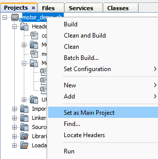

4. Edit the [`config.h`](#configurable-parameters) file, found in `common_files` folder, with the utilized motor parameters and drive options. See [Configuration Settings](#configuration-settings) for examples.

5. Build the `motor_demo_eb.X`, `motor_demo_da.X` or `motor_demo_mega4809.X` project by clicking **Clean and Build Project**.

<br>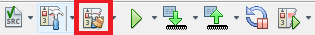

6. Click **Make and Program Device** to program the project to the board.

<br>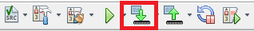

### Console Interface

<br>The application has a console communication interface. To activate it, open a PC software terminal and select the UART protocol, 8N1, with a baud rate of 57600 bps.
<br> The serial interface provides information about the remote controller PWM input, potentiometer value, voltage bus value, motor current value, electrical rotations per minute (RPM) value and motor running state (ON/OFF).

<br>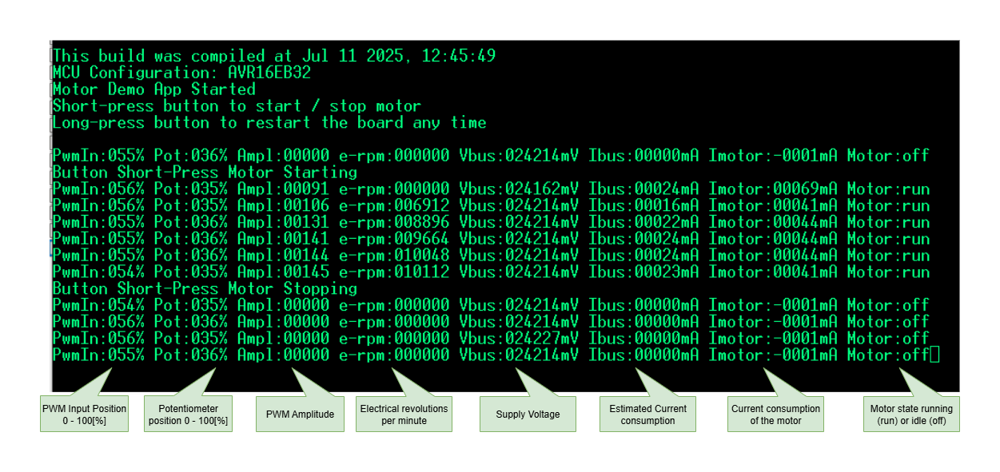

### PWM Input Interface
<br>The MPPB hardware and the software application support interfacing with a PWM Remote Controller (PWM-RC).
<br>The application measures both signal from the PWM-RC and on-board potentiometer, but the PWM-RC has priority over the potentiometer in controlling the motor.
<br>If the PWM-RC/PWM-IN signal is not detected, then the on-board potentiometer is used for control.
<br>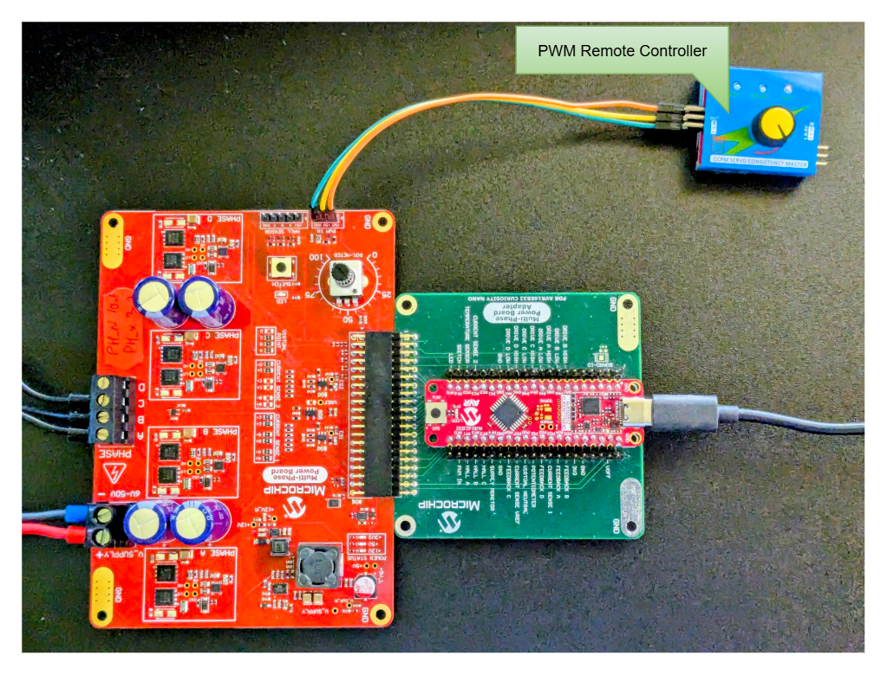

## Software Description

### Software Organization in Folders and Files

All the files shared by the three platforms are in the `common_files` folder. Each platform has its own `main.c` and `mcc_mapping.h` files.
```
   fw
    ├───common_files
    │   │   app.c
    │   │   config.h
    │   │
    │   ├───motor
    │   │       analog.c
    │   │       analog.h
    │   │       conversion_macros.h
    │   │       motor.c
    │   │       motor.h
    │   │
    │   └───utils
    │           button_led.c
    │           button_led.h
    │           dbg_logger.c
    │           dbg_logger.h
    │           dbg_pins.h
    │           precise_delay.h
    │           pwm_in.c
    │           pwm_in.h
    │           sw_timer.c
    │           sw_timer.h
    │
    ├───motor_demo_da.X
    │   │   main.c
    │   │   Makefile
    │   │   mcc_mapping.h
    │   │   motor_demo_da.mc3
    │   │
    │   ├───mcc_generated_files
    │   └───nbproject
    │           configurations.xml
    │           project.xml
    │
    ├───motor_demo_eb.X
    │   │   main.c
    │   │   Makefile
    │   │   mcc_mapping.h
    │   │   motor_demo_eb.mc3
    │   │
    │   ├───mcc_generated_files
    │   └───nbproject
    │           configurations.xml
    │           project.xml
    │
    └───motor_demo_mega4809.X
        │   main.c
        │   Makefile
        │   mcc_mapping.h
        │   motor_demo_mega4809.mc3
        │
        ├───mcc_generated_files
        └───nbproject
                configurations.xml
                project.xml
```

### MCC Maping

The `mcc_mapping.h` files are used to map all the port pins and low-level driver functions generated using the MPLAB® Code Configurator (MCC) to the abstract layers of the application. These layers include: motor, analog, LED/button, PWM-IN and other wrapper layers. The `mcc_mapping.h` files can be found in `fw/motor_demo_eb.X`, `fw/motor_demo_da.X` and `fw/motor_demo_mega4809.X`.

### Application Block Overview

<br>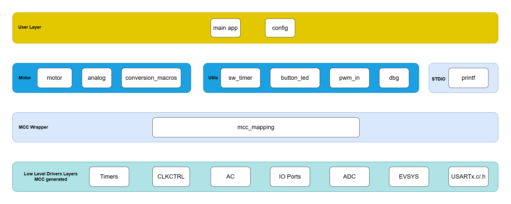

### Application Flowchart

<br>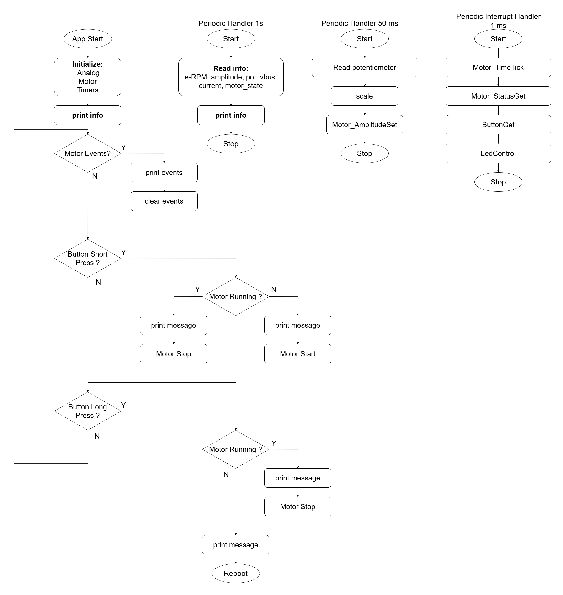

1. Short-press the button on the MPPB board. The motor starts spinning in CW direction and enters the Running state. The LED from MPPB turns on. The speed can be adjusted using the potentiometer present on the MPPB board or an external PWM-RC.
2. Short-press the button from MPPB again. The motor decelerates, comes to a complete stop and enters the Idle state. The LED from MPPB turns off.
3. Short-press the button on the MPPB board. The motor starts spinning in CCW direction and enters the Running state. The LED from MPPB turns on. The speed can be adjusted using the potentiometer present on the MPPB board or an external PWM-RC.
4. Short-press the button from MPPB again. The motor decelerates, comes to a complete stop and enters the Idle state. The LED from MPPB turns off.
5. Long-press the button (more than 1.5s) to restart the application.
6. If a Fault event occurs, the motor stops, the event is mentioned in the console and the application enters the Idle state. The LED blinks five times signalling the error, then stops.

### Application Programming Interface Functions

<br> The APIs from the Motor Control Stack found in `motor_control.h` are the following:

<br>• <b>`Motor_Initialize()`</b> - Initialization function, needs to be called before any other function
<br>• <b>`Motor_Start()`</b> - Starts the motor and sets the motor spinning direction. If the motor is already spinning, the call is ignored
<br>• <b>`Motor_Stop()`</b> - Stops the motor. If the motor is already stopped, the call is ignored
<br>• <b>`Motor_Fault()`</b> - Stops the motor and then clears the Fault flags. It is registered in the application to be called by the Analog module in case of a fault situation.
<br>• <b>`Motor_CommandSet()`</b> - Has dual use. For speed regulation mode it receives the value of the target speed. For open-loop mode it receives the value of the drive amplitude (PWM duty cycle).
<br>• <b>`Motor_MaxAmpGet()`</b> - Returns the maximum possible PWM amplitude value
<br>• <b>`Motor_StatusGet()`</b> - Returns the ON/OFF state of the motor and possible fault events
<br>• <b>`Motor_ErpmGet()`</b> - Returns the electrical RPM value of the motor during run time
<br>• <b>`Motor_AmplitudeGet()`</b> - Gets the PWM amplitude value
<br>• <b>`Motor_TimeTick()`</b> - Needs to be called once every 1 ms, only in the context of an interrupt. It is required for internal synchronization

<b>Important:</b> Use only the public APIs from the `motor_control.h` file so as not to alter the library functionality in any way.

### Configurable Parameters

The parameters from the `config.h` file used to customize the application are the following:

<br><b> Analog Module Settings </b>

<br>• <b>`ADC_IIR_FILTER`</b> - Enables or disables a smoothing filter for analog measurements: potentiometer, voltage bus and current. This filter is used only for displaying values, and not by fault or any other mechanism that requires a fast response.

<br><b> PWM Input Settings </b>

<br>• <b>`PWM_IN_PERIOD`</b> - Represents the period of the PWM input signal, compatible with radio-controlled receivers, that can be used to set the speed reference in Closed-Loop, or the PWM amplitude reference in Open-Loop. The standard value of this parameter in 20 ms.
<br>• <b>`PWM_IN_MAX_DCY`</b> - Represents the maximum `ON` time of the PWM input signal and is equivalent to setting the maximum reference. The standard value of this parameter is 2 ms, but it can be tuned accordingly to eventual tolerances.
<br>• <b>`PWM_IN_MIN_DCY`</b> - Represents the minimum `ON` time of the PWM input signal and is equivalent to setting the minimum reference. The standard value of this parameter is 1 ms, but it can be tuned accordingly to eventual tolerances.

<br><b> Power Board Settigs </b>

<br>• <b>`CURRENT_SHUNT_RESISTANCE`</b> - The current sense shunt resistance, given in ohms, dependent on the power board
<br>• <b>`CURRENT_AMPLIFIER_GAIN`</b> - The current sense amplifier, dependent on the power board
<br>• <b>`VBUS_DIVIDER`</b> - The voltage divider, used to scale the V<sub>BUS</sub> to be able to measure it with the `ANALOG_REFERENCE` logic, dependent on the power board
<br>• <b>`ANALOG_REFERENCE`</b> - The voltage reference (this application has a 3V3 logic)
<br>• <b>`ADC_VBUS_TRIP`</b> - Sets the ADC trip level in case of an overvoltage protection, expressed in millivolts
<br>• <b>`ADC_CURRENT_TRIP`</b> - Sets the ADC trip level in case of an average overcurrent protection, expressed in milliamperes
<br>• <b>`COMPARATOR_CURRENT_TRIP`</b> - Sets the internal comparator's trip level in case of a peak overcurrent protection. This parameter does not have any effect for the external comparator configuration, specifically for the ATmega4809 configuration.
<br>• <b>`FAULT_COMPARATOR_EN`</b> - Enables or disables the comparator used for current trip. For AVR16EB32 and AVR128DA48, this mechanism is implemented using an internal comparator. For ATmega4809, the support is implemented using an external comparator, which must be added separately to utilize this feature.
<br>• <b>`BOARD_PHASE_RC_DELAY`</b> - Delay added to the BEMF Zero-Cross Detection (ZCD) by the RC filter present on the power board
<br>• <b>`BOARD_MOSFET_RDSON`</b> - The drain-source on-resistance value of the transistors present on the power board. This value is acquired from the data sheet of the transistor.

<br><b> Motor Settings </b>

<br>• <b>`MOTOR_PHASE_ADVANCE`</b> - Sets the value of the phase drive advance, and takes values between `0` and `30` electrical degrees. This parameter is used to improve the motor efficiency and performance at higher speeds by advancing the phase of the applied voltage relative to the BEMF of the motor, effectively shifting the timing of the current flow. Tune this according to the motor used.
<br>• <b>`MOTOR_STARTUP_CURRENT`</b> - The amount of current supplied to the motor phases during the start-up phase, given in amperes
<br>• <b>`MOTOR_RPP`</b> - Motor resistance measured phase-to-phase
<br>• <b>`MOTOR_OPEN_LOOP_RAMP`</b> - Amplitude increase rate; the higher the number, the more aggresive the ramp
<br>• <b>`MOTOR_ALIGNMENT_DURATION`</b> - Initial alignment duration before start-up
<br>• <b>`MOTOR_STARTUP_TIME`</b> - Represents the waiting time until the value from the `Motor_CommandSet()` is used to set the amplitude or reference speed. If this parameter is set to '-1', the value written by `Motor_CommandSet()` is ignored.
<br>• <b>`MOTOR_STARTUP_SPEED`</b> - Sets the initial speed for start-up. The minimum value is 120 e-RPM, but faster motors with low inductance need a bigger initial speed, with values of thousands of electrical RPMs.
<br>• <b>`HALL_ENABLED`</b> - Enables or disables the sensored control. If the sensored control is disabled, the sensorless control is enabled and vice-versa. The application does not support both sensored and sensorless control at the same time.
<br>• <b>`HALL_MISALIGNMENT`</b> - This parameter is used to compensate the errors, because the sensors transitions are imperfect, due to mechanical placing. Its values can range between 0 and 30 electrical degrees.
<br>• <b>`HALL_INVERTED`</b> - Used to invert hall pins polarity, if needed. Some hall sensors are active in `1` logic, while others are active in `0` logic.

<br><b> Speed Regulator Settings </b>

<br>• <b>`MOTOR_SPEED_REGULATOR_EN`</b> - Enables or disables the closed-loop speed regulator
<br>• <b>`REGULATOR_MAX_SPEED`</b> - Sets the maximum speed for the speed regulator
<br>• <b>`REGULATOR_MIN_SPEED`</b> - Sets the minimum speed for the speed regulator
<br>• <b>`REGULATOR_PI_KP`</b> - Proportional term constant parameter used by the speed regulator. It can have values between 0.0 and 1.0. Tune this according to the motor being used.
<br>• <b>`REGULATOR_PI_KI`</b> - Integral term constant parameter used by the speed regulator. It can have values between 0.0 and 1.0. Tune this according to the motor being used.
<br>• <b>`REGULATOR_PI_DT`</b> - Represents the time step or sample interval between consecutive speed controller calculations, with a resolution of 1 ms step increment. The smaller this value, the faster the regulator loop is called. Setting this to a very short period (smaller than 10 ms) may cause oscillations and system instability.

<br><b> Drive Algorithm Settings </b>

<br>• <b>`DRIVE_FORCED`</b> - Setting this parameter to `true` enables only forced commutation. Setting it to `false` enables motor synchronization.
<br>• <b>`SINGLE_PULSE_MODE`</b> - Enables or disables Single Pulse mode at run time
<br>• <b>`PWM_TO_SP_THRESHOLD`</b> - Threshold speed value for switching from PWM mode to Single Pulse mode
<br>• <b>`SP_TO_PWM_THRESHOLD`</b> - Threshold speed value for switching from Single Pulse mode to PWM mode
<br>• <b>`STALL_DETECTION_THRESHOLD`</b> - The number of reached stall conditions until the motor is stopped. It can take values between 0 and 255.
<br>• <b>`STALL_DETECTION_ENABLED`</b> - Enables or disables the stall detection mechanism
<br>• <b>`STALL_MAXIMUM_ERPM`</b> - Speed value limit of the motor given in electrical RPM, when the algorithm might lose synchronization
<br>• <b>`ONE_PHASE_MODE`</b> - Enables or disables One Phase mode at run time

<br> If the initial values are maintained, the motor will operate but performance may not be optimal. However, these settings above provide a good starting point for further tuning to meet the requirements of a custom application.

### Application Interrupt Window Time

<br>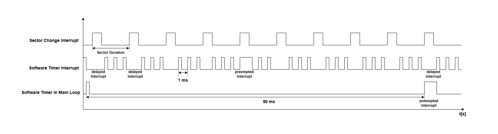

Interrupts (ISRs) used by the application:

1. Sector timer interrupt - Variable period, dependent on the RPM of the motor (handles drive, BEMF feedback measurement and motor synchronization)
2. Software timer interrupt - 1-ms period (handles speed regulator, open loop controller, analog measurements, button and LED states)
3. Software timer in main loop - 50-ms period (handles reference commands scaling, amplitude in open-loop and speed in closed-loop, received from the potentiometer or external PWM input)

The table below presents the duration of each ISR or loop in the aplication:

| MCU and XC8 Options | Sector Timer ISR [μs] | 1 ms ISR [μs] | 50 ms Software Timer [μs] | Speed Regulator Loop [μs]   |
|:-------------------:|:---------------------:|:-------------:|:-------------------------:|:---------------------------:|
|AVR16EB32 FREE       |    23.5               |   21.5        |   45                      |   5.5                       |
|AVR16EB32 PRO        |    21.5               |   17          |   36                      |   5                         |
|ATMEGA4809 FREE      |    23.5               |   21.5        |   45                      |   5.5                       |
|ATMEGA4809 PRO       |    21.5               |   17          |   35                      |   5                         |
|AVR128DA48 FREE      |    20.5               |   17          |   38                      |   4                         |
|AVR128DA48 PRO       |    18.5               |   14          |   30                      |   4                         |

<br> <b>Notes:</b>

1. FREE refers to the default optimization of the XC8 compiler version, available without license. PRO refers to the speed-optimized XC8 compiler version, available with license.

2. The sector timer interrupt has a higher priority and will preempt running other interrupts, increasing their overall execution time, or will delay other interrupts. One sector duration represents a sixth of one electrical revolution. The duration of one electrical revolution is inversely proportional with the rotational speed, expressed in revolutions per second. 

### Motor Drive Sequence

Drive sequence legend for three-phase motors:

| Sector | Drive AH | Drive AL | Drive BH | Drive BL | Drive CH | Drive CL | Motor Phase A | Motor Phase B | Motor Phase C |
|:------:|:--------:|:--------:|:--------:|:--------:|:--------:|:--------:|:-------------:|:-------------:|:-------------:|
|   S1   |    Low   |   Low    |   PWM    |   Low    |   Low    |   High   |   Floating    |  PWM Driven   |  Low Driven   |
|   S2   |    PWM   |   Low    |   Low    |   Low    |   Low    |   High   |   PWM Driven  |  Floating     |  Low Driven   |
|   S3   |    PWM   |   Low    |   Low    |   High   |   Low    |   Low    |   PWM Driven  |  Low Driven   |  Floating     |
|   S4   |    Low   |   Low    |   Low    |   High   |   PWM    |   Low    |   Floating    |  Low Driven   |  PWM Driven   |
|   S5   |    Low   |   High   |   Low    |   Low    |   PWM    |   Low    |   Low Driven  |  Floating     |  PWM Driven   |
|   S6   |    Low   |   High   |   PWM    |   Low    |   Low    |   Low    |   Low Driven  |  PWM Driven   |  Floating     |

<br>Drive sequence legend for one-phase motors:

| Sector | Drive AH | Drive AL | Drive BH | Drive BL | Motor Phase A | Motor Phase B |
|:------:|:--------:|:--------:|:--------:|:--------:|:-------------:|:-------------:|
|   S1   |    Low   |   Low    |   Low    |   Low    |   Floating    |  Floating     |
|   S2   |    PWM   |   Low    |   Low    |   High   |   PWM Driven  |  Low Driven   |
|   S3   |    Low   |   Low    |   Low    |   Low    |   Floating    |  Floating     |
|   S4   |    Low   |   High   |   PWM    |   Low    |   Low Driven  |  PWM Driven   |

<br>Drive AH, BH and CH pins are Waveform Output (WO) pins, that are controlled by a timer and change their duty cycle based on the control algorithm.
<br>Drive AL, BL and CL are General Purpose Input/Output (GPIO) pins, that change their state based on the current sector.
<br>The drive sequence is the same in both PWM mode and Single Pulse mode, the difference consisting in the way the AH, BH and CH signals are generated using the PWM timer.

#### PWM Mode

<br> This is the default drive mode. In this mode, the sector timer has a variable period based on the speed of the motor, and the PWM timer has a fixed period of 25.6 μs (~40 kHz switching frequency). In each sector, there are multiple periods of the PWM timer. By using this mode, high electrical speeds can be achieved (<200,000 electrical RPM). However, this mode is not useful anymore at very high speeds (>200,000 Electrical RPM), due to switching losses and limited resolution of the PWM timer using a fixed period. The solution is to switch to the Single Pulse mode when a threshold speed is achieved.

<h4> PWM Mode Drive Signals </h4>

|          Three Phase Motors                                            |            One Phase Motors                                                |
|:----------------------------------------------------------------------:|:--------------------------------------------------------------------------:|
| 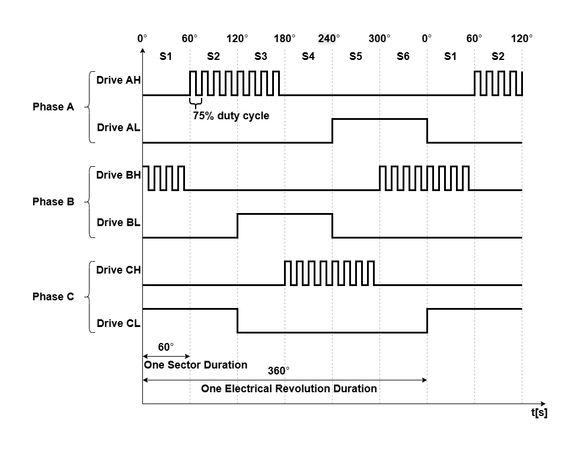 | 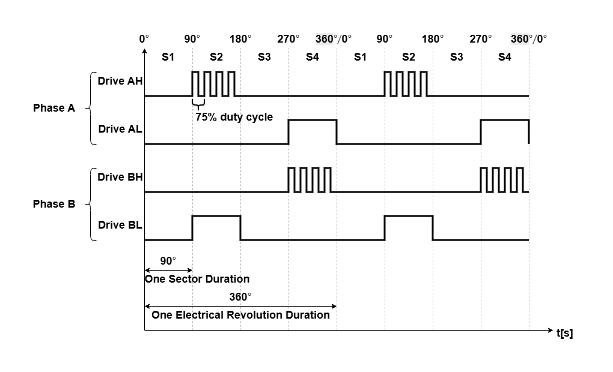 |

#### Single Pulse Mode

<br>This mode must be activated by using `SINGLE_PULSE_MODE` and setting values to `PWM_TO_SP_THRESHOLD` and `SP_TO_PWM_THRESHOLD` in the `config.h` file before run time.
<br>`PWM_TO_SP_THRESHOLD` and `SP_TO_PWM_THRESHOLD` represent the speed limits when the switch from one mode to the other occurs. Note that there is a difference between the two values. To avoid unwanted switches between the two modes, a hysteresis mechanism has been implemented.
<br>It is recommended to switch to Single Pulse mode when the speed reaches a value big enough that there are fewer than five PWM timer periods per one sector. Similarly, switch back to PWM mode when there are seven or more PWM timer periods per one sector.
<br>Single Pulse mode has two advantages that allow it to reach higher speeds than PWM modes. The first one is that there are significantly less switching losses compared to PWM mode, as there is only one big `ON` time and one big  `OFF` time in one electrical period of six sectors, for each phase. The second advantage is the increased timer resolution provided by a variable period. This is observable at very high speeds, because in the PWM mode there can be sectors with different numbers of PWM timer periods. In Single Pulse mode, the sectors are equal even at very high speeds, because there is just one big `ON` time instead of multiple 'ON' times, as seen in PWM mode.

<h4> Single Pulse Mode Drive Signals </h4>

|          Three Phase Motors                                            |            One Phase Motors                                                |
|:----------------------------------------------------------------------:|:--------------------------------------------------------------------------:|
| 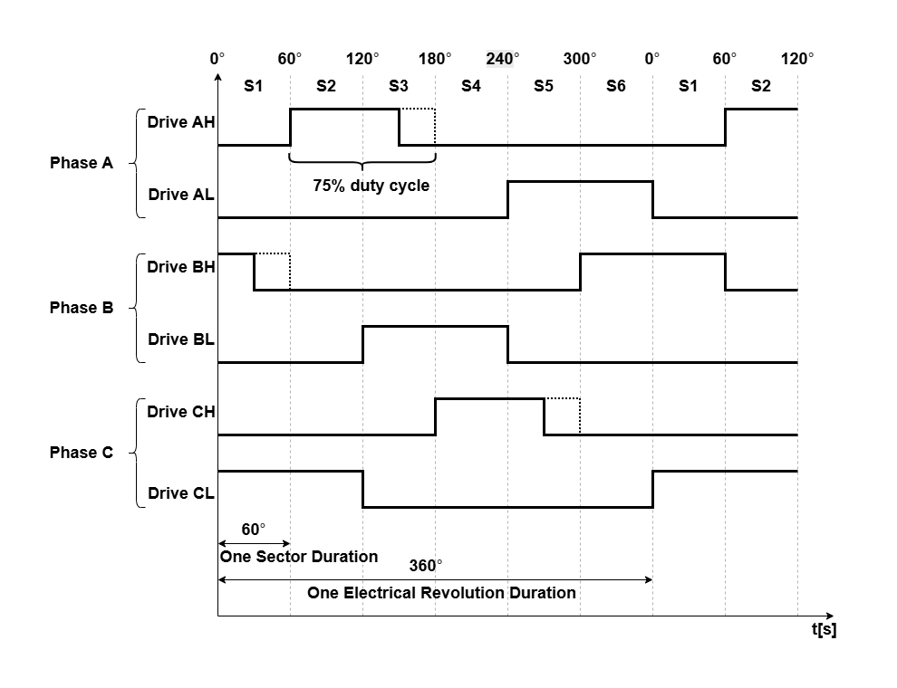  | 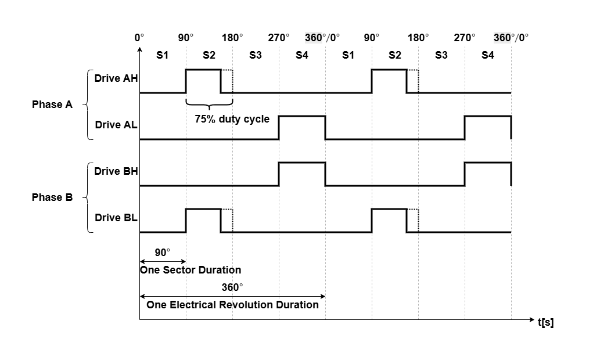  |

#### Switching Between PWM and Single Pulse

<br> The Single Pulse mode has certain advantages compared to PWM mode, in the context of high speed values. At lower speeds, the PWM mode is much more reliable. Most motors cannot even be started using Single Pulse mode, because of the very fast rise of the current through the windings. The working principle is to spin the motor in PWM mode until it reaches the maximum possible speed (<200,000 electrical RPM), and then switch to Single Pulse mode to reach extreme speeds (>200,000 electrical RPM).

<h4>PWM Mode to Single Pulse Mode Overview </h4>

|          Three Phase Motors                                             |            One Phase Motors                                                 |
|:-----------------------------------------------------------------------:|:---------------------------------------------------------------------------:|
| 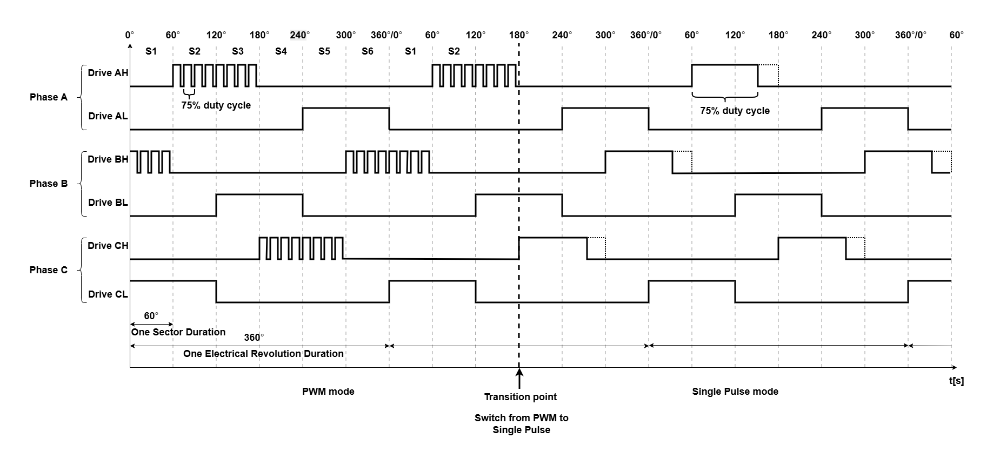    | 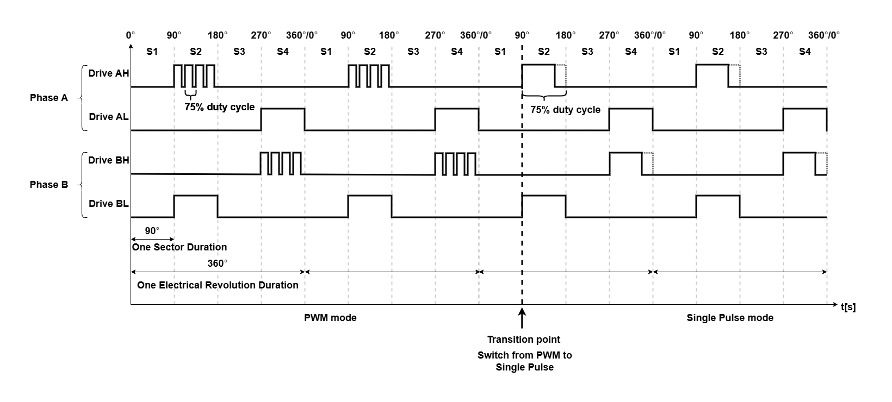    |

<br> It can be noticed that the duty cycle (75% in this example) remains the same after switching from one mode to another, but it is scaled to the new period of the PWM timer.

### Motor Feedback Sensing

<br>

#### BEMF Sensing

<br> The rotor position estimation in the Trapezoidal Sensorless Control mode is done by monitoring the BEMF signals from the motor phases. For best efficiency, the BEMF signals must be in-phase with the current signals for each motor phase.

<h4> Drive, BEMF and Current Signals for One Motor Phase </h4>

<br>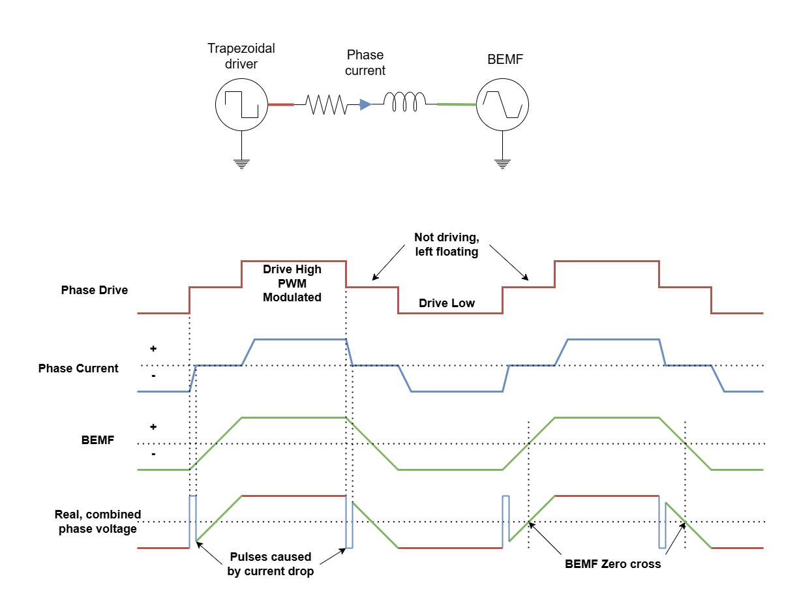

<br> For sensorless feedback, the values of the BEMF signals for each motor phase are sampled with the Analog Comparator (AC) peripheral. During each sector, one of the three motor phases will be in Floating state, for the BEMF to be read. All the PWM driving signals from the respective motor phase must be ‘`0`’ logically low synchronously, the coil is not driven, and the signal measured after all the propagation delays represent the motor’s BEMF.

<br> The Analog Comparator (AC) is connected to the divided motor phase signals at its positive input. A multiplexed input selection is used to switch between motor phases, enabling the acquisition of the required data. The AC is connected to the motor, summing neutral at the negative input. The neutral is reconstructed using hardware components in a resistor-star configuration. The signals are divided in ranges of 0 to 3.3V, in order to be readable by the microcontroller (MCU). The values for the voltage dividers used in this application are the ones present on the MPPB.

<h4> BEMF Sensing Overview </h4>

<br>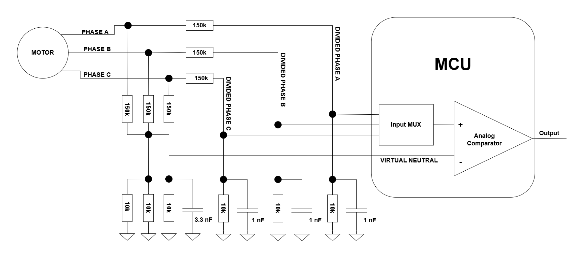

<h4> Sector Commutation Overview</h4>

|          Three Phase Motors                                            |            One Phase Motors                                                |
|:----------------------------------------------------------------------:|:--------------------------------------------------------------------------:|
| 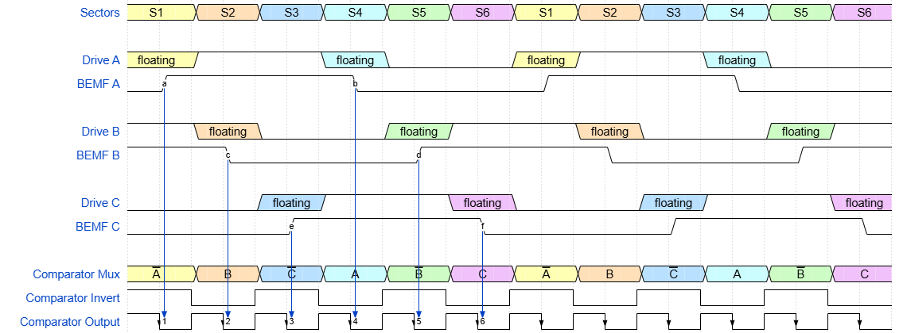        | 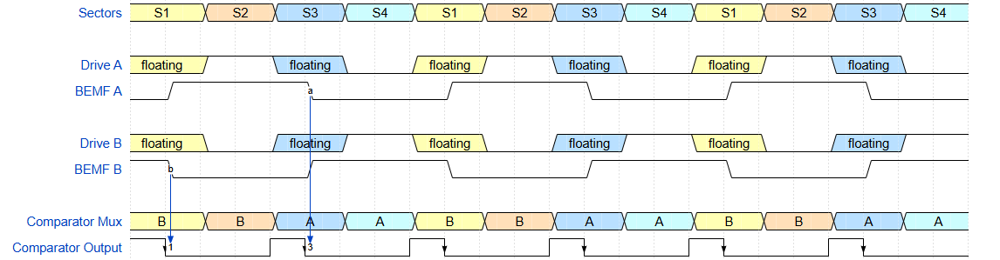        |

<br> The sensorless control is very reliable at high speeds; however, the only drowback is related to achieving synchronization at speeds lower than 10% to 15% of the nominal speed of the motor. In this case, the level of the BEMF signals are comparable with noise signals from PWM and their magnitude is not high enough to accurately detect zero-crosses. Thus, the motor synchronization with BEMF is not possible at a very low speed.

#### Hall Sensing

<br> The estimation of the rotor position in the Trapezoidal Sensored-Control mode is done by monitoring the Hall sensors signals. The transitions from the sensors during the rotor magnet passing by decides when to switch to a new sector. Usually, the Hall sensors are in groups of three, placed inside the motor, with each sensor being 120° apart one from another.

<h4> Reading Hall Signals </h4>

<br>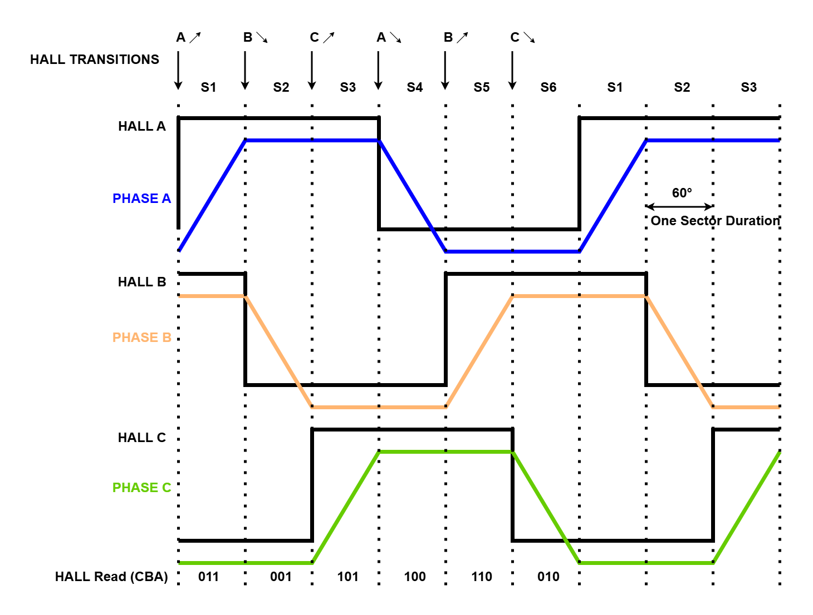

The Hall signals are monitored using GPIO pins that are connected via the Event System (EVSYS) peripheral to signal when a new transition is detected. A multiplexed input selection is used to switch between the Hall pins, enabling the acquisition of the required data.

<h4> Hall Sensing Overview </h4>

<br>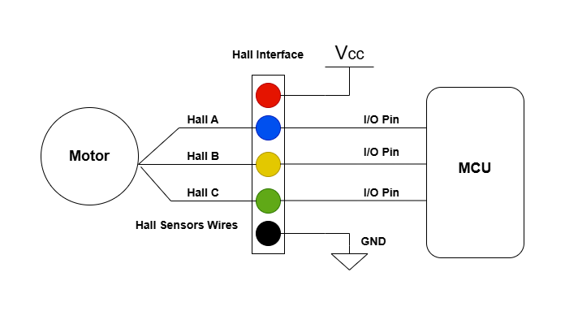

<br> The sensored control is more reliable at lower speed compared to the sensorless control, nonetheless with drowback is achieving high speed, where the sensor latency for detecting a transition can cause phase errors and lose synchronization.

<br> <b>Note:</b> The AVR16EB32 and AVR128DA48 platforms can achieve the minimum rotational speed of 120 e-RPM. The ATmega4809 platform can achieve the minimum rotational speed of 1600 e-RPM, due to hardware capabilities and limitations.

### Motor Synchronization Algorithm

<br> The motor synchronization is achieved through a simplified Proportional Integral Derivative (PID) algorithm that calculates the error between the ideal zero cross of BEMF (always set to half of the timer's period), and the actual zero cross, acquired through a hardware capture mechanism of a timer. The algorithm has only the proportional and the integral terms, but no derivative. It also uses a phase advance ranging between 0 and 30 electrical degrees, which is added to `setValue`, representing half of the period. The aim of the zero cross of the BEMF is to fall exactly in the middle of the sector, after 30 electrical degrees.
<br>The advantages of this algorithm relate to being based on bit-shifting operations and not adding too much CPU overload and interrupt time to process all the data. The speed oscillations are thus greatly reduced.

<h4> Synchronization Algorithm Timing </h4>

<br>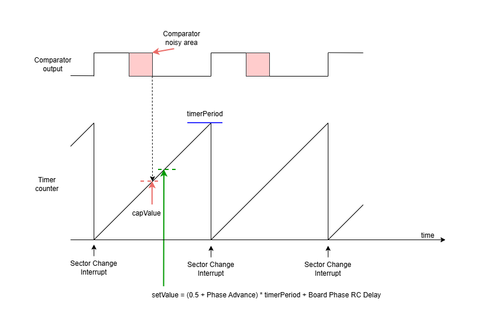

<br><b>Note:</b> The Zero-Cross Detection (ZCD) is also affected by the 10 μs RC constant. The detection of the BEMF zero cross is done after 30 electrical degrees plus the values of the phase advance and RC constant, translated in time, based on the sector length as well as on the RC delay.

<h4> Synchronization Algorithm Chart </h4>

<br>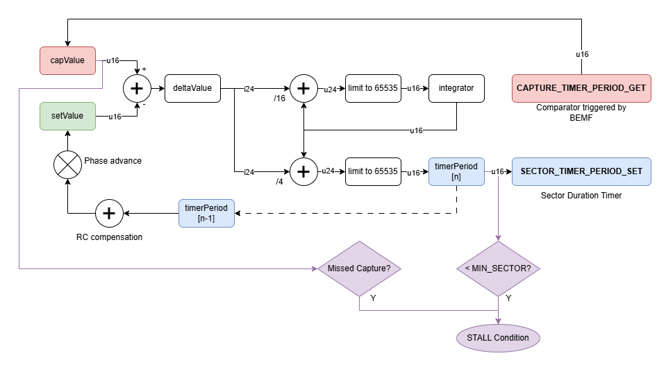

<h4> Phase Advance </h4>

For best efficiency, the BEMF signals must be in phase with the current signals for each motor phase. Due to the inductance of the motor and in the context of high RPM, the electrical time constant of the motor windings creates a delay in current buildup, causing the current signals to lag the voltage BEMF signals. Thus, phase advance is used for switching the driving sequence in advance. By switching the voltage in advance, the current has time to reach the maximum point before the BEMF signal transitions, which indicates a sector change.

<br>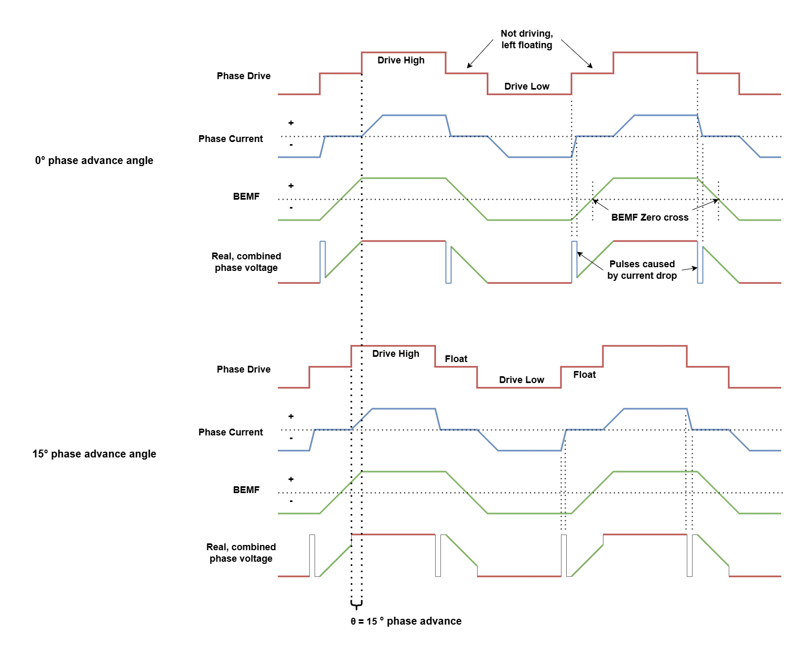

### Motor Speed Regulator Algorithm

<br> Speed regulation in Closed-Loop is achieved using a simplified PID algorithm that calculates the error between the target speed and measured speed. The algorithm only has the proportional and the integral terms, but no derivative. The target speed value is in the range between `REGULATOR_MIN_SPEED` and `REGULATOR_MAX_SPEED`. The measured speed is acquired by counting the sector change events during a fixed period of time. The values of `REGULATOR_PI_KP` and `REGULATOR_PI_KI` constants can be tuned to achieve a desired behaviour, depending on the specific motor being used. The values of the two constants must be positive.

<h4> Speed Regulator Algorithm Chart </h4>

<br>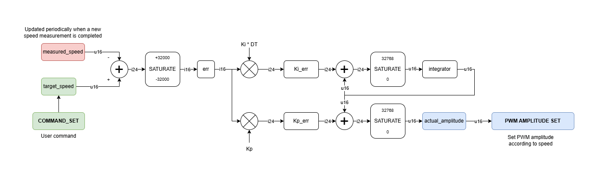

## Results

The images below present captures of the A2207 KV2500 drone motor, in PWM mode, Single Pulse mode and at full drive (maximum speed achieved at 100% duty cycle).<br>
Oscilloscope traces: 
  * Ch 1 (Blue Trace)  Phase A Current - current probe direction from the motor towards the board
  * Ch 2 (Cyan Trace)  Phase A Voltage - referenced to ground

|      Mode           |Supply Voltage [V]| Current Consumption [A] | Duty Cycle [%] | e-RPM    |
|:-------------------:|:----------------:|:-----------------------:|:--------------:|:--------:|
|     **PWM**         |     16           |     0.68                |  15            | 112,000  |

<br>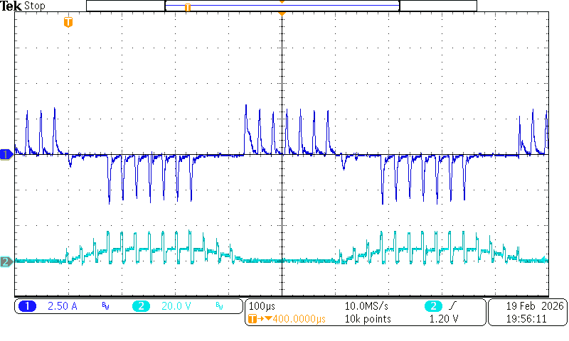

|      Mode           |Supply Voltage [V]| Current Consumption [A] | Duty Cycle [%] | e-RPM    |
|:-------------------:|:----------------:|:-----------------------:|:--------------:|:--------:|
|   **Single Pulse**  |     16           |     2.00                |  38            | 250,000  |

<br>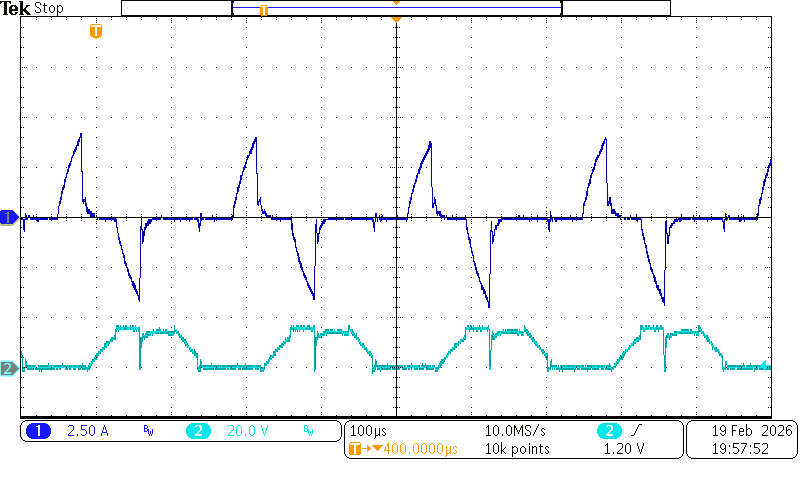

|      Mode           |Supply Voltage [V]| Current Consumption [A] | Duty Cycle [%] | e-RPM    |
|:-------------------:|:----------------:|:-----------------------:|:--------------:|:--------:|
|    **Full Drive**   |     16           |     2.40                |  100           | 280,000  |

<br>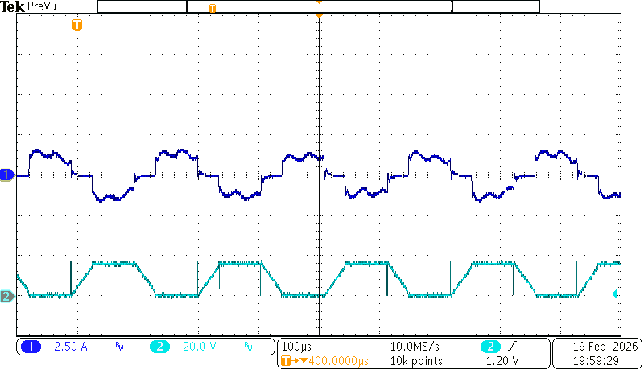

<br>Results obtained with various motors used in this project:

| Motor                 | Brief Specifications            | Supply Voltage [V] | Current Consumption [A] | e-RPM                    | Type    |
|:---------------------:|:-------------------------------:|:------------------:|:-----------------------:|:------------------------:|:-------:|
|ACT42BLF01             | 24 V / 1.9 A / 4 pp* / 4 kRPM   |    24              |      0.20  (no load)    |       15,000             | 3-phase |
|ACT57BLF02             | 24 V / 7.8 A / 4 pp / 3 kRPM    |    24              |      0.50  (no load)    |       12,000             | 3-phase |
|Hurst DMA0002024C1010  | 24 V / 4 A / 5 pp* / 3 kRPM     |    24              |      0.14  (no load)    |       15,000             | 3-phase |
|Hair Dryer             | 12 V / 150 W / 1 pp / 130 kRPM  |    12              |      11.0  (own fan)    |      120,000             | 3-phase |
|A2207 KV2500           | 16.8 V / 7 pp / 42 kRPM         |    16              |      2.2   (no load)    |      250,000             | 3-phase |
|A2212 KV2200           | 12 V / 6 pp / 26 kRPM           |    12              |      2.5   (no load)    |      180,000             | 3-phase |
|A10 KV2900             | 8.4 V / 6 pp / 23 kRPM          |     9              |      1.5   (no load)    |      140,000             | 3-phase |
|Hair Dryer             | 220 V / 100 W / 1 pp / 110 kRPM |    50              |      0.07  (own fan)    |       25,000             | 3-phase |
|Hair Dryer One Phase   | 220 V / 120 W / 2 pp / 110 kRPM |    50              |      0.12  (own fan)    |       80,000             | 1-phase |

**Note:** *pp - pole pairs

## Summary

<br>This project provides support for spinning a BLDC/PMSM motor using the Trapezoidal Drive method and feedback from the BEMF ZCD or Hall sensors to achieve motor synchronization in an Open-Loop configuration and speed control in a Closed-Loop configuration. The control algorithm is straightforward and robust and it can be implemented on a variety of low-end MCUs that have a few timer capabilities, with an AC and an ADC.
