[](https://www.microchip.com)

## Motor Control With AVR® Family

This repository features a motor control application designed for sinusoidal control, which includes two implementations based on the AVR family: AVR16EB32 and AVR128DA48. Check the [*Release Notes*](#release-notes) section to see the available functionality of the current release. The aim of this application is to maintain stability through a simplified Proportional-Integral (PI) algorithm. Sensorless control using Back Electromotive-Force (BEMF) and Sensored control using Hall sensors is supported. These two code examples have the same functionality; the only difference being the device used.

- <b>AVR EB</b> has two new peripherals: the Timer Counter type E (TCE) and the Waveform Extension (WEX), with new hardware capabilities designed to handle functions typically managed by software in motor control, as described in the [Getting Started with the TCE and WEX](https://onlinedocs.microchip.com/oxy/GUID-8FB8D192-E8C9-4748-B991-D4D842E01591-en-US-1/index.html) and in the [AVR® EB Data Sheet](https://www.microchip.com/en-us/product/avr16eb32#document-table)

- <b>AVR DA</b> provides increased memory, higher CPU frequency and additional pins, as described in the [AVR® DA Data Sheet](https://www.microchip.com/en-us/product/avr128da48#document-table)
  
The application is designed to obtain a sinusoidal drive with motor synchronization. The focus is on the Brushless Direct Current (BLDC) and Permanent Magnet Synchronous (PMSMs) motors.

The sensored feedback and synchronization are achieved using the transitions from the Hall sensors, corresponding to each of the three phases of the motor. The transitions are captured by periodically reading the Hall sensors pins. The motor synchronization is achieved using a PI algorithm that calculates the error between the given stator angle and the acquired rotor angle from Halls.

The sensorless feedback and synchronization are achieved by reconstructing the BEMF signals of the motor phases from the measured currents corresponding to each phase. The BEMF zero-crosses are captured by periodically sampling the reconstructed signals. The motor synchronization is achieved using a PI algorithm that calculates the error between the given stator angle and the acquired rotor angle from BEMF.

Field Oriented Control (FOC) is not used in this application, due to a lack of computational power of 8-bit AVR devices. Instead, a simplified, but efficient sinusoidal drive is implemented. The difference, compared to FOC control, is that in this application the absolute rotor angle can be acquired only every 60 electrical degrees using interpolation between two BEMF zero-crosses or Hall transitions.

<h2> Table of Contents </h2>

- [Motor Control With AVR® Family](#motor-control-with-avr-family)
- [Release Notes](#release-notes)
- [Related Documentation](#related-documentation)
- [Software Used](#software-used)
- [Hardware Used](#hardware-used)
- [Solution Diagram](#solution-diagram)
- [Quick Start Guide](#quick-start-guide)
  - [Physical Setup](#physical-setup)
  - [Curiosity Nano — MPPB Pin Mapping](#curiosity-nano--mppb-pin-mapping)
  - [Necessary Hardware Tweaks](#necessary-hardware-tweaks)
  - [Configuration Settings](#configuration-settings)
- [Programming the AVR® MCU](#programming-the-avr-mcu)
  - [Programming Using MPLAB® X IDE](#programming-using-mplab-x-ide)
  - [Programming Using VS Code®](#programming-using-vs-code)
- [Application Usage](#application-usage)
  - [Let's Spin the Motor](#lets-spin-the-motor)
  - [Tunning Guide](#tunning-guide)
  - [Console Interface](#console-interface)
  - [PWM Input Interface](#pwm-input-interface)
- [Software Description](#software-description)
  - [Software Organization in Folders and Files](#software-organization-in-folders-and-files)
  - [MCC Maping](#mcc-maping)
  - [Application Block Overview](#application-block-overview)
  - [Application Flowchart](#application-flowchart)
  - [Application Programming Interface Functions](#application-programming-interface-functions)
  - [Configurable Parameters](#configurable-parameters)
  - [Application Interrupt Window Time](#application-interrupt-window-time)
  - [Motor Sinusoidal Drive](#motor-sinusoidal-drive)
  - [Motor Feedback Sensing](#motor-feedback-sensing)
    - [Hall Sensing](#hall-sensing)
    - [BEMF Sensing](#bemf-sensing)
    - [Single-Shunt DC Bus Current Sensing Overview](#single-shunt-dc-bus-current-sensing-overview)
    - [Proposed Dual-Shunt Current Sensing Method](#proposed-dual-shunt-current-sensing-method)
    - [BEMF Reconstruction Algorithm](#bemf-reconstruction-algorithm)
  - [Motor Synchronization Algorithm](#motor-synchronization-algorithm)
  - [Motor Speed Regulator Algorithm](#motor-speed-regulator-algorithm)
- [Results](#results)
- [Summary](#summary)

## Release Notes

Current Version 2.0.0 features:

- Support for the sensorless sinusoidal control (not FOC) using BEMF reconstruction
- Configurable speed ramp at start-up with the following parameters: start-speed, end-speed and speed-step
- Pulse-Width Modulation (PWM) switching frequency at 20 kHz and BEMF/Hall feedback processing frequency at 10 kHz
- Tested speed up to <b>15000 eRPM</b>

Version 1.0.0 features:

- Support for three-phase BLDC and PMSM motors
- Motor specification in the configuration file
- Sinusoidal drive using a saddle profile
- Support for the sensored control using Hall sensors
- Start ramp
- Support for changing the motor spinning direction at run-time, clockwise (CW) and counterclockwise (CCW)
- Proportional-Integral (PI) algorithm with fixed parameters for Open-Loop synchronization
- Speed regulator with adjustable Kp and Ki parameters for Closed-Loop control
- Fault support for hardware Peak Overcurrent Protection (Peak OCP), software Average Overcurrent Protection (Avg OCP), Overvoltage Protection (OVP) and Stall Detection
- Current, Voltage Bus and Potentiometer analog measurements at run-time
- PWM input for compatibility with radio-controlled receivers
- PWM switching frequency at 20 kHz

## Related Documentation

More details and code examples on the AVR16EB32 and AVR128DA48 can be found at the following links:

- [AVR<sup>®</sup> EB Family Page](https://www.microchip.com/en-us/products/microcontrollers-and-microprocessors/8-bit-mcus/avr-mcus/avr-eb?utm_source=GitHub&utm_medium=TextLink&utm_campaign=MCU8_AVR-EB&utm_content=avr-motor-control-sinusoidal-github&utm_bu=MCU08)
- [AVR<sup>®</sup> EB Code Examples](https://mplab-discover.microchip.com/v2?dsl=avr16eb32)
- [AVR<sup>®</sup> DA Product Page](https://www.microchip.com/wwwproducts/en/AVR128DA48?utm_source=GitHub&utm_medium=TextLink&utm_campaign=MCU8_AVR-DA&utm_content=avr-motor-control-sinusoidal-github&utm_bu=MCU08)
- [AVR<sup>®</sup> DA Code Examples](https://mplab-discover.microchip.com/v2?dsl=avr128da48)

## Software Used

- [MPLAB® X IDE v6.35 or newer](https://www.microchip.com/en-us/tools-resources/develop/mplab-x-ide?utm_source=GitHub&utm_medium=TextLink&utm_campaign=MCU8_AVR-EB&utm_content=avr-motor-control-sinusoidal-github&utm_bu=MCU08)
- [MPLAB Code Configurator (MCC) v5.9.0 or newer](https://www.microchip.com/en-us/tools-resources/configure/mplab-code-configurator?utm_source=GitHub&utm_medium=TextLink&utm_campaign=MCU8_AVR-EB&utm_content=avr-motor-control-sinusoidal-github&utm_bu=MCU08)
- [MPLAB® Tools for VS Code® v1.2.5 or newer](https://www.microchip.com/en-us/tools-resources/develop/mplab-tools-vs-code?utm_source=GitHub&utm_medium=TextLink&utm_campaign=MCU8_AVR-EB&utm_content=avr-motor-control-sinusoidal-github&utm_bu=MCU08)
- [MPLAB® XC8 compiler v4.00 or newer](https://www.microchip.com/en-us/tools-resources/develop/mplab-xc-compilers?utm_source=GitHub&utm_medium=TextLink&utm_campaign=MCU8_AVR-EB&utm_content=avr-motor-control-sinusoidal-github&utm_bu=MCU08)
- [AVR-Ex DFP v2.12.239 or newer](https://packs.download.microchip.com/)
- [AVR-Dx DFP v2.8.343 or newer](https://packs.download.microchip.com/)

## Hardware Used

- [AVR<sup>®</sup> EB Curiosity Nano](https://www.microchip.com/en-us/development-tool/EV73J36A?utm_source=GitHub&utm_medium=TextLink&utm_campaign=MCU8_AVR-EB&utm_content=avr-motor-control-sinusoidal-github&utm_bu=MCU08)
- [AVR<sup>®</sup> DA Curiosity Nano](https://www.microchip.com/en-us/development-tool/dm164151?utm_source=GitHub&utm_medium=TextLink&utm_campaign=MCU8_AVR-DA&utm_content=avr-motor-control-sinusoidal-github&utm_bu=MCU08)
- [Multi-Phase Power Board (MPPB)](https://www.microchip.com/en-us/development-tool/EV35Z86A?utm_source=GitHub&utm_medium=TextLink&utm_campaign=MCU8_AVR-EB&utm_content=avr-motor-control-sinusoidal-github&utm_bu=MCU08)
- [AVR EB Curiosity Nano Adaptor to MPPB](https://www.microchip.com/en-us/development-tool/EV88N31A)
- [AVR DA Curiosity Nano Adaptor to MPPB](#curiosity-nano---mppb-pin-mapping), made with wires
- A voltage power supply (6-50V and 10A limit, depending on the motor used)
- At least one BLDC motor
- For the development and testing of this demo, the following motors were used:
  - ACT42BLF01
  - ACT57BLF02
  - Hurst DMA0002024C1010
  - Hurst DMA0204024B101

## Solution Diagram

<br>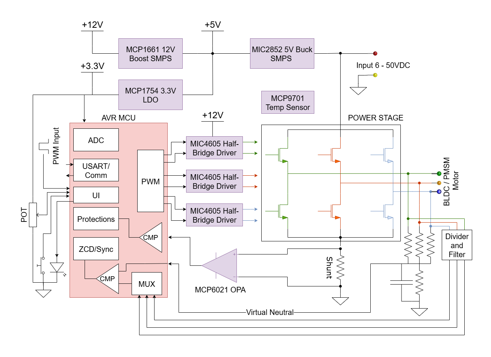

## Quick Start Guide

### Physical Setup

The AVR16EB32 or AVR128DA48 Curiosity Nano Development boards are used along with the MPPB, AVR EB or AVR DA CNANO to MPPB adapter board, the BLDC motor and a voltage power supply.

<br>Connection steps:

1. Plug in the AVR16EB32 or AVR128DA48 Curiosity Nano board in the connector present on the MPPB adapter board.
2. Plug in the MPPB adapter board to the MPPB board.
3. Plug in the AVR® EB or AVR DA Curiosity Nano boards to the PC.
4. Connect the voltage power supply wires to the V_SUPPLY conector from the MPPB.
5. Connect the motor phase wires to the PHASE connector from MPPB in order: A, B and C.
6. Connect the Hall sensors wires to the HALL SENSOR connector from MPPB (phase A with Hall A, phase B with Hall B and phase C with Hall C).

<br> <b>Note:</b> The order of Hall sensors wires must match the order of motor phases wires for the control algorithm to work. The A, B, and C wire connection succession is mandatory for both motor phases and Hall sensors.

<h4> Example Setup</h4>

<br> 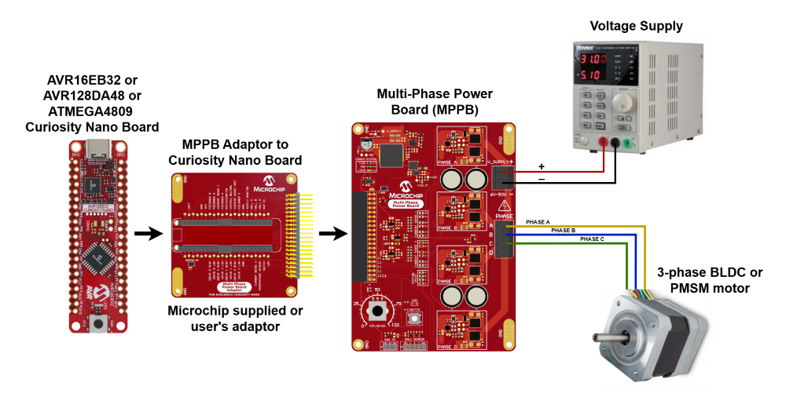 

### Curiosity Nano — MPPB Pin Mapping

If the MPPB and the adapter boards are not used, the user can integrate the AVR EB or AVR DA boards into another hardware setup by using the following pinouts:

| Curiosity Nano Boards Pinout                                              | Curiosity Nano — MPPB Pin Mapping                                        |
|:-------------------------------------------------------------------------:|:------------------------------------------------------------------------:|
| 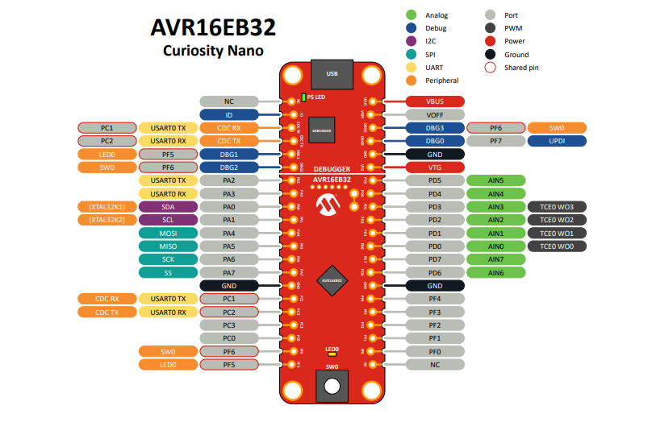                                   | 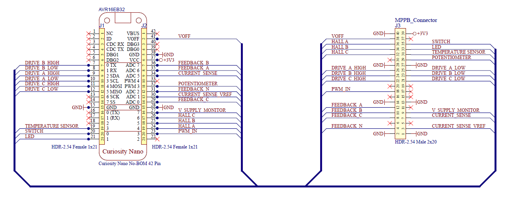                                   |
| 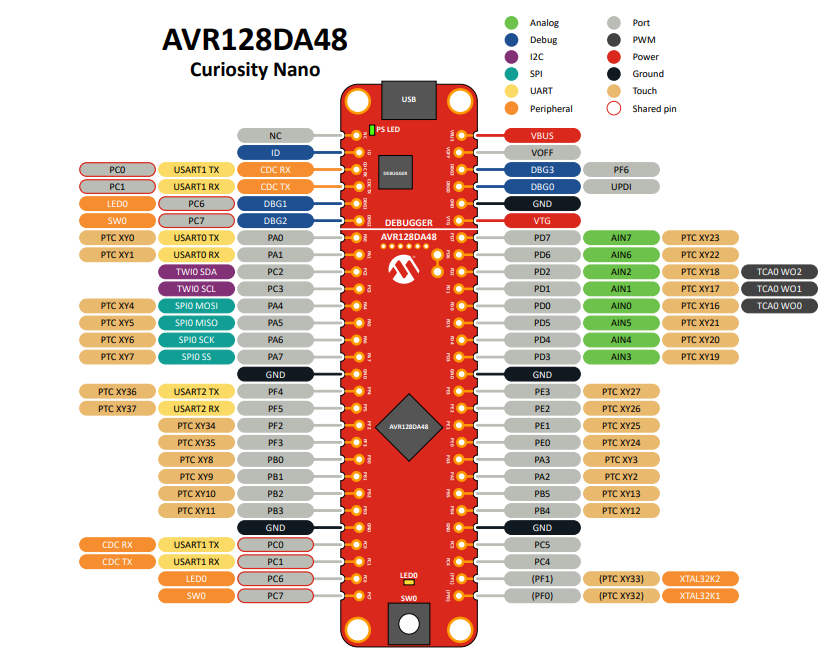                                   | 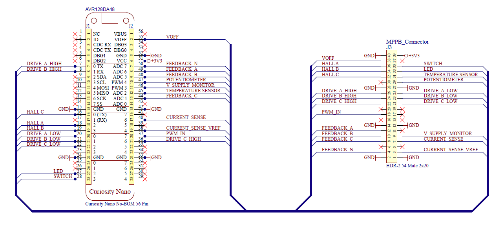                                   |

<h4> Pin Mapping Legend — AVR16EB32 and AVR128DA48 Curiosity Nano Boards to MPPB </h4>

| Pin Name                      | AVR16EB32 Curiosity Nano Board | AVR128DA48 Curiosity Nano Board | MPPB Board                    |
|-------------------------------|--------------------------------|---------------------------------|-------------------------------|
|Drive A High                   |Pin 9  - PA0                    |Pin 7  - PA0                     |Pin 26                         |
|Drive A Low                    |Pin 10 - PA1                    |Pin 20 - PB0                     |Pin 25                         |
|Drive B High                   |Pin 7  - PA2                    |Pin 8 -  PA1                     |Pin 24                         |
|Drive B Low                    |Pin 8  - PA3                    |Pin 21 - PB1                     |Pin 23                         |
|Drive C High                   |Pin 11 - PA4                    |Pin 36 - PA2                     |Pin 22                         |
|Drive C Low                    |Pin 12 - PA5                    |Pin 22 - PB2                     |Pin 21                         |
|Current Sense 1                |Pin 34 - PD3                    |Pin 40 - PE2                     |Pin 7                          |
|Current Sense 2                |Pin 18 - PC3                    |Pin 39 - PE1                     |Pin 5                          |
|Current Sense V<sub>REF</sub>  |Pin 30 - PD7                    |Pin 38 - PE0                     |Pin 3                          |
|Current Trip                   |Pin 34 - PD3                    |Pin 40 - PE2                     | -                             |
|V Supply Monitor               |Pin 27 - PF4                    |Pin 46 - PD0                     |Pin 9                          |
|Potentiometer                  |Pin 32 - PD1                    |Pin 47 - PD1                     |Pin 29                         |
|LED                            |Pin 21 - PF5                    |Pin 27 - PC6                     |Pin 33                         |
|Switch                         |Pin 20 - PF6                    |Pin 28 - PC7                     |Pin 35                         |
|PWM IN                         |Pin 23 - PF0                    |Pin 37 - PA3                     |Pin 18                         |
|TXC                            |Pin 16 - PC1                    |Pin 25 - PC0                     | -                             |
|RXC                            |Pin 17 - PC2                    |Pin 26 - PC1                     | -                             |
|HALL A                         |Pin 24 - PF1                    |Pin 18 - PF2                     |Pin 36                         |
|HALL B                         |Pin 25 - PF2                    |Pin 19 - PF3                     |Pin 34                         |
|HALL C                         |Pin 26 - PF3                    |Pin 16 - PF4                     |Pin 32                         |
|3V3                            |Pin 37                          |Pin 51                           |Pin 39                         |
|V<sub>OFF</sub>                |Pin 41                          |Pin 55                           |Pin 38                         |
|GND                            |Pins: 38, 28, 15                |Pins: 52, 42, 33, 24, 15         |Pins: 40, 28, 27, 14, 13, 2, 1 |

<br><b>Note:</b> In this repository schematics for the two platforms are provided in the `pdf` folder:

- AVR16EB32_MPPB_Mapping
- AVR128DA48_MPPB_Mapping

</br>

### Necessary Hardware Tweaks

<br> This demo requires removing the `B+`, `B-`, `C+` and `C-` SMD resistors from the MPPB board in the `CURRENT SENSE 1` section, and swapping the place of `D+` and `D-` SMD resistors to `B+` and `B-` pads in the `CURRENT SENSE 2` section. The MPPB comes with the default configuration of a single-shunt topology, where the current from all three phases A, B and C, total DC bus current, can be measured. If sensorless control is preffered, a dual-shunt configuration is needed, so that the individual currents from phase A and B can be measured. The third current from phase C is determined using Kirchhoff's law.

<br><br>

<br> <b>Notes:</b>

1. The resistors' location is marked with green rectangles.
2. The resistors configuration can be left as it is, if only sensored control is preferred.

### Configuration Settings

<br>The following configuration settings (apart from the default values) are needed to run the demo in the Sinusoidal Sensorless mode with the ACT57BLF02 motor. If Sensored mode is preferred, then set `HALL_ENABLED` to true.
<br>Edit the settings in the [`config.h`](#configurable-parameters) configuration file according to the usage scenario.

<br><h3> ACT57BLF02 Motor Configuration Settings </h3>

```c
/* PWM-In settings */
#define PWM_IN_PERIOD                   (20.0)       /* ms */
#define PWM_IN_MAX_DCY                  ( 2.0)       /* ms */
#define PWM_IN_MIN_DCY                  ( 1.0)       /* ms */

/* Board specific settings - MPPB */
#define CURRENT_SHUNT_RESISTANCE        (0.01)       /* Resistance in ohm of the current shunt */
#define CURRENT_AMPLIFIER_GAIN          (15.0)
#define VBUS_DIVIDER                    (16.0)
#define ANALOG_REFERENCE                (3300.0)     /* mV */
#define ADC_VBUS_TRIP                   (51000.0)    /* mV - VBUS trip level */
#define ADC_CURRENT_TRIP                (15000.0)    /* mA - ADC current trip level */
#define COMPARATOR_CURRENT_TRIP         (22000.0)    /* mA - Comparator trip level - not used on external-comparator configurations */
#define FAULT_COMPARATOR_EN             true
#define BOARD_MOSFET_RDSON              (0.004)      /* ohm - MOSFETs Rds-on resistance */

/* Motor-specific settings */
/* ACT57BLF02:  supply 24V, 3A limit */
#define MOTOR_PHASE_ADVANCE             (12.0)       /* Phase advance 0.0 ... 30.0 electrical degrees */
#define MOTOR_STARTUP_CURRENT           (13000.0)    /* mA - Initial alignment current pulse may be higher than overcurrent protection */
#define MOTOR_RPP                       (0.45)       /* ohm - Motor resistance measured phase-to-phase */
#define MOTOR_LPP                       (0.3)        /* mH - Motor inductance measured phase-to-phase */
#define MOTOR_ALIGNMENT_DURATION        (100)        /* ms */
#define MOTOR_AMPRAMP_STEP_INTERVAL     (3)          /* Amplitude ramp step interval: expressed in milliseconds, representing the time passed between two amplitude steps - 1 for aggresive ramp, 10 for soft ramp */    
#define MOTOR_STARTUP_TIME              (100)        /* ms - Delay until commands (POT or PWM-in) are accepted; a value of '-1' causes commands to be ignored */
#define MOTOR_RAMP_START_SPEED          (500.0)      /* e-RPM - Specifies the initial speed - minimum value is 100 e-RPM*/
#define MOTOR_RAMP_END_SPEED            (3600.0)     /* e-RPM */
#define MOTOR_RAMP_STEP_SPEED           (3)          /* e-RPM */
#define HALL_ENABLED                    false        /* Setting to 'true' enables the Hall synchronization, while setting to 'false' enables the BEMF synchronization */
#define HALL_MISALIGNMENT_CW            (8.0)        /* Hall misalignment 0.0 ... 90.0 electrical degrees */
#define HALL_MISALIGNMENT_CCW           (10.0)       /* Hall misalignment 0.0 ... 90.0 electrical degrees */

/* Speed regulation specific settings */
#define REGULATOR_SPEED_EN              true         /* Setting to 'true' enables speed control in Closed Loop, while setting to 'false' enables amplitude control in Open Loop */
#define REGULATOR_MAX_SPEED             (10000.0)    /* e-RPM target speed for 100% command */
#define REGULATOR_MIN_SPEED             (4000.0)     /* e-RPM target speed for   0% command */
#define REGULATOR_PI_KI                 (2.0)        /* PI speed control loop integral coefficient, minimum 1.0 */
#define REGULATOR_PI_KP                 (4.0)        /* PI speed control loop proportional coefficient, minimum 1.0 */
#define REGULATOR_PI_DT                 (10)         /* PI time step size [ms] - minimum 10 ms */

/* Drive Algorithm settings */
#define DRIVE_FORCED                    false        /* Setting to 'true' runs the motor without BEMF sensing, only blind drive and no rotor synchronization, which could overheat the motor */
#define STALL_DETECTION_THRESHOLD       (50)         /* Stall detection tolerance: a higher number leads to more tolerance to perturbances, but slower detection */
#define STALL_DETECTION_ENABLED         true         /* Setting to 'false' disables the stall detection mechanism */
#define STALL_MAXIMUM_ERPM              (30000.0)    /* e-RPM - Threshold when the algorithm might lose synchronization */
```

<br><b>Note:</b> The `config_examples` folder contains sample `config.h` files, with one example provided for each motor used to test this demo. Copy the variant of the `config.h` file corresponding to the desired motor and place it in `fw/common_files`. The copied configuration file will overwrite the old one.</br>

## Programming the AVR® MCU

The two motor demo code examples support both MPLAB X IDE and Visual Studio Code (VS Code) for programming the hardware. The processes to program the boards using the two tools is explained below.

### Programming Using MPLAB® X IDE

This chapter demonstrates how to use the MPLAB X IDE to program an AVR device with an `Example_Project.X`. This is applicable to other projects.

1. Connect the board to the PC.

2. Open the `Example_Project.X` project in MPLAB® X IDE.

3. Right click the project and select Set as Main Project.
  <br>
  <br>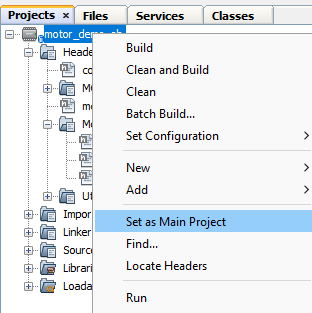

4. Select the desired configuration.
  <br>
  <br>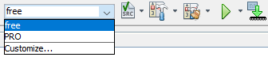

5. Clean and build the `Example Project.X` project by clicking **Clean and Build Project**.
  <br>
  <br>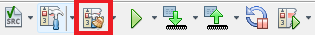

6. Click **Make and Program Device** to program the project to the board.
  <br>
  <br>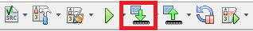

### Programming Using VS Code®

This chapter demonstrates how to use the VS Code to program an AVR device with an `Example_Project.X`. This is applicable to other projects.

1.  Connect the board to the PC.

2.  Open the `Example_Project.X` project in VS Code.

3.  Clean and build the project.
    <br>Press `Ctrl` + `Shift` + `P` on the keyboard and select MPLAB CMake: Clean and Build.
    <br>
    <br>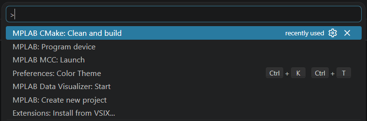

4.  Select the desired configuration.
    <br>
    <br>

5.  Program the project to the board.
    <br>Press `Ctrl` + `Shift` + `P` on the keyboard and select MPLAB: Program device.
    <br>
    <br>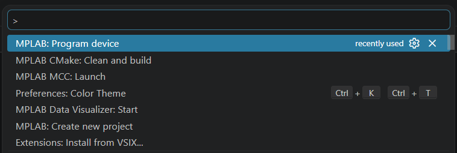

6.  Select the desired configuration.
    <br>
    <br>

7.  Select AVRxxxxx Curiosity Nano in the Connected Hardware Tool section of the project settings:
    <br>
    <br>
    <br>

<b>Important!</b>
<br>1. When opening one of the two `motor_demo_eb` or `motor_demo_da` code examples in VS Code, a pop-up window will show up asking to include the external `common_files` folder to the opened project. When the pop-window appears on the screen, click the **Yes** button, otherwise the project will not build and compile.
<br>2. When trying to program the board, another pop-up window might show up saying the build for that project is not found. If the window appears, click the **Debug Anyway** button.

## Application Usage

### Let's Spin the Motor

After all the steps from the [Quick Start Guide](#quick-start-guide) section are completed, turn the MPPB potentiometer to 50%, then press the MPPB button to spin the motor. The spinning direction depends on the wiring of the phases.

### Tunning Guide

If the motor is not yet spining after following all the steps in the [Quick Start Guide](#quick-start-guide) section, or an error message appears on the console, the steps below can help tunning the application for a new motor:

1. Measure the phase-to-phase resistance between any two wires of the motor. Put this value, expressed in ohms, in `MOTOR_RPP`, from the `config.h` file.
2. Measure the phase-to-phase inductance between any two wires of the motor. Put this value, expressed in millihenries, in `MOTOR_LPP`, from the `config.h` file.
3. Disable the speed regulator by setting `REGULATOR_SPEED_EN` to `false`.
4. The initial value for `MOTOR_STARTUP_CURRENT` can be close to the rated current of the motor.
5. If the motor is not spinning after the first two steps and reprogramming, set `MOTOR_STARTUP_TIME` to '-1' and `DRIVE_FORCED` to 'true', to put the motor in Forced Commutation mode. Try to increase `MOTOR_STARTUP_CURRENT` by 0.5A and reprogram until the motor starts spinning. Furthermore, the ramp parameters `MOTOR_RAMP_START_SPEED`, `MOTOR_RAMP_END_SPEED` and `MOTOR_RAMP_STEP_SPEED` must be adjusted until the motor spins smoothly. After the motor is spinning in Forced mode without vibrations, set `MOTOR_STARTUP_TIME` to the initial value and `MOTOR_FORCED` back to 'false' to get to open-loop synchronization.
6. `MOTOR_ALIGNMENT_DURATION` can also be adjusted. For example, for a motor with lower inductance, the alignment period is much smaller compared to a motor with higher inductance. Try to increase or decrease the duration with steps not greater than 10 ms at a time.
7. If the motor is still not spinning well, or it consumes a lot of current and not spinning at the rated speed for the rated voltage, then the `MOTOR_PHASE_ADVANCE` must be adjusted. To achieve a good current consumption and satisfying rotational speed, set `MOTOR_PHASE_ADVANCE` to 0 degrees, then increase with one degree and run again until the optimal value is found.
8. After getting the motor to spin in open loop, set the`REGULATOR_SPEED_EN` parameter back to 'true' to switch to closed-loop speed control.
9. For stability, ensure that `REGULATOR_MIN_SPEED` is high enough to run the motor stable (~10%–15% of nominal speed) and that `REGULATOR_MAX_SPEED` does not exceed the maximum rated speed at the supplied voltage.
10. For sensored control, set the `HALL_ENABLED` parameter to 'true'; start with `HALL_MISALIGNMENT_CW` and `HALL_MISALIGNMENT_CCW` configured to a initial value of 0 electrical degrees. If the motor spins eratically, consumes a lot of current or enters a Stall condition, try to increase `HALL_MISALIGNMENT_CW` and `HALL_MISALIGNMENT_CCW` with five electrical degrees at a time and run again. The values of Hall misalignment for the CW and CCW spinning direction might not be the same. If the motor has Hall sensors with inverted polarity, the misalignment values will be bigger — between 0 and 90 electrical degrees. Compare the achieved speed and current consumption with the ones rated for the supplied voltage or with the ones from sensorless control with BEMF reconstruction. If the results are the same, the motor is tuned to use Hall sensors.

### Console Interface

<br>The application has a console communication interface. To activate it, open a PC software terminal and select the UART protocol, 8N1, with a baud rate of 57600 bps.
<br> The serial interface provides information about the remote controller PWM input, potentiometer value, voltage bus value, motor current value, electrical rotations per minute (RPM) value and motor running state (ON/OFF).

<br>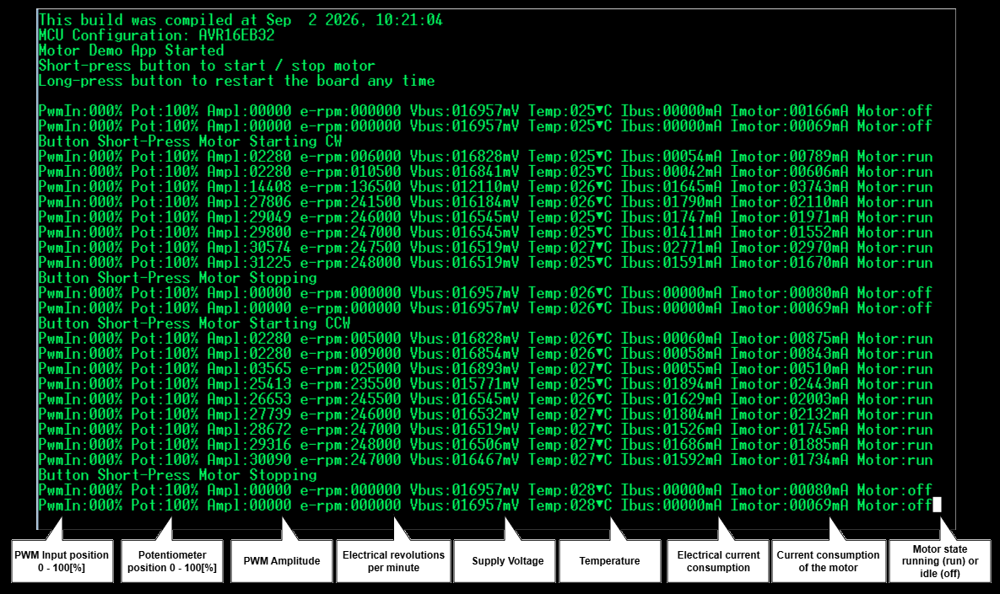

### PWM Input Interface
<br>The MPPB hardware and the software application support interfacing with a PWM Remote Controller (PWM-RC).
<br>The application measures the signals from the PWM-RC and on-board potentiometer, but the PWM-RC has priority over the potentiometer in controlling the motor.
<br>If the PWM-RC/PWM-IN signal is not detected, then the on-board potentiometer is used for control.
<br>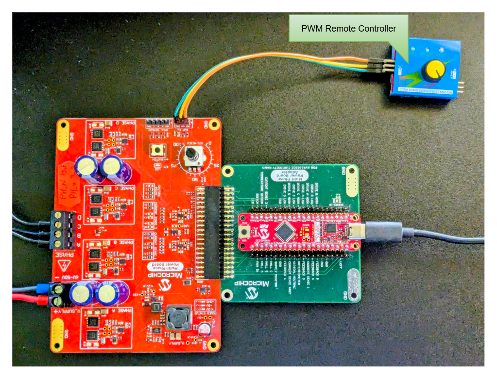

## Software Description

### Software Organization in Folders and Files

All the files shared by the three platforms are in the `common_files` folder. Each platform has its own `main.c` and `mcc_mapping.h` files.
```
   fw
    ├───common_files
    │   │   app.c
    │   │   config.h
    │   │
    │   ├───motor
    │   │       analog.c
    │   │       analog.h
    │   │       conversion_macros.h
    │   │       motor.c
    │   │       motor.h
    │   │
    │   └───utils
    │           button_led.c
    │           button_led.h
    │           dbg_logger.c
    │           dbg_logger.h
    │           dbg_pins.h
    │           precise_delay.h
    │           pwm_in.c
    │           pwm_in.h
    │           sw_timer.c
    │           sw_timer.h
    │           frac-lib.h
    │           frac-lib.s
    │
    ├───motor_demo_da.X
    │   │   main.c
    │   │   Makefile
    │   │   mcc_mapping.h
    │   │   motor_demo_da.mc3
    │   │   util_da.s
    │   │
    │   ├───mcc_generated_files
    │   └───nbproject
    │           configurations.xml
    │           project.xml
    │
    ├───motor_demo_eb.X
        │   main.c
        │   Makefile
        │   mcc_mapping.h
        │   motor_demo_eb.mc3
        │
        ├───mcc_generated_files
        └───nbproject
                configurations.xml
                project.xml
  
```

### MCC Maping

The `mcc_mapping.h` files are used to map all the port pins and low-level driver functions generated using the MPLAB® Code Configurator (MCC) to the abstract layers of the application. These layers include: motor, analog, LED/button, PWM-IN and other wrapper layers. The `mcc_mapping.h` files can be found in `fw/motor_demo_eb.X` and `fw/motor_demo_da.X`.

### Application Block Overview

<br>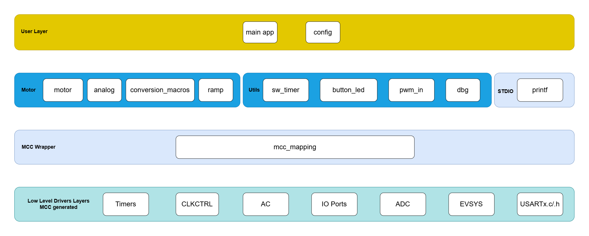

### Application Flowchart

<br>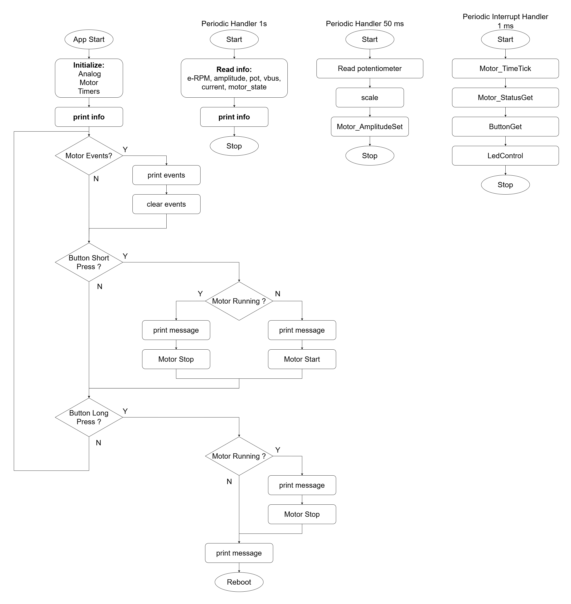

1. Short press the button on the MPPB board. The motor starts spinning in CW direction and enters the Running state. The LED from MPPB turns on. The speed can be adjusted using the potentiometer present on the MPPB board or through an external PWM-RC.
2. Short press the button from MPPB again. The motor decelerates, comes to a complete stop and enters the Idle state. The LED from MPPB turns off.
3. Short press the button on the MPPB board. The motor starts spinning in CCW direction and enters the Running state. The LED from MPPB turns on. The speed can be adjusted using the potentiometer present on the MPPB board or through an external PWM-RC.
4. Short press the button from MPPB again. The motor decelerates, comes to a complete stop and enters the Idle state. The LED from MPPB turns off.
5. Long press the button (more than 1.5s) to restart the application.
6. If a Fault event occurs, the motor stops, the event is mentioned on the console and the application enters the Idle state. The LED blinks five times signaling the error and stops afterwards.

### Application Programming Interface Functions

<br> The APIs from the Motor Control Stack found in `motor_control.h` are the following:

<br>• <b>`Motor_Initialize()`</b> - Initialization function, needs to be called before any other function
<br>• <b>`Motor_Start()`</b> - Starts the motor and sets the motor spinning direction. If the motor is already spinning, the call is ignored.
<br>• <b>`Motor_Stop()`</b> - Stops the motor. If the motor is already stopped, the call is ignored.
<br>• <b>`Motor_Fault()`</b> - Stops the motor and then clears the Fault flags. It is registered in the application to be called by the Analog module in case of a fault situation.
<br>• <b>`Motor_CommandSet()`</b> - Has dual use. For speed regulation mode, it receives the value of the target speed. For open-loop mode, it receives the value of the drive amplitude (PWM duty cycle).
<br>• <b>`Motor_MaxAmpGet()`</b> - Returns the maximum possible PWM amplitude value
<br>• <b>`Motor_StatusGet()`</b> - Returns the ON/OFF state of the motor and possible fault events
<br>• <b>`Motor_ErpmGet()`</b> - Returns the electrical RPM value of the motor during run-time
<br>• <b>`Motor_AmplitudeGet()`</b> - Gets the PWM amplitude value
<br>• <b>`Motor_TimeTick()`</b> - Needs to be called once every 1 ms, only in the context of an interrupt. It is required for internal synchronization.

<b>Important:</b> Use only the public APIs from the `motor_control.h` file so as not to alter the library functionality in any way.

### Configurable Parameters

The parameters from the `config.h` file used to customize the application are the following:

<br><b> PWM Input Settings </b>

<br>• <b>`PWM_IN_PERIOD`</b> - Represents the period of the PWM input signal, compatible with radio-controlled receivers, that can be used to set the speed reference in Closed-Loop, or the PWM amplitude reference in Open-Loop. The standard value of this parameter in 20 ms.
<br>• <b>`PWM_IN_MAX_DCY`</b> - Represents the maximum `ON` time of the PWM input signal and is equivalent to setting the maximum reference. The standard value of this parameter is 2 ms, but it can be tuned accordingly to eventual tolerances.
<br>• <b>`PWM_IN_MIN_DCY`</b> - Represents the minimum `ON` time of the PWM input signal and is equivalent to setting the minimum reference. The standard value of this parameter is 1 ms, but it can be tuned accordingly to eventual tolerances.

<br><b> Power Board Settings </b>

<br>• <b>`CURRENT_SHUNT_RESISTANCE`</b> - The current sense shunt resistance, given in ohms, dependent on the power board
<br>• <b>`CURRENT_AMPLIFIER_GAIN`</b> - The current sense amplifier, dependent on the power board
<br>• <b>`VBUS_DIVIDER`</b> - The voltage divider, used to scale the V<sub>BUS</sub> to be able to measure it with the `ANALOG_REFERENCE` logic, dependent on the power board
<br>• <b>`ANALOG_REFERENCE`</b> - The voltage reference (this application has a 3V3 logic)
<br>• <b>`ADC_VBUS_TRIP`</b> - Sets the Analog-to-Digital Converter (ADC) trip level in case of an overvoltage protection, expressed in millivolts
<br>• <b>`ADC_CURRENT_TRIP`</b> - Sets the ADC trip level in case of an average overcurrent protection, expressed in milliamperes
<br>• <b>`COMPARATOR_CURRENT_TRIP`</b> - Sets the internal comparator's trip level in case of a peak overcurrent protection on the first current shunt resistor
<br>• <b>`FAULT_COMPARATOR_EN`</b> - Enables or disables the comparator used for current trip. For AVR16EB32 and AVR128DA48, this mechanism is implemented using an internal comparator.
<br>• <b>`BOARD_MOSFET_RDSON`</b> - The drain-source on-resistance value of the transistors present on the power board. This value is acquired from the data sheet of the transistor.

<br><b> Motor Settings </b>

<br>• <b>`MOTOR_PHASE_ADVANCE`</b> - Sets the value of the phase drive advance and takes values between `0` and `30` electrical degrees. This parameter is used to improve the motor efficiency and performance at higher speeds by advancing the phase of the applied voltage relative to the BEMF of the motor, effectively shifting the timing of the current flow. Tune this according to the motor used.
<br>• <b>`MOTOR_STARTUP_CURRENT`</b> - The amount of current supplied to the motor phases during the start-up phase, given in amperes
<br>• <b>`MOTOR_RPP`</b> - Motor resistance measured phase-to-phase
<br>• <b>`MOTOR_LPP`</b> - Motor inductance measured phase-to-phase
<br>• <b>`MOTOR_ALIGNMENT_DURATION`</b> - Initial alignment duration before start-up
<br>• <b>`MOTOR_AMPRAMP_STEP_INTERVAL`</b> - Amplitude increase rate expressed in milliseconds; the higher the number, the softer the ramp
<br>• <b>`MOTOR_STARTUP_TIME`</b> - Represents the waiting time until the value from the `Motor_CommandSet()` is used to set the amplitude or reference speed. If this parameter is set to '-1', the value written by `Motor_CommandSet()` is ignored.
<br>• <b>`MOTOR_RAMP_START_SPEED`</b> - Sets the initial speed for start-up. The minimum value is 100 e-RPM, but faster motors with low inductance need a bigger initial speed, with values of thousands of electrical RPMs.
<br>• <b>`MOTOR_RAMP_END_SPEED`</b> - Sets the speed at the end of the start-up ramp. The minimum value must be higher than the `MOTOR_STARTUP_SPEED`.
<br>• <b>`MOTOR_RAMP_STEP_SPEED`</b> - Sets the speed increment size during the start-up ramp. The higher the number, the more aggressive the ramp; however, the motor might enter a stall condition if the ramp is too abrupt.
<br>• <b>`HALL_ENABLED`</b> - Enables or disables the sensored control with Halls. If the sensored control is disabled, the sensorless control with BEMF is enabled and vice-versa. The application does not support both sensored and sensorless control at the same time.
<br>• <b>`HALL_MISALIGNMENT_CW`</b> - This parameter is used to compensate the errors resulting when spinning in the CW direction, as the sensors transitions are imperfect due to mechanical placing. Its values can range between 0 and 90 electrical degrees.
<br>• <b>`HALL_MISALIGNMENT_CCW`</b> - This parameter is used to compensate the errors resulting when spinning in the CCW direction, as the sensors transitions are imperfect due to mechanical placing. Its values can range between 0 and 90 electrical degrees.

<br><b> Speed Regulator Settings </b>

<br>• <b>`MOTOR_SPEED_REGULATOR_EN`</b> - Enables or disables the closed-loop speed regulator
<br>• <b>`REGULATOR_MAX_SPEED`</b> - Sets the maximum speed for the speed regulator
<br>• <b>`REGULATOR_MIN_SPEED`</b> - Sets the minimum speed for the speed regulator
<br>• <b>`REGULATOR_PI_KP`</b> - Proportional term constant parameter used by the speed regulator. The minimum value is 1.0. Tune this in accordance with the used motor.
<br>• <b>`REGULATOR_PI_KI`</b> - Integral term constant parameter used by the speed regulator. The minimum value is 1.0. Tune this in accordance with the used motor.
<br>• <b>`REGULATOR_PI_DT`</b> - Represents the time step or sample interval between consecutive speed controller calculations, with a resolution of 1 ms step increment. The smaller this value is, the faster the regulator loop is called. Setting this to a very short period (smaller than 10 ms) may cause oscillations and system instability.

<br><b> Drive Algorithm Settings </b>

<br>• <b>`DRIVE_FORCED`</b> - Setting this parameter to 'true' enables only forced commutation. Setting it to 'false' enables motor synchronization.
<br>• <b>`STALL_DETECTION_THRESHOLD`</b> - The number of reached stall conditions until the motor is stopped. It can take values between 0 and 255.
<br>• <b>`STALL_DETECTION_ENABLED`</b> - Enables or disables the stall detection mechanism
<br>• <b>`STALL_MAXIMUM_ERPM`</b> - Speed value limit of the motor given in electrical RPM, when the algorithm might lose synchronization

<br> If the initial values are maintained, the motor will operate but performance may not be optimal. However, the settings above provide a good starting point for further tuning to meet the requirements of a custom application.

### Application Interrupt Window Time

<br>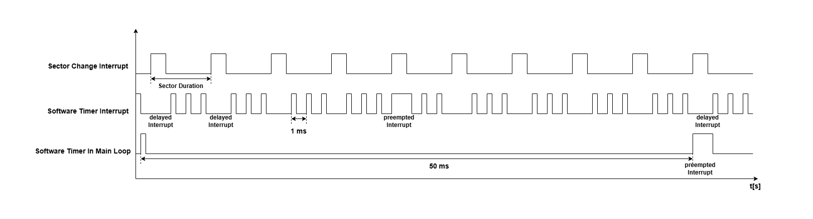

Interrupts (ISRs) used by the application:

1. Software timer interrupt - 50 μs period (handles drive, analog measurements, feedback processing and motor synchronization).
2. Software timer interrupt - 1 ms period (handles speed regulator, open-loop controller, button and LED states).
3. Software timer in main loop - 50 ms period (handles reference commands scaling, amplitude in open-loop and speed in closed-loop, received from the potentiometer or external PWM input).

The table below presents the duration of each ISR or loop in the aplication:

| MCU and XC8 Options | 50 μs ISR [μs]        | 1 ms ISR [μs] | 50 ms Software Timer [μs] | Speed Regulator Loop [μs]   |
|:-------------------:|:---------------------:|:-------------:|:-------------------------:|:---------------------------:|
|AVR16EB32 FREE       |    32.5               |   23          |   45                      |   5.5                       |
|AVR16EB32 PRO        |    28.5               |   20          |   36                      |   5                         |
|AVR128DA48 FREE      |    30.5               |   17          |   38                      |   4                         |
|AVR128DA48 PRO       |    27.5               |   14          |   30                      |   4                         |

<br> <b>Notes:</b>

1. FREE refers to the default optimization of the XC8 compiler version, available without license. PRO refers to the speed-optimized XC8 compiler version, available with license.
2. The 50 μs timer interrupt has a higher priority and will preempt running other interrupts, increasing their overall execution time, or will delay other interrupts.

### Motor Sinusoidal Drive

The Drive algorithm generates the six PWM signals that are used to drive the motor. For Sinusoidal drive, all three motor phases are constantly driven. There are no floating phases. One sine wave period represents 360 electrical degrees, and the sine wave signals for the three phases are generated using a precalculated Look-up Table (LUT) to be able to emulate sinusoidal signals by modulating the PWM signals. The frequency of the sine waves increases or decreases based on the motors' imposed speed.

The values from the LUT are scaled based on the desired amplitude. The three phases have a phase delay of 120 electrical degrees between each other at all times. At initialization, the first phase starts from 0 electrical degrees, the second one starts from 120 electrical degrees and the third one starts from 240 electrical degrees.
The sine wave signals frequency increases if the speed of the motor is increased, and decreases if the speed of the motor is decreased. The amplitude of the sine wave is changed by modulating the duty cycles of the PWM signals. AVR EB can change the amplitude of the sine wave signals in hardware by just changing the values written in a few registers, without the need to recalculate the LUT values and add extra mathematical computation that contributes to the CPU overhead. AVR DA compensates the hardware capabilities of AVR EB in software, with more CPU capabilities.

Example of sinusoidal signal generated using PWM duty cycle signal modulation:
<br>

Example of controlling the amplitude of the sinewave with PWM duty cycle modulation:
<br>

This application uses a Saddle profile of PWM modulation, because it offers higher DC-link voltage utilization (approx. 15.5% more) and lower Total Harmonic Distortion (THD) compared to plain sinusoidal PWM. Saddle PWM improves efficiency and reduces switching losses by leaving one leg of the inverter in a constant switching state, effectively reducing overall commutations.
Saddle PWM is generated by adding a third-harmonic to a standard sine wave and comparing this modified reference signal to a high-frequency triangle carrier wave. This process flattens the peaks of the modulating wave, reducing switching losses in 3-phase.

Example of the average voltage generated for one phase of the motor:
<br>

<br><b>Important:</b> Even if the Phase Voltages compared to GND are not sinusoidal, the difference between any two Phase Voltages is sinusoidal. Furthermore, all the currents generated in the motor windings are sinusoidal.

<br>

### Motor Feedback Sensing

<br>

#### Hall Sensing

<br> The estimation of the rotor position in the Sinusoidal Sensored-Control mode is done by monitoring the Hall sensors signals. The sensor transitions caused by the passing rotor magnet determine when 60 electrical degrees have elapsed within a complete 360-degree electrical revolution. Usually, the Hall sensors are placed inside the motor in groups of three, with a 120° distance between each sensor.

<h4> Reading Hall Signals </h4>

| Phase Signals                                | Hall Signals                        |
|:--------------------------------------------:|:-----------------------------------:|
|  | 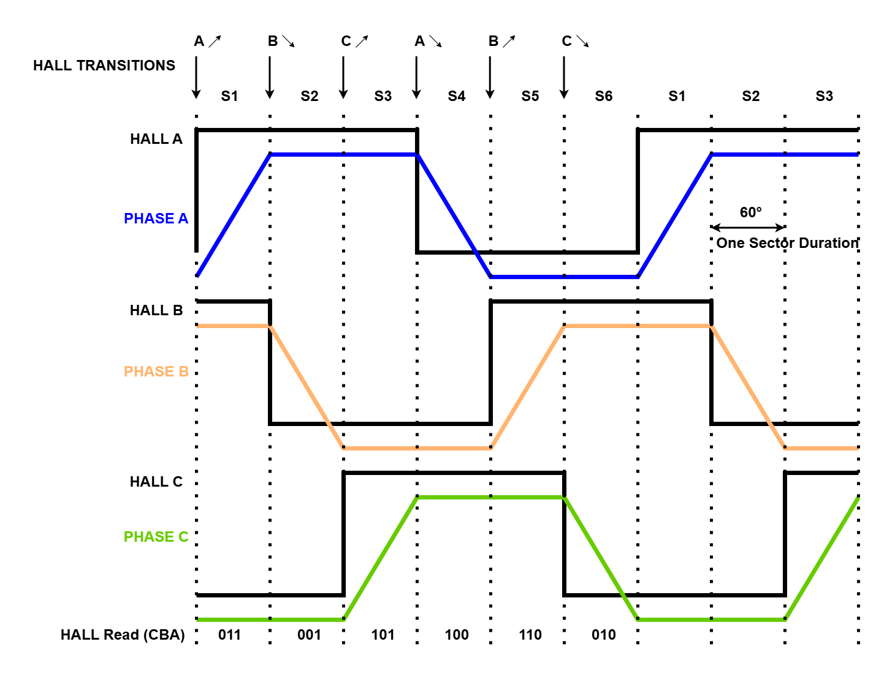 |

The Hall sensors data is acquired using three General Purpose Input/Output (GPIO) pins. The three pins are set as inputs to the Hall sensors, sampled periodically during an interrupt window, and compared to the previous value to detect a new transition.

<br> <b>Note:</b> Plain sine wave voltage signals were used in the image above to more easily illustrate how Hall sensor data is acquired. In reality, saddle wave signals are used.

<h4> Hall Sensing Overview </h4>

<br>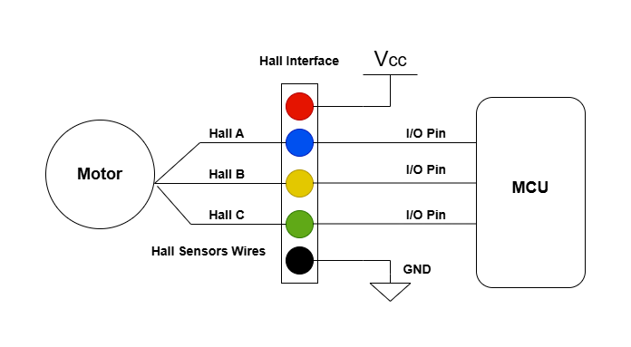

The sensored control allows to control the motor from 3% of the nominal speed up to the maximum nominal speed. There is no guaranteed stability with a value below 3% of the nominal speed.

<br> <b>Note:</b> The AVR16EB32 and AVR128DA48 platforms can achieve the minimum rotational speed of 120 e-RPM.

#### BEMF Sensing

<br> The rotor position estimation in the Sinusoidal Sensorless-Control mode is done by reconstructing the BEMF signals from the motor phases. For best efficiency, the BEMF signals must be in-phase with the current signals for each motor phase. Since the drive is sinusoidal and all three half bridges are driven all the time, the BEMF can not be directly measured, as there are no floating phases. Instead, the BEMF is reconstructed from the current measurements of the motor phases using a simplified algorithm.

The MPPB board comes with a single-resistor shunt configuration, integrated on the low-side transistors and used by default for current sensing. Although this sensing method is cheaper, with a reduced bill of materials because it uses only one shunt resistor and one Opamp, the computation power used by the sensing algorithm for reconstructing current from the total DC bus link is intensive for an 8-bit microcontroller.

#### Single-Shunt DC Bus Current Sensing Overview

<br>

<b>Note:</b> While there are three shunts on the MPPB in the default configuration, they have the same value on them and they merge into one average shunt that can measure the total DC link current from all three motor phases.

<h4> Drawbacks of Measuring the Total DC Bus Current</h4>

During each PWM cycle (every 50 µs), only two phase currents are measured, while the third one is determined using Kirchhoff's law (KCL), stating that the algebraic sum of all currents entering and exiting a node is zero. When all three low-side transistors are open or closed, the current in the shunt cannot be measured. These are called circular currents. The current in the shunt can be measured only when either one or two low-side transistors are open at the same time. For each PWM cycle, the measured phase currents are determined using the truth table from the image above, based on the transistors combinations dictated by the PWM signals from the drive algorithm.

During each PWM cycle, there are two measurement windows when one or two low-side transistors are open. A good example is depicted in the image below. The ADC will trigger a new conversion at the moments pointed out with arrows (in the middle of the valid measurement windows). The timer that generates the drive PWM signals is configured in Double Ramp mode with buffering operations.

<br>

T0 and T3 windows are unusable, and currents can not be measured there. Only T1 and T2 represent valid measurement windows, if they offer enough time to allow ADC sample and hold acquisition.

The ADC of the AVR devices has only one channel, which makes it unable to sample both measurable phase currents during the same PWM cycle. The values of the two measurable phase currents are acquired with the ADC over two consecutive PWM cycles, while the third one is reconstructed with KCL. The ADC trigger points are recalculated every new PWM cycle. To calculate the trigger points, the algorithm has to know which duty cycle is the minimum, the medium and the maximum out of the three duty cycles from the low-side PWM signals. First, the duty cycle values are sorted in rising order, then the ADC trigger points are calculated by applying the following formulas:

<br>

<br>• <b>`PWM_PERIOD`</b> - Represents the timer's period, expressed in clock cycles
<br>• <b>`PWM_DT`</b> - Represents the value of dead time added between high-side and low-side PWM signals, expressed in clock cycles
<br>• <b>`OPAMP_DELAY`</b> - Represents the propagation delay of the operational amplifier, expressed in clock cycles
<br>• <b>`MIN_DCY, MID_DCY, MAX_DCY`</b> - Represent the three values of PWM duty cycles for the low-side transistors, expressed in clock cycles

The most important drawback to take into account is the fact that the currents cannot be measured at all times during a full 360 electrical degrees period of the sinewaves. That happens because the duty cycles of the PWM signals are overlapping at times with each other, or have very similar values. When this happens, the measurement windows are either not enough or non-existing. The ADC sampled values are erronated and the sampled current corresponds to another phase than the one in the algorithm sequence, resulting in current "spikes" that disturb the synchronization algorithm. A good example is depicted in the image below:

<br>

It can be observed in the image above that because the duty cycles for phases B and C have very similar values, the measurement window is shortened significantly and thus not wide enough to contain an appropriate ADC measurement. This problem is encountered in more regions during a full sinewave period, as shown below:  

<br>

There are six distinct regions during a full electrical revolution where the duty cycles have similar or equal values. While in those regions, the current cannot be measured unless the measurement windows are enlarged. This can be done using an asymetrical PWM update to enlarge the duty cycle on one side and shorthen it on the other. However, this approach limits the range of duty cycles from 30% to 70% due to the hardware limitations of the AVR family of devices. If the asymetrical update is not done correctly, current distortions are introduced, generating noise and vibrations in the motor.

The interrupt window ISR time needed to implement this method on the AVR device family can be observed below:

<br>

The single-shunt method forces the ISR duration to the limit, making the user unable to add extra code and create a custom application. In this case, the single-shunt configuration requires a timer that supports asymetric compare registers updates, as double compare updates are needed per PWM cycle. The AVR family of devices does not support these features and has fewer resources. To overcome these limitations, this application proposes the dual-shunt method.

#### Proposed Dual-Shunt Current Sensing Method

<br> To avoid the complex calculus required to reconstruct the motor phase currents using the single-shunt topology, the MPPB board has been modified as explained in the [Necessary Hardware Tweaks](#necessary-hardware-tweaks) section.

<h4> Dual-Shunt Current Sensing Topology</h4>

<br>

The ADC sampling is still synchronized with the PWM cycle, but the trigger point is always fixed at the top overflow of the PWM timer. This approach limits the range of duty cycles from 5% to a maximum of 95%, which is more efficient compared to the other method. Using this method to directly measure the individual phase A, B and C currents, instead of calculating them from the total DC link, greatly offloads the CPU usage and interrupt window time. Lastly, no current distortions are introduced, because there is no need to modify the drive signals to create valid measurement windows. The low-side transistors will always be open at the top overflow of the PWM timer.

<br>

<b> Notes: </b>
<br>1. For sensorless feedback, the BEMF signals are reconstructed from the values of motor phase currents, along with other parameters
<br>2. When a BEMF signal has a transition from negative to positive, or viceversa, the rotor position is updated.
<br>3. The rotor position is interpolated between two BEMF transitions.
<br>4. The rotor position update is slower using this method compared to the FOC method, because there are only six BEMF transitions per one electrical revolution of 360 degrees.

Because the ADC of the AVR devices has only one channel, only one phase current can be measured at a time. To measure all three motor currents, two consecutive PWM cycles are needed. The drive PWM switching frequency is 20 kHz (50 µs), but the BEMF signals processing frequency is 10 kHz (100 µs). The control loops are slower, but the overall time spent in the ISR is reduced because not all of the calculus happens at the same time.

The interrupt window ISR time needed to implement this method on the AVR device family can be observed below:

<br>

Using this method will reduce the ISR duration, thus allowing the user to add extra code in the ISR and create a custom application. Despite the slower rotor position feedback, good synchronization and control can be achieved with this method.

<h4> Drive, Current and Estimated BEMF Signals for One Motor Phase </h4>

<br>

#### BEMF Reconstruction Algorithm

To reconstruct the BEMF signals and detect zero-crosses, this application uses a simple algorithm based on the following parameters, constants and formulas:

| Parameter/Constant                           | Description                                                                                              |
|:--------------------------------------------:|:--------------------------------------------------------------------------------------------------------:|
| <b>V<sub>E</sub></b>                         | BEMF voltage generated by the motor coil, expressed in volts                                             |
| <b>V<sub>BUS</sub></b>                       | DC bus voltage applied to the circuit, expressed in volts                                                |
| <b>I</b>                                     | Current flowing through the motor coil, expressed in amperes                                             |
| <b>R</b>                                     | Resistance of the motor coil winding, expressed in ohms                                                  |
| <b>L</b>                                     | Inductance of the motor coil winding, expressed in millihenries                                          |
| <b>ANALOG<sub>REFERENCE</sub></b>            | Voltage range used by the ADC, expressed in millivolts                                                   |
| <b>EMF<sub>K1, K2, K3</sub></b>              | Constants used to reconstruct the BEMF signals                                                           |
| <b>NSCALE</b>                                | Constant that scales all the values in the Q8.24 format (used by the EMF K1, K2, K3 constants)           |
| <b>ADC<sub>MAX</sub></b>                     | Constant that represents the maximum value in the ADC format                                             |
| <b>PWM<sub>MAX</sub></b>                     | Constant that represents the maximum value of the PWM duty-cycle                                         |
| <b>CURRENT<sub>SHUNT</sub></b>               | Constant that represents the value of the shunt resistors, from where the currents are sampled           |
| <b>AMPLIFIER<sub>GAIN</sub></b>              | Constant that represents the gain of the OPAMP which amplifies the measured currents                     |
| <b>DT</b>                                    | Constant that represents the BEMF processing period, expressed in seconds                                |
| <b>SAMPLING FREQUENCY</b>                    | Constant that represents the BEMF processing frequency; expressed in Hz, the inverse of <b>DT</b>        |
| <b>RS</b>                                    | Constant that represents the series resistance, expressed in ohms                                        |
| <b>LS</b>                                    | Constant that represents the series inductance, expressed in henries                                     |

<br>

The BEMF reconstruction for phase A of the motor goes through the following process:

1. The actual current sample for motor phase A is acquired from the ADC and stored in a variable called I<sub>ADC</sub>.
2. The previous current sample for motor phase A is stored in another variable called PI<sub>ADC</sub>.
3. The voltage bus is acquired from the ADC.
4. The phase A voltage for the respective motor phase is calculated using the following formula:

<br>

5. The obtained phase voltage is multiplied with the voltage bus and the EMF<sub>K1</sub> constant.
6. The actual current sample is multiplied with the EMF<sub>K2</sub> constant.
7. The previous current sample is multiplied with the EMF<sub>K3</sub> constant.
8. The BEMF signal is determined with the following formula:

<br>

9. The previous current sample is overwritten with the actual current sample value; PI<sub>ADC</sub> = I<sub>ADC</sub>.
10. The whole process is repeated over and over.

The same BEMF reconstruction process is done for phases B and C. The only difference is how V<sub>phase</sub> is calculated along with the motor currents for the respective phases.

### Motor Synchronization Algorithm

<br> The motor synchronization is achieved through a simplified Proportional Integral Derivative (PID) algorithm that calculates the error between the generated stator angle position and the rotor angle position, acquired from Hall sensors data. The algorithm has only the proportional and the integral terms, but no derivative. The aim is to allign the position of the rotor with the position of the stator
<br>The advantages of this algorithm relate to being based on bit-shifting operations and not adding too much CPU overload and interrupt time to process all the data. The speed oscillations are thus greatly reduced.

<h4> Synchronization Algorithm Timing </h4>

<br>

<br><b>Note:</b> The motor has the best efficiency when the phase voltages are aligned with the Hall signals. In theory, the motor has the best efficiency when the current signals in the motor windings are alligned with the generated Back Electromotive Force (BEMF) signals.

<h4> Synchronization Algorithm Chart </h4>

<br>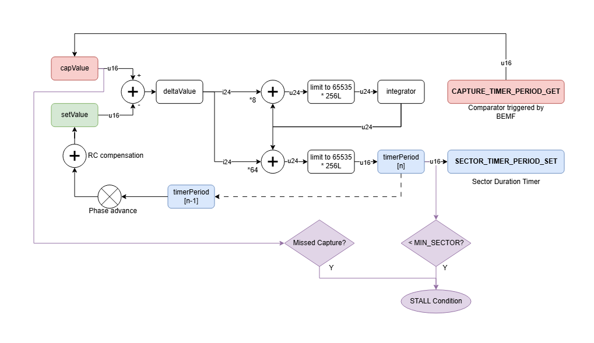

### Motor Speed Regulator Algorithm

<br> Speed regulation in Closed-Loop mode is achieved using a simplified PI algorithm that calculates the error between the target speed and measured speed. The algorithm only has the proportional and the integral terms, but no derivative. The target speed value is in the range between `REGULATOR_MIN_SPEED` and `REGULATOR_MAX_SPEED`. The measured speed represents the stator's speed, or the increment of the LUT that generates the drive voltages. The values of `REGULATOR_PI_KP`, `REGULATOR_PI_KI` and `REGULATOR_PI_DT` constants can be tuned to achieve a desired behavior, depending on the specific motor being used. The values of the three constants must be positive.

<h4> Speed Regulator Algorithm Chart </h4>

<br>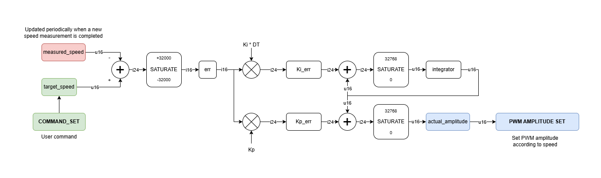

## Results

The image below presents a capture of the Hurst DMA0002024C1010 motor at 8000 eRPM.<br>
Oscilloscope traces:

* Ch 1 (yellow trace) Phase A Current — Current probe direction from the motor towards the board
* Ch 2 (cyan trace) Phase A Voltage — Referenced to ground

<br>

<br>Results obtained with various motors used in this project:

| Motor                 | Brief Specifications            | Supply Voltage [V] | Current Consumption [A] | e-RPM                    | Type    |
|:---------------------:|:-------------------------------:|:------------------:|:-----------------------:|:------------------------:|:-------:|
|ACT42BLF01             | 24 V / 1.9 A / 4 pp* / 4 kRPM   |    24              |      0.13  (no load)    |       10,000             | 3-phase |
|ACT57BLF02             | 24 V / 7.8 A / 4 pp / 3 kRPM    |    24              |      0.38  (no load)    |       10,000             | 3-phase |
|Hurst DMA0002024C1010  | 24 V / 4 A / 5 pp / 3 kRPM      |    24              |      0.1   (no load)    |        8,000             | 3-phase |
|Hurst DMA0204024B101   | 24 V / 7 A / 5 pp / 3 kRPM      |    24              |      0.4   (no load)    |        8,000             | 3-phase |

**Note:** *pp — stands for pole pairs

## Summary

<br>This project provides support for spinning a BLDC/PMSM motor using the Sinusoidal Drive method and feedback from Hall sensors or reconstructed BEMF from phase currents to achieve motor synchronization in an Open-Loop configuration and speed control in a Closed-Loop configuration. The control algorithm is straightforward, robust and it can be implemented on a variety of low-end MCUs that have a few timer capabilities, with an AC, an ADC and Event System (EVSYS).
