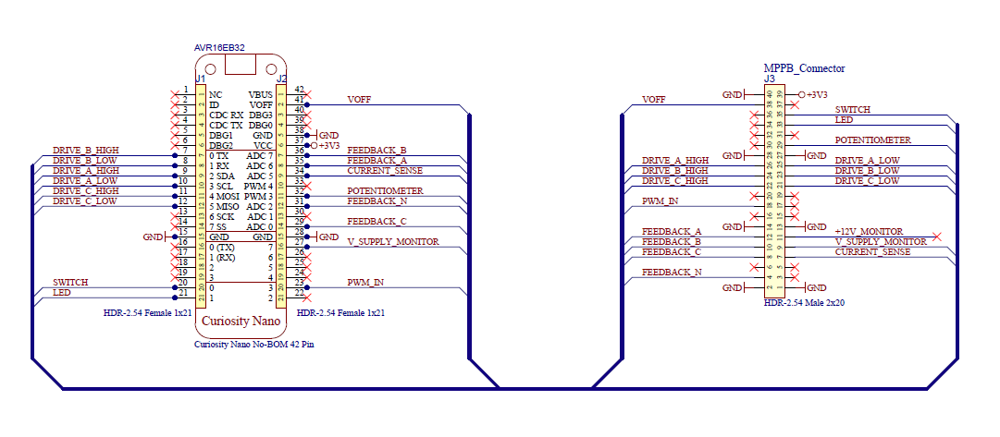
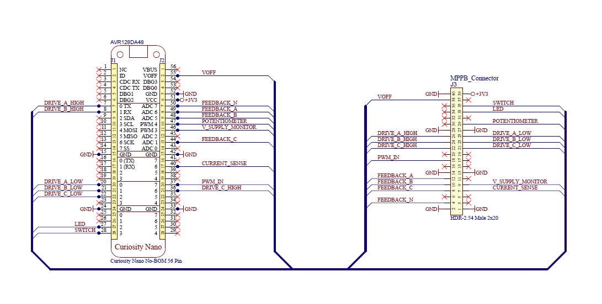
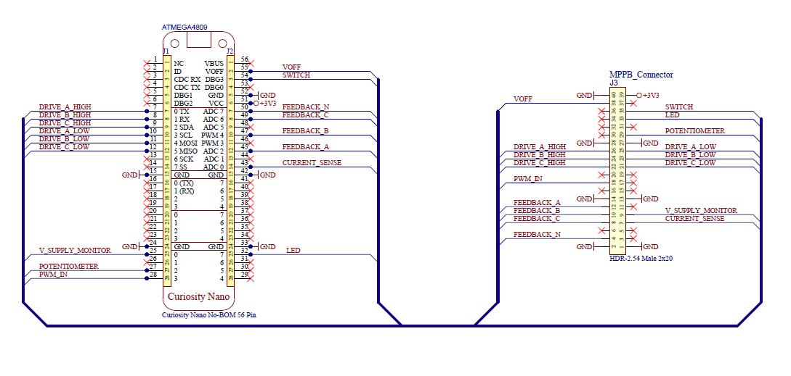
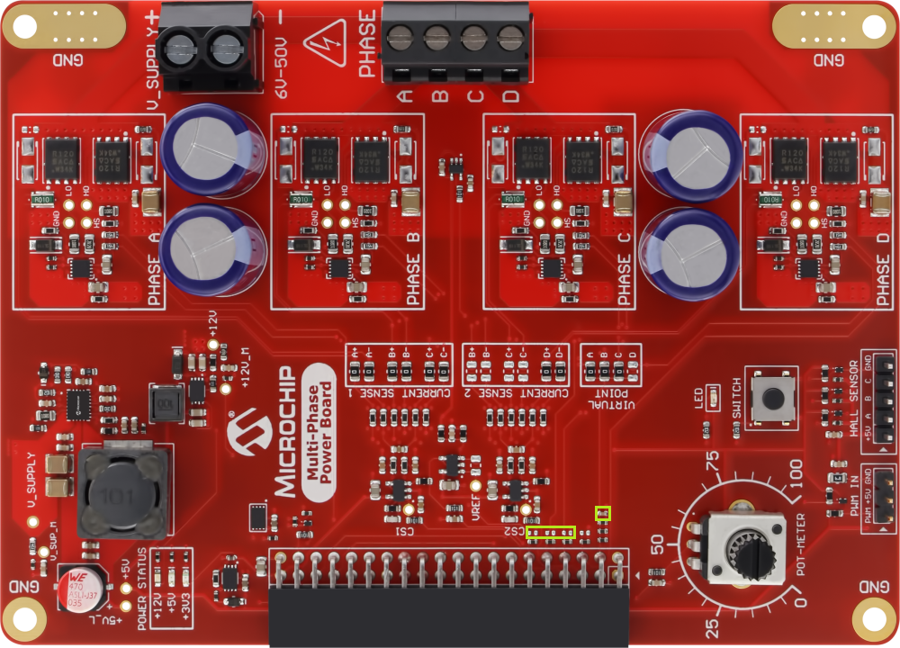
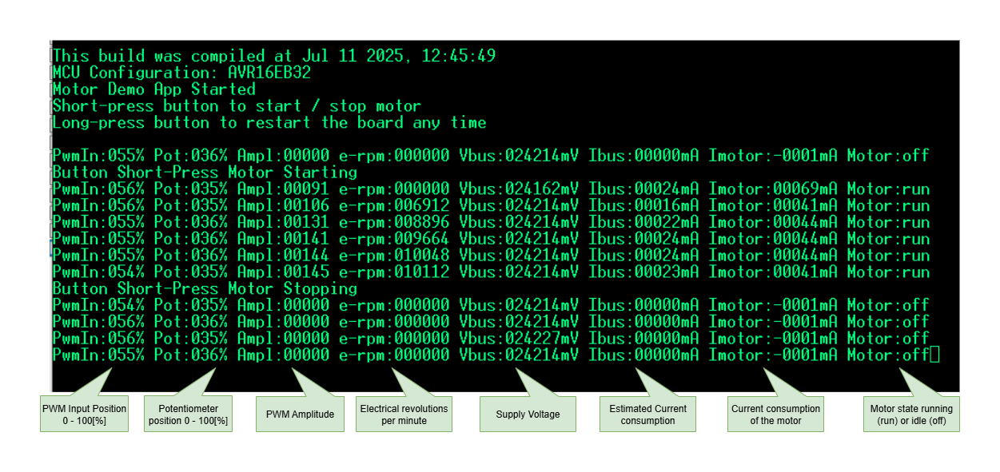
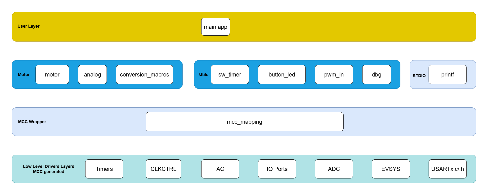
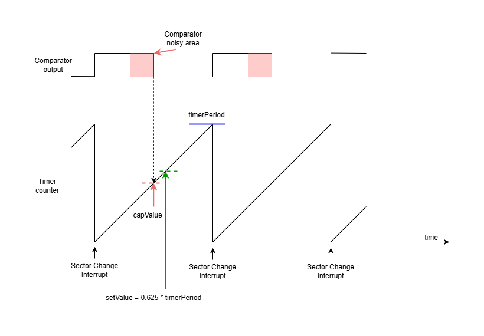
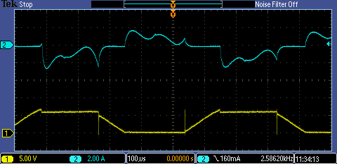

[](https://www.microchip.com)

<h2> Table of Contents </h2>

- [Motor Control With AVR®](#motor-control-with-avr®)
- [Release Notes](#release-notes)
- [Related Documentation](#related-documentation)
- [Software Used](#software-used)
- [Hardware Used](#hardware-used)
- [Quick Start Guide](#quick-start-guide)
  - [Physical Setup](#physical-setup)
  - [Curiosity Nano - MPPB Pin Mapping](#curiosity-nano---mppb-pin-mapping)
  - [Necessary Hardware Tweaks](#necessary-hardware-tweaks)
  - [Predefined Configuration Settings](#predefined-configuration-settings)
- [Application Usage](#application-usage)
  - [Let's Spin the Motor](#lets-spin-the-motor)
  - [Tunning Guide](#tunning-guide)
  - [Programming the AVR®](#programming-the-avr®)
  - [Console Interface](#console-interface)
- [Software Description](#software-description)
  - [Software Organization in Folders and Files](#software-organization-in-folders-and-files)
  - [MCC Maping](#mcc-maping)
  - [Application Block Overview](#application-block-overview)
  - [Application Flowchart](#application-flowchart)
  - [Application Programming Interface Functions](#application-programming-interface-functions)
  - [Configurable Parameters](#configurable-parameters)
  - [Application Interrupt Window Time](#application-interrupt-window-time)
  - [Motor Drive Sequence](#motor-drive-sequence)
  - [Motor Feedback Sensing](#motor-feedback-sensing)
  - [Motor Synchronization Algorithm](#motor-synchronization-algorithm)
- [Results](#results)
- [Summary](#summary)

## Motor Control With AVR®

This repository contains a Motor Control application focused on high-speed Trapezoidal Sensorless control, using three implementations of the AVR family: AVR16EB32, AVR128DA48 and ATmega4809 devices. Check the [*Release Notes*](#release-notes) section to see all the available functionality of the current release. The aim of this application is keeping stability at high count of electrical rotations per minute (>150 000 Electrical RPM ), using a simplified Proportional-Integral (PI) algorithm. All three code examples have the same functionality; the only difference is the device used.

- <b>AVR EB</b> has two new peripherals, the Timer Counter type E (TCE) and a Waveform Extension (WEX), that have new hardware capabilities meant to take over software functions usually used in motor control, as described in [Getting Started with the TCE and WEX](https://onlinedocs.microchip.com/oxy/GUID-8FB8D192-E8C9-4748-B991-D4D842E01591-en-US-1/index.html) and in the [AVR® EB Data Sheet](https://www.microchip.com/en-us/product/avr16eb32#document-table)

- <b>AVR DA</b> offers more memory and a bit more CPU frequency and pins, as described in the [AVR® DA Data Sheet](https://www.microchip.com/en-us/product/avr128da48#document-table)

- <b>ATmega</b> incorporates features from both the AVR EB and AVR DA families, offering a well-balanced combination of hardware capabilities, memory, and pin count, as described in the [AVR® ATmega Data Sheet](https://www.microchip.com/en-us/product/atmega4809#document-table)
  
- The application's functionality is to obtain a trapezoidal (6-step block commutation) with motor synchronization and support for sensorless feedback type. The focus is on Brushless Direct Current (BLDC) motors and Permanent Magnet Synchronous Motors (PMSMs)

- The Sensorless feedback and synchronization are achieved using the Zero-Cross Detections (ZCD) of Back-Electromotive Forces (BEMFs) of each of the three phases of the motor. The BEMFs are captured using hardware peripherals, thus improving the accuracy of zero-cross detections at high speeds. Motor synchronization is achieved by using a Proportional-Integral (PI) algorithm, that calculates the error between the measured ZCD and the ideal ZCD.

## Release Notes

Current version 1.0.0 features:

- Support for three phase BLDC and PMSM motors
- Motor specification in configuration file
- Trapezoidal drive
- BEMF sensing
- Start ramp
- Proportional-Integral (PI) algorithm with fixed parameters for Open-Loop synchronization
- Fault support for Hardware Peak Overcurrent Protection (Peak OCP), Software Average Overcurrent Protection (Avg OCP), Overvoltage Protection (OVP) and Stall Detection
- Current, Voltage Bus and Potentiometer analog measurements at run time
- Potentiometer emulation in percentage, configurable from configuration file
- Switching frequency at 40 kHz

Known issues and future improvements:

- Adjustable phase advance
- Speed regulator
- Pulse-Width Modulation (PWM) input for compatibility with radio-controlled receivers
- Improve speed measurement precision

## Related Documentation

More details and code examples on the AVR16EB32, AVR128DA48 and ATmega4809 can be found at the following links:

- [AVR<sup>®</sup> EB Product Page](https://www.microchip.com/en-us/products/microcontrollers/8-bit-mcus/avr-mcus/avr-eb)
- [AVR<sup>®</sup> EB Code Examples](https://mplab-discover.microchip.com/v2?dsl=avr16eb32)
- [AVR<sup>®</sup> DA Product Page](https://www.microchip.com/en-us/products/microcontrollers/8-bit-mcus/avr-mcus/avr-da)
- [AVR<sup>®</sup> DA Code Examples](https://mplab-discover.microchip.com/v2?dsl=avr128da48)
- [AVR<sup>®</sup> ATmega Product Page](https://www.microchip.com/en-us/products/microcontrollers/8-bit-mcus/avr-mcus/atmega4809)
- [AVR<sup>®</sup> ATmega Code Examples](https://mplab-discover.microchip.com/v2?dsl=atmega4809)

## Software Used

- [MPLAB® X IDE v6.25 or newer](https://www.microchip.com/en-us/tools-resources/develop/mplab-x-ide?utm_source=GitHub&utm_medium=TextLink&utm_campaign=MCU8_AVR-EB&utm_content=avr16eb32-bldc-pmsm-motor-control-library-github&utm_bu=MCU08)
- [AVR-Ex DFP v2.11.221 or newer](https://packs.download.microchip.com/)
- [AVR-Dx DFP v2.7.321 or newer](https://packs.download.microchip.com/)
- [AVR-ATmega DFP v3.4.282 or newer](https://packs.download.microchip.com/)
- [MPLAB® XC8 compiler v3.00 or newer](https://www.microchip.com/en-us/tools-resources/develop/mplab-xc-compilers?utm_source=GitHub&utm_medium=TextLink&utm_campaign=MCU8_AVR-EB&utm_content=avr16eb32-bldc-pmsm-motor-control-library-github&utm_bu=MCU08)
- [MPLAB Code Configurator (MCC) v5.6.2 or newer](https://www.microchip.com/en-us/tools-resources/configure/mplab-code-configurator)

## Hardware Used

- [AVR<sup>®</sup> EB Curiosity Nano](https://www.microchip.com/en-us/development-tool/EV73J36A)
- [AVR<sup>®</sup> DA Curiosity Nano](https://www.microchip.com/en-us/development-tool/DM164151)
- [AVR<sup>®</sup> ATmega Curiosity Nano](https://www.microchip.com/en-us/development-tool/DM320115)
- [Multi-Phase Power Board (MPPB)](https://www.microchip.com/en-us/development-tool/EV35Z86A)
- [AVR EB Curiosity Nano Adaptor to MPPB](https://www.microchip.com/en-us/development-tool/EV88N31A)
- [AVR DA Curiosity Nano Adaptor to MPPB](#curiosity-nano---mppb-pin-mapping), made with wires
- [AVR ATmega Curiosity Nano Adaptor to MPPB](#curiosity-nano---mppb-pin-mapping), made with wires
- BLDC Motor (Used in this demo for testing the algorithm: ACT42BLF01, ACT57BLF02, SZSPEED 2207 KV 2500, 130K RPM 12V low cost hair-dryer motor)
- A Voltage power supply (6-55V and 10A limit, depending on the motor used)

## Quick Start Guide

### Physical Setup

The AVR16EB32, AVR128DA48 or ATmega4809 Curiosity Nano Development boards are used along with the MPPB, AVR EB, AVR DA or ATmega CNANO to MPPB adapter board, the BLDC Motor and a Voltage power supply.

<br>Connection steps:

1. Plug in the AVR16EB32, AVR128DA48 or ATmega4809 Curiosity Nano board in the connector present on the MPPB adapter board.
2. Plug in the MPPB adapter board to the MPPB board.
3. Plug in the AVR® EB, AVR DA or ATmega Curiosity Nano boards to the PC.
4. Connect the voltage power supply wires to the V_SUPPLY conector from the MPPB.
5. Connect the motor phase wires to the PHASE connector from MPPB in any order.

<h4> Example Setup: </h4>

<br>

### Curiosity Nano - MPPB Pin Mapping

If the MPPB and the adapter boards are not used, the user can integrate the AVR EB, AVR DA or ATmega boards into another hardware setup by using the following pinouts:

| Curiosity Nano Boards Pinout                 | Curiosity Nano - MPPB Pin Mapping          |
|:--------------------------------------------:|:------------------------------------------:|
|       |      |
|       |      |
|   |  |

<br>Pin mapping legend AVR16EB32, AVR128DA48, ATmega4809 Curiosity Nano Boards to MPPB:

| Pin Name       | AVR16EB32 Curiosity Nano Board | AVR128DA48 Curiosity Nano Board | ATmega4809 Curiosity Nano Board | MPPB Board                  |
|----------------|--------------------------------|---------------------------------|---------------------------------|-----------------------------|
|Drive A High    |Pin 9 -  PA0                    |Pin 7 -  PA0                     |Pin 7 -   PA0                    |Pin 26                       |
|Drive A Low     |Pin 10 - PA1                    |Pin 20 - PB0                     |Pin 10 -  PA3                    |Pin 25                       |
|Drive B High    |Pin 7 -  PA2                    |Pin 8 -  PA1                     |Pin 8 -   PA1                    |Pin 24                       |
|Drive B Low     |Pin 8 -  PA3                    |Pin 21 - PB1                     |Pin 11 -  PA4                    |Pin 23                       |
|Drive C High    |Pin 11 - PA4                    |Pin 36 - PA2                     |Pin 9 -   PA2                    |Pin 22                       |
|Drive C Low     |Pin 12 - PA5                    |Pin 22 - PB2                     |Pin 12 -  PA5                    |Pin 21                       |
|Feedback A      |Pin 35 - PD4                    |Pin 49 - PD6                     |Pin 45 -  PD2                    |Pin 12                       |
|Feedback B      |Pin 36 - PD5                    |Pin 48 - PD2                     |Pin 47 -  PD4                    |Pin 10                       |
|Feedback C      |Pin 29 - PD6                    |Pin 44 - PD4                     |Pin 49 -  PD6                    |Pin 8                        |
|Feedback N      |Pin 31 - PD0                    |Pin 50 - PD7                     |Pin 50 -  PD7                    |Pin 4                        |
|Current Sense   |Pin 34 - PD3                    |Pin 40 - PE2                     |Pin 43 -  PD0                    |Pin 7                        |
|Current Trip    |Pin 34 - PD3                    |Pin 40 - PE2                     |Pin 41 -  PC7                    | -                           |
|V Supply Monitor|Pin 27 - PF4                    |Pin 46 - PD0                     |Pin 25 -  PE0                    |Pin 9                        |
|Potentiometer   |Pin 32 - PD1                    |Pin 47 - PD1                     |Pin 27 -  PE2                    |Pin 29                       |
|LED             |Pin 21 - PF5                    |Pin 27 - PC6                     |Pin 32 -  PF5                    |Pin 33                       |
|Switch          |Pin 20 - PF6                    |Pin 28 - PC7                     |Pin 54 -  PF6                    |Pin 35                       |
|TXC             |Pin 16 - PC1                    |Pin 25 - PC0                     |Pin 20 -  PB0                    | -                           |
|RXC             |Pin 17 - PC2                    |Pin 26 - PC1                     |Pin 21 -  PB1                    | -                           |
|3V3             |Pin 37                          |Pin 51                           |Pin 51                           |Pin 39                       |
|VOFF            |Pin 41                          |Pin 55                           |Pin 55                           |Pin 38                       |
|GND             |Pins 38, 28, 15                 |Pins 52, 42, 33, 24, 15          |Pins 52, 42, 33, 24, 15          |Pins 40, 28, 27, 14, 13, 2, 1|

<br><b>Note:</b> In this repository, schematics for all three platforms are provided in `pdf` folder: AVR16EB32_MPPB_Mapping, AVR128DA48_MPPB_Mapping an ATMEGA4809_MPPB_Mapping.</br>

### Necessary Hardware Tweaks

<br> This demo requires adding three capacitors of 3.3 nF and an SMD with the size of 0402 on the MPPB board.

<br> Because this demo counts on capturing the BEMF using a hardware capture mechanism of a timer, the captured signals need filtering to remove false zero-cross detection. The easiest method to do this is by using a RC low-pass filter. The MPPB board has placeholder pads for the capacitors that need to be added. The capacitor for virtual neutral point is already in place, and the capacitor values for phases A, B and C must have the value of 3.3 nF (three times smaller than the one from virtual neutral, which has 10 nF). With these capacitor values, the resulted RC filters will add a 30 µs delay to the zero-cross detection.

<h3> Capacitors location marked with green rectangles </h3>

<br><br>

<h3> Capacitors location zoomed in</h3>

<br><br>

### Predefined Configuration Settings

<br>This is a set of configuration settings, apart from the default values, needed to run the demo in the Trapezoidal Sensorless mode, with the following motors: ACT42BLF01, ACT57BLF02, SZSPEED 2207 2500 KV, and 12V hair dryer 130 KRPM.
<br>In the configuration file [`config.h`](#configurable-parameters) edit the settings according to the usage scenario. 

<br><h3> Predefined Configuration Settings for the ACT42BLF01 Motor </h3>

```c

/* Analog thresholds */
#define VIRTUAL_POTENTIOMETER           (0.00)       /* Value: 0.1 ... 100.0 |  Set to 0.00 for the real potentiometer usage */
#define ADC_IIR_FILTER                  true         /* Smoothing filter on ADC functions: POT, VBUS, current */

/* Board specific settings - MPPB */
#define CURRENT_SHUNT_RESISTANCE        (0.01)       /* Resistance in ohm of the current shunt */
#define CURRENT_AMPLIFIER_GAIN          (7.5)
#define CURRENT_AMPLIFIER_OFFSET        (1650.0)     /* mV - Typical offset is VREF/2 = 1650 mV  */
#define VBUS_DIVIDER                    (16.0)
#define ANALOG_REFERENCE                (3300.0)     /* mV */
#define ADC_VBUS_TRIP                   (51000.0)    /* mV - VBUS trip level */
#define ADC_CURRENT_TRIP                (7000.0)     /* mA - ADC current trip level */
#define COMPARATOR_CURRENT_TRIP         (8000.0)     /* mA - Comparator trip level - not used on external-comparator configurations */
#define FAULT_COMPARATOR_EN             false

/* Motor-specific settings */
/* ACT42BLF01:  supply 24V, 3A limit */
#define MOTOR_STARTUP_CURRENT           (2500.0)     /* mA - Initial alignment current pulse may be higher than overcurrent protection */
#define MOTOR_RPP                       (2.6)        /* ohms - Motor resistance measured phase-to-phase */
#define MOTOR_AMPRAMP_STEP_INTERVAL     (15)         /* Amplitude ramp step interval: expressed in milliseconds, time passed between two amplitude steps, 10 for aggresive ramp, 100 for soft ramp */
#define MOTOR_ALIGNMENT_DURATION        (10)         /* ms */
#define MOTOR_MAXIMUM_ERPM              (50000.0)    /* e-RPM */
#define STALL_THRS                      10           /* Stall detection tolerance: higher number - more tolerant to perturbances, but slower detection */

#define MOTOR_STARTUP_TIME              (1000)       /* ms until POT is used | '-1' means potentiometer is ignored, whether it is real or emulated */
#define MOTOR_FORCED                    false        /* Setting to 'true' makes the motor run with no BEMF sensing, only blind drive */

```

<br><h3> Predefined Configuration Settings for the ACT57BLF02 Motor </h3>

```c

/* Analog thresholds */
#define VIRTUAL_POTENTIOMETER           (0.00)       /* Value: 0.1 ... 100.0 |  Set to 0.00 for the real potentiometer usage */
#define ADC_IIR_FILTER                  true         /* Smoothing filter on ADC functions: POT, VBUS, current */

/* Board specific settings - MPPB */
#define CURRENT_SHUNT_RESISTANCE        (0.01)       /* Resistance in ohm of the current shunt */
#define CURRENT_AMPLIFIER_GAIN          (7.5)
#define CURRENT_AMPLIFIER_OFFSET        (1650.0)     /* mV - Typical offset is VREF/2 = 1650 mV  */
#define VBUS_DIVIDER                    (16.0)
#define ANALOG_REFERENCE                (3300.0)     /* mV */
#define ADC_VBUS_TRIP                   (51000.0)    /* mV - VBUS trip level */
#define ADC_CURRENT_TRIP                (9000.0)     /* mA - ADC current trip level */
#define COMPARATOR_CURRENT_TRIP         (9000.0)     /* mA - Comparator trip level - not used on external-comparator configurations */
#define FAULT_COMPARATOR_EN             false

/* Motor-specific settings */
/* ACT57BLF02:  supply 24V, 3A limit */
#define MOTOR_STARTUP_CURRENT           (12000.0)    /* mA - Initial alignment current pulse may be higher than overcurrent protection */
#define MOTOR_RPP                       (0.45)       /* ohms - Motor resistance measured phase-to-phase */
#define MOTOR_AMPRAMP_STEP_INTERVAL     (15)         /* Amplitude ramp step interval: expressed in milliseconds, time passed between two amplitude steps, 10 for aggresive ramp, 100 for soft ramp */
#define MOTOR_ALIGNMENT_DURATION        (10)         /* ms */
#define MOTOR_MAXIMUM_ERPM              (50000.0)    /* e-RPM */
#define STALL_THRS                      10           /* Stall detection tolerance: higher number - more tolerant to perturbances, but slower detection */

#define MOTOR_STARTUP_TIME              (1000)       /* ms until POT is used | '-1' means potentiometer is ignored, whether it is real or emulated */
#define MOTOR_FORCED                    false        /* Setting to 'true' makes the motor run with no BEMF sensing, only blind drive */

```

<br><h3> Predefined Configuration Settings for the 12V 150W 130,000 RPM Hair Dryer Motor </h3> 

```c

/* Analog thresholds */
#define VIRTUAL_POTENTIOMETER           (0.00)       /* Value: 0.1 ... 100.0 |  Set to 0.00 for the real potentiometer usage */
#define ADC_IIR_FILTER                  true         /* Smoothing filter on ADC functions: POT, VBUS, current */

/* Board specific settings - MPPB */
#define CURRENT_SHUNT_RESISTANCE        (0.01)       /* Resistance in ohm of the current shunt */
#define CURRENT_AMPLIFIER_GAIN          (7.5)
#define CURRENT_AMPLIFIER_OFFSET        (1650.0)     /* mV - Typical offset is VREF/2 = 1650 mV  */
#define VBUS_DIVIDER                    (16.0)
#define ANALOG_REFERENCE                (3300.0)     /* mV */
#define ADC_VBUS_TRIP                   (51000.0)    /* mV - VBUS trip level */
#define ADC_CURRENT_TRIP                (20000.0)    /* mA - ADC current trip level, disabled */
#define COMPARATOR_CURRENT_TRIP         (11000.0)    /* mA - Comparator trip level - not used on external-comparator configurations */
#define FAULT_COMPARATOR_EN             false

/* Motor-specific settings */
/* Hair Dryer Motor:  supply 8V, 10A limit */
#define MOTOR_STARTUP_CURRENT           (15000.0)    /* mA - Initial alignment current pulse may be higher than overcurrent protection */
#define MOTOR_RPP                       (0.1)        /* ohms - Motor resistance measured phase-to-phase */
#define MOTOR_AMPRAMP_STEP_INTERVAL     (5)          /* Amplitude ramp step interval: expressed in milliseconds, time passed between two amplitude steps, 10 for aggresive ramp, 100 for soft ramp */
#define MOTOR_ALIGNMENT_DURATION        (5)          /* ms */
#define MOTOR_MAXIMUM_ERPM              (250000.0)   /* e-RPM */
#define STALL_THRS                      10           /* Stall detection tolerance: higher number - more tolerant to perturbances, but slower detection */

#define MOTOR_STARTUP_TIME              (1000)       /* ms until POT is used | '-1' means potentiometer is ignored, whether it is real or emulated */
#define MOTOR_FORCED                    false        /* Setting to 'true' makes the motor run with no BEMF sensing, only blind drive */

```

<br><h3> Predefined Configuration Settings for the SZSPEED 2207 KV2500 6S Drone Motor </h3> 

```c

/* Analog thresholds */
#define VIRTUAL_POTENTIOMETER           (0.00)       /* Value: 0.1 ... 100.0 |  Set to 0.00 for the real potentiometer usage */
#define ADC_IIR_FILTER                  true         /* Smoothing filter on ADC functions: POT, VBUS, current */

/* Board specific settings - MPPB */
#define CURRENT_SHUNT_RESISTANCE        (0.01)       /* Resistance in ohm of the current shunt */
#define CURRENT_AMPLIFIER_GAIN          (7.5)
#define CURRENT_AMPLIFIER_OFFSET        (1650.0)     /* mV - Typical offset is VREF/2 = 1650 mV  */
#define VBUS_DIVIDER                    (16.0)
#define ANALOG_REFERENCE                (3300.0)     /* mV */
#define ADC_VBUS_TRIP                   (51000.0)    /* mV - VBUS trip level */
#define ADC_CURRENT_TRIP                (20000.0)    /* mA - ADC current trip level, disabled */
#define COMPARATOR_CURRENT_TRIP         (11000.0)    /* mA - Comparator trip level - not used on external-comp configurations */
#define FAULT_COMPARATOR_EN             false

/* Motor-specific settings */
/* SZSPEED 2207 2500 KV:  supply 6V, 10A limit */
#define MOTOR_STARTUP_CURRENT           (10000.0)    /* mA - Initial alignment current pulse may be higher than overcurrent protection */
#define MOTOR_RPP                       (0.1)        /* ohms - Motor resistance measured phase-to-phase */
#define MOTOR_AMPRAMP_STEP_INTERVAL     (5)          /* Amplitude ramp step interval: expressed in milliseconds, time passed between two amplitude steps, 10 for aggresive ramp, 100 for soft ramp */
#define MOTOR_ALIGNMENT_DURATION        (50)         /* ms */
#define MOTOR_MAXIMUM_ERPM              (250000.0)   /* e-RPM */
#define STALL_THRS                      10           /* Stall detection tolerance: higher number - more tolerant to perturbances, but slower detection */

#define MOTOR_STARTUP_TIME              (1000)       /* ms until POT is used | '-1' means potentiometer is ignored, whether it is real or emulated */
#define MOTOR_FORCED                    false        /* Setting to 'true' makes the motor run with no BEMF sensing, only blind drive */

```

## Application Usage

### Let's Spin the Motor

After all the steps from [Quick Start Guide](#quick-start-guide) are completed, turn the MPPB potentiometer to 50%, then press the MPPB button to spin the motor.
Depending on the phase wires connection to the MPPB, the spinning direction might be either clockwise (CW) or counter-clockwise (CCW).

### Tunning Guide

In case the user has followed all the steps from [Quick Start Guide](#quick-start-guide) and the motor is not spining, or an error message is displayed in the console, these are some useful steps to try to tune the application for a new motor:

1. Measure the phase-to-phase resistance between any two wires of the motor. Put this value in `MOTOR_RPP`, from the `config.h` file.
2. The initial value for `MOTOR_STARTUP_CURRENT` can be up to 25% of the rated current of that motor.
3. If after the first two steps and reprogramming, the motor is not spinnning, set `MOTOR_STARTUP_TIME` to `-1` and `MOTOR_FORCED` to `true`, to put the motor in Forced Commutation mode. Try to increase `MOTOR_STARTUP_CURRENT` by 0.5A and reprogram until the motor starts spinning. After the motor is spinning in Forced mode without vibrations, set `MOTOR_STARTUP_TIME` to the initial value and `MOTOR_FORCED` to `false`.
4. `MOTOR_ALIGNMENT_DURATION` can also be adjusted. For example, for a drone motor with low inductance, the alignment period is much smaller compared to a motor with high inductance. Try to increase or decrease the duration with steps not greater than 10 ms at a time.
5. `MOTOR_AMPRAMP_STEP_INTERVAL` can also be adjusted. This parameter dictates how aggresive the ramp-up process is. For motors with low inductance and high speeds, the ramp can be more aggresive compared to a motor with high inductance. Try to increase or decrease the duration with steps no greater than 5 ms at a time.

### Programming the AVR®

1. Download the zip file or clone the repository to get the source code.

2. Open the `fw/motor_demo_eb.X`,  `fw/motor_demo_da.X` or  `fw/motor_demo_mega4809.X` project in MPLAB® X IDE.

3. Right click the project and select Set as Main Project.

<br>

4. Edit the [`config.h`](#configurable-parameters) file, found in `motor_demo_eb.X`, `motor_demo_da.X` or `motor_demo_mega4809.X`, with the utilized motor parameters and drive options. See [Predefined Config Settings](#predefined-config-settings) for examples.

5. Build the `motor_demo_eb.X`, `motor_demo_da.X` or `motor_demo_mega4809.X` project by clicking **Clean and Build Project**.

<br>

6. Click **Make and Program Device** to program the project to the board.

<br>

### Console Interface

<br>The application has a console communication interface.To activate it, open a PC software terminal and select the UART protocol, 8N1, with a baud rate of 57600 bps.
<br> The serial interface provides information about the potentiometer value, voltage bus value, motor current value, electrical rotations per minute (RPM) value and motor running state (ON/OFF).

<br>

## Software Description

### Software Organization in Folders and Files

All the files shared by the three platforms are in the `common_files` folder. Each platform has its own `main.c`, `config.h` and `mcc_mapping.h` files.
```
├───common_files
│   │   app.c
│   │
│   ├───motor
│   │       analog.c
│   │       analog.h
│   │       conversion_macros.h
│   │       motor.c
│   │       motor.h
│   │
│   └───utils
│           button_led.c
│           button_led.h
│           dbg_logger.c
│           dbg_logger.h
│           dbg_pins.h
│           precise_delay.h
│           sw_timer.c
│           sw_timer.h
│
├───motor_demo_da.X
│   │   config.h
│   │   main.c
│   │   Makefile
│   │   mcc_mapping.h
│   │   motor_demo_da.mc3
│   │
│   ├───mcc_generated_files
│   └───nbproject
│           configurations.xml
│           project.xml
│
├───motor_demo_eb.X
│   │   config.h
│   │   main.c
│   │   Makefile
│   │   mcc_mapping.h
│   │   motor_demo_eb.mc3
│   │
│   ├───mcc_generated_files
│   └───nbproject
│           configurations.xml
│           project.xml
│
└───motor_demo_mega4809.X
    │   config.h
    │   main.c
    │   Makefile
    │   mcc_mapping.h
    │   motor_demo_mega4809.mc3
    │
    ├───mcc_generated_files
    └───nbproject
            configurations.xml
            project.xml
```

### MCC Maping

`mcc_mapping.h` files are used to map all the port pins and low-level drivers functions generated using the MPLAB® Code Configurator (MCC) to the abstract layers of the application. These layers include: motor, analog, led/button and other wrapper layers. `mcc_mapping.h` files can be found in `fw/motor_demo_eb.X`, `fw/motor_demo_da.X` and `fw/motor_demo_mega4809.X`.

### Application Block Overview

<br>

### Application Flowchart

<br>

1. Short-press the button on the MPPB board. The motor starts spinning and enters the Running state. The LED from MPPB turns on. The speed can be adjusted using the potentiometer present on the MPPB board.
2. Short-press the button from MPPB again. The motor decelerates, comes to a complete stop and enters the Idle state. The LED from MPPB turns off.
3. Long-press the button (more than 1.5 s) to restart the application.
4. If a Fault event occurs, the motor stops and enters the Idle state. The LED from MPPB turns off.

### Application Programming Interface Functions

<br> The APIs from the Motor Control Stack found in `motor_control.h` are the following:

<br>• <b>`Motor_Initialize()`</b> - Initialization function, needs to be called before any other function
<br>• <b>`Motor_Start()`</b> - Starts or the motor depending on which state it is found in when the start event is received
<br>• <b>`Motor_Stop()`</b> - Stops the motor depending on which state it is found in when the stop event is received
<br>• <b>`Motor_Fault()`</b> - Stops the motor and then clears the Fault flags
<br>• <b>`Motor_AmplitudeSet()`</b> - Sets the PWM amplitude value
<br>• <b>`Motor_MaxAmpGet()`</b> - Returns the maximum possible PWM amplitude value
<br>• <b>`Motor_StatusGet()`</b> - Returns the state ON/OFF of the motor and possible fault events
<br>• <b>`Motor_ErpmGet()`</b> - Returns the electrical RPM value of the motor during run time
<br>• <b>`Motor_AmplitudeGet()`</b> - Gets the PWM amplitude value
<br>• <b>`Motor_TimeTick()`</b> - Monitors the speed, updates the amplitude ramp and has to be called once every 1 ms, only in the context of an interrupt

<b>Important:</b> Use only the public APIs from the `motor_control.h` file so as not to alter the library functionality in any way.

### Configurable Parameters

The parameters from `config.h` file used to customize the application are the following:

<br><b> Motor Settings </b>

<br>• <b>`MOTOR_STARTUP_CURRENT`</b> - The amount of current supplied to the motor phases during the start-up phase, given in amperes
<br>• <b>`MOTOR_RPP`</b> - Motor resistance measured phase-to-phase
<br>• <b>`MOTOR_AMP_RAMP_RATE`</b> - Amplitude increase rate; the higher the number, the slower the rate is
<br>• <b>`MOTOR_ALIGNMENT_DURATION`</b> - Initial alignment duration before start up
<br>• <b>`MOTOR_MAXIMUM_ERPM`</b> - Limit speed value of the motor given in electrical RPM
<br>• <b>`MOTOR_STARTUP_TIME`</b> - This is the ramp-up time until the value from potentiometer is used to set the amplitude. If this parameter is set to '-1', then the potentiometer is ignored.
<br>• <b>`MOTOR_FORCED`</b> - Setting this parameter to `true` enables only forced commutation. Setting it to `false` enables motor synchronization.
<br>• <b>`STALL_THRS`</b> - The number of reached stall conditions until the motor is stopped

<br><b> Power Board and Analog Settigs </b>

<br>• <b>`CURRENT_SHUNT_RESISTANCE`</b> - The current sense shunt resistance, given in ohms, dependent on the power board
<br>• <b>`CURRENT_AMPLIFIER_GAIN`</b> - The current sense amplifier, dependent on the power board
<br>• <b>`VBUS_DIVIDER`</b> - The voltage divider, used to scale the V<sub>BUS</sub> to be able to measure it with the `ANALOG_REFERENCE` logic, dependent on the power board
<br>• <b>`ANALOG_REFERENCE`</b> - The voltage reference (this application has a 3V3 logic)
<br>• <b>`CURRENT_AMPLIFIER_OFFSET`</b> - Typical offset is half of `ANALOG_REFERENCE`. This parameter is used when calculating the current value. For MPPB board, the limit values of current are between [-11 A, +11A].
<br>• <b>`ADC_VBUS_TRIP`</b> - Sets the ADC trip level in case of an overvoltage protection, expressed in millivolts
<br>• <b>`ADC_CURRENT_TRIP`</b> - Sets the ADC trip level in case of an average overcurrent protection, expressed in milliamperes
<br>• <b>`COMPARATOR_CURRENT_TRIP`</b> - Sets the internal comparator's trip level in case of a peak overcurrent protection. This parameter does not have any effect for the external comparator configuration, specifically for the ATmega4809 configuration.
<br>• <b>`FAULT_COMPARATOR_EN`</b> - Enables or disables the comparator used for current trip. For AVR16EB32 and AVR128DA48, this mechanism is implemented using an internal comparator. For ATmega4809, the support is implemented for an external comparator, which must be added to use it.
<br>• <b>`ADC_IIR_FILTER`</b> - Enables or disables a smoothing filter for analog measurements: potentiometer, voltage bus and current. This filter is used only for displaying values, not by fault or other mechanism that requires a fast response.
<br>• <b>`VIRTUAL_POTENTIOMETER`</b> - Set this parameter to a value different than 0.0 (0.1 to 1.0) to disable the actual  potentiometer on the MPPB and have a fixed value. Set  this parameter to 0.0 to use the real potentiometer.

<br> With the initial values, the motor will operate, although performance may not be optimal. However, these settings provide a good starting point for further tuning to meet the requirements of a custom application.

### Application Interrupt Window Time

<br>

<br> One sector duration represents one sixth of one electrical revolution. The duration of one electrical revolution is inverse proportional with the rotational speed, expressed in revolutions per second. 
<br> The ADC interrupt has a higher priority and will preempt running other interrupts increasing their overall execution time.

### Motor Drive Sequence

<br>

Drive sequence legend:

| Sector | Drive AH | Drive AL | Drive BH| Drive BL| Drive CH| Drive CL|
|--------|---------|-----------|---------|---------|---------|---------|
|   S1   |  Float  | Float     |PWM Drive|   Low   |  Low    |  High   |
|   S2   |PWM Drive| Low       | Float   |   Float |  Low    |  High   |
|   S3   |PWM Drive| Low       | Low     |   High  | Float   |  Float  |
|   S4   |  Float  | Float     | Low     |   High  |PWM Drive|  Low    |
|   S5   |  Low    | High      | Float   |   Float |PWM_Drive|  Low    |
|   S6   |  Low    | High      |PWM Drive|   Low   | Float   |  Float  |

<br>High means `1` output logic, Low means `0` output logic, and Pulse-Width Modulation (PWM) drive represents a PWM signal.
<br>Low and Float both represent a `0` output logic level; however, they are labeled differently here for clarity.
<br>Drive AH, BH and CH pins are waveform output (WO) pins, that are controlled by a timer and change their duty cycle based on the current sector.
<br>Drive AL, BL and CL are general purpose input/output (GPIO) pins, that change their state based on the curret sector.

### Motor Feedback Sensing

<br> Rotor position estimation in Trapezoidal Sensorless control mode is done by monitoring the BEMF signals from motor phases. To have the best efficiency, the BEMF signals must be in-phase with the current signals for each motor phase.

<h4> Drive, BEMF and Current Signals for One Motor Phase </h4>

<br>

<br> For sensorless feedback, the values for the BEMF signals for each motor phase are sampled with the Analog Comparator (AC) peripheral. During each sector, one of the three motor phases will be in the Floating state, from where the BEMF can be read. All the PWM driving signals from that motor phase must be synchronously logically low `0`, the coil is not driven and the signal measured after all the propagation delays is the motor’s BEMF.

<br> The Analog Comparator is connected to the divided motor's phase signals at the positive input using a multiplexed input selection to switch from one motor phase to another and acquire the necessary data. The AC is connected to the motor, summing neutral at the negative input. The neutral is reconstructed using hardware components in a resistor star configuration. The signals are divided to be in the range of 0 to 3.3V, to be readable by the microcontroller (MCU). The values for the voltage dividers used in this application are the ones present on the MPPB.

<h4> BEMF Sensing Overview </h4>

<br>

<h4> Sector Commutation Overview</h4>

<br>

### Motor Synchronization Algorithm

<br> Synchronization is achieved using a PI algorithm that calculates the error between the ideal zero-cross of BEMF, which is always set to half of the timer's period, and the actual zero-cross, that is acquired using a timer's hardware capture mechanism. The algorithm only has the proportional and the integral terms, without the derivative one. The algorithm also uses a little bit of phase advance ```(timerPeriod >> 3)``` that is added to the ```setValue```, which is half of the period.
<br>The advantage of this algorithm is that it is based on bit-shifting operations, and it does not add much CPU overload and interrupt time to process all the data. Using this algorithm greatly reduces the speed oscillations.

<h4> Synchronization Algorithm Timing </h4>

<br>

<h4> Synchronization Algorithm Chart </h4>

<br>

## Results
|   | Ch 1 (Yellow Trace)  Phase Voltage    |     | Ch 2 (Blue Trace) Phase Current       |
|---|---------------------------------------|-----|---------------------------------------|
| A |      |  B  |      |
| C |  |  D  |  |

| Motor    | Brief Specifications        | Supply Voltage [V] | Current Consumption [A] | e-RPM at 100% Duty Cycle | Voltage  Graphs |
|:--------:|:---------------------------:|:------------------:|:-----------------------:|:------------------------:|----------------:|
|ACT42BLF01| 24V/1.9A/4ppoles/4kRPM      |    24              |      0.205 (no load)    |       22,500             |  Fig A          |
|ACT57BLF02| 24V/4.0A/4ppoles/3kRPM      |    24              |      0.530 (no load)    |       18,000             |  Fig B          |
|Hair Dryer| 12V/150W/1ppole/130kRPM     |     8              |      8.5 (original fan) |      120,000             |  Fig C          |
|A2207 KV2500| 16.8V/920W/7ppoles/30kRPM |     6              |      1.3 (no load)      |      106,000             |  Fig D          |

## Summary

<br>This project provides support for spinning a BLDC/PMSM motor using the Trapezoidal Drive method and feedback from the BEMF ZCD to achieve motor synchronization in an Open-Loop configuration. The control algorithm is straightforward and robust and it can be implemented on a variety of low-end MCUs that have a few timer capabilities, such as an analog comparator and an ADC.
